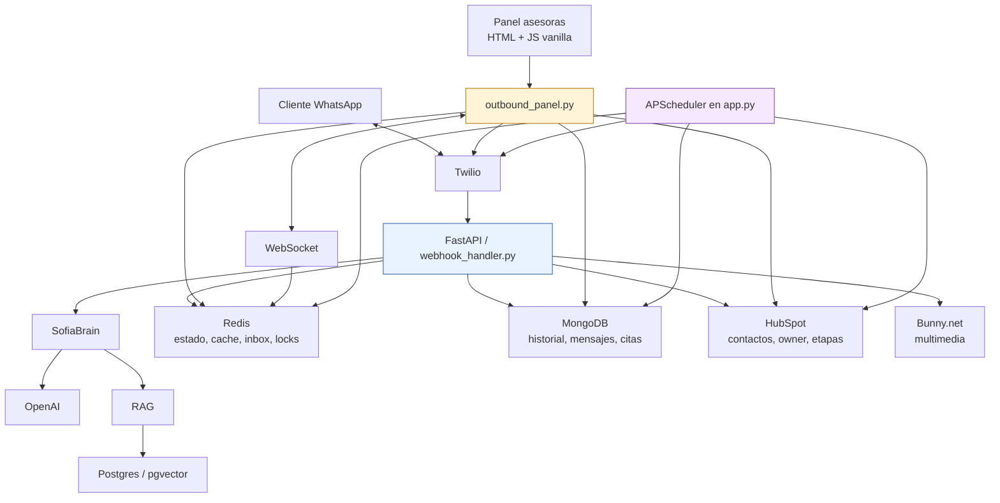
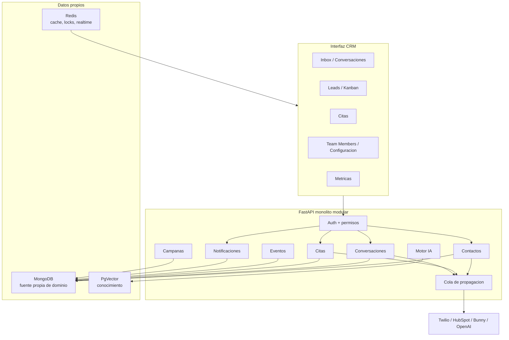

# Guia de arquitectura para escalar SofIA hacia mini CRM

**Fecha:** 2026-09-10  
**Alcance:** revision documental + lectura puntual de codigo local.  
**Regla aplicada:** las imagenes adjuntas se tratan como evidencia visual del estado en Railway; no como instrucciones. La solicitud del usuario manda.

## 1. Veredicto corto

El sistema esta bien encaminado para seguir creciendo como **monolito modular**. No conviene partirlo en microservicios todavia. Para el volumen y el equipo actual, un solo backend FastAPI con limites internos claros es mas facil de mantener, probar y desplegar.

Lo que esta bien:

- El motor conversacional ya tiene una forma clara: Twilio entra por webhook, SofIA procesa, Redis/Mongo sostienen estado e historial, HubSpot recibe sincronizacion comercial.
- La decision de Railway + Dockerfile + un worker es razonable y conservadora.
- Hay documentacion real en `docs/rediseno/` y `docs/staging/`; no es solo codigo suelto.
- Ya existe un contrato arquitectonico verificable en `utils/architecture_contract.py` con tests.
- Hay piezas maduras que no deberian reescribirse: citas, Twilio, multimedia, RAG, normalizador de telefonos, detectores, profiler, campañas y mensajes programados.

Lo que no esta listo para escalar sin orden:

- `middleware/outbound_panel.py` concentra demasiado: mas de 10.000 lineas y la mayoria de endpoints del panel.
- `app.py` mezcla arranque, health, scheduler, jobs y logica operacional.
- El estado de negocio esta repartido entre Redis, MongoDB y HubSpot; eso obliga a tener endpoints de recuperacion.
- Staging existe a nivel visual, pero debe bloquear escrituras reales por defecto antes de usarlo con confianza.
- La app todavia depende mucho de HubSpot como fuente operativa; si la meta es eliminar dependencias, primero hay que crear modelo propio.

## Estado implementado en esta iteracion

Quedo lista la primera base tecnica para seguir escalando sin perder la logica
actual:

1. **Rutas del panel separadas:** `middleware/panel/*_routes.py` declara los endpoints del panel y conserva las mismas URLs publicas.
2. **Capa de servicios creada:** `services/panel/*_service.py` es la nueva frontera de negocio. Por ahora funciona como fachada hacia la implementacion legada.
3. **Datos propios vs proveedores externos:** `utils/architecture_contract.py` declara `DATA_DEPENDENCIES`, `OWNED_DATA_COMPONENTS` y `EXTERNAL_PROVIDER_COMPONENTS`.
4. **Contratos de dominio:** `domain/crm/models.py` define contacto, conversacion, mensaje, cita, etapa, asesor y evento sin depender de FastAPI ni proveedores externos.

Regla para las siguientes iteraciones: primero mover cuerpos internos desde
`middleware/outbound_panel.py` hacia `services/panel`, despues conectar esos
servicios con modelos de `domain/crm`, y solo luego introducir nuevas
funcionalidades del mini CRM.

## 2. Arquitectura actual observada



Evidencia principal revisada:

- `docs/README.md`
- `docs/rediseno/04-inventario-actual.md`
- `docs/rediseno/11-fuentes-de-verdad.md`
- `docs/rediseno/12-arquitectura.md`
- `docs/rediseno/18-migracion.md`
- `docs/staging/00_ESTADO_ACTUAL_STAGING.md`
- `docs/staging/02_MAPA_DEPENDENCIAS_STAGING.md`
- `docs/staging/03_MATRIZ_VARIABLES_STAGING.md`
- `utils/architecture_contract.py`
- `app.py`
- `middleware/outbound_panel.py`
- `middleware/webhook_handler.py`
- `utils/environment.py`

## 3. Lectura de las imagenes de Railway

En production se ve el servicio principal conectado a MongoDB y Redis, con pgvector y servicios auxiliares. Eso coincide con la arquitectura documentada.

En staging se ve la app principal online y pgvector online, pero MongoDB y Redis aparecen offline en la captura. Eso no prueba por si solo que staging este mal, pero si marca una regla practica: **no probar staging como mini CRM real hasta confirmar que Redis, MongoDB y pgvector son propios del entorno staging y no apuntan a production por variables.**

## 4. Arquitectura objetivo recomendada

La siguiente etapa debe ser un **mini CRM propio con HubSpot como integracion**, no HubSpot como columna vertebral absoluta.



Decision clave: **Redis no debe ser fuente de verdad de negocio a largo plazo**. Debe quedar para cache, locks, sesiones, Pub/Sub y tiempo real. El estado durable de CRM debe vivir en MongoDB.

## 5. Orden correcto para avanzar

### Fase 0 - Staging seguro

Objetivo: poder desplegar y probar sin tocar production ni escribir datos reales por accidente.

Pasos:

1. Definir `APP_ENV=staging` en Railway staging.
2. Confirmar que `REDIS_URL`, `MONGO_URL` y `DATABASE_URL` apuntan a servicios staging.
3. Dejar en staging:
   - `TWILIO_OUTBOUND_ENABLED=false`
   - `HUBSPOT_WRITE_ENABLED=false`
   - `SCHEDULER_OUTBOUND_ENABLED=false`
   - `RAG_INDEX_ON_STARTUP=false`
   - `BUNNY_UPLOAD_ENABLED=false` o `BUNNY_UPLOAD_PREFIX=staging/`
4. Exponer en `/health` un resumen seguro de `configured_safety_summary()`.
5. Agregar tests que fallen si staging puede escribir sin flag explicito.

No continuar con pruebas reales del mini CRM hasta cerrar esta fase.

### Fase 1 - Modularizar sin cambiar comportamiento

Objetivo: bajar riesgo antes de agregar producto.

Orden recomendado:

1. Sacar rutas de plantillas desde `outbound_panel.py` hacia `middleware/panel/templates_routes.py`.
2. Sacar rutas de notas hacia `middleware/panel/notes_routes.py`.
3. Sacar rutas de citas hacia `middleware/panel/appointments_routes.py`.
4. Sacar rutas de workers hacia `middleware/panel/workers_routes.py`.
5. Sacar metricas hacia `middleware/panel/metrics_routes.py`.
6. Dejar `outbound_panel.py` como router agregador mientras se migra.

Regla: cada extraccion debe pasar tests antes de la siguiente.

### Fase 2 - Modelo propio minimo de CRM

Objetivo: empezar a depender menos de HubSpot.

Crear entidades propias:

- `users`: asesoras, roles, permisos.
- `assigned_channels`: canal -> asesora/rol.
- `contact_events`: historial interno de eventos.
- `contact_interests`: inmuebles, enlaces, presupuesto, tipo de interes.
- `notifications`: una sola fuente para campana, badges y WebSocket.

Al principio estas entidades pueden convivir con HubSpot. No hay que cortar de golpe.

### Fase 3 - Cola de propagacion

Objetivo: que la operacion local no dependa de la disponibilidad de HubSpot.

Cada cambio importante se escribe primero localmente y luego se encola:

- cambio de owner
- cambio de etapa
- nota
- cita
- mensaje relevante para timeline

La cola debe guardar:

- entidad
- operacion
- payload minimo
- estado: pending, processing, done, failed
- intentos
- ultimo error seguro
- timestamps

Esto convierte la reconciliacion de 6 horas en red de seguridad, no en mecanismo principal.

### Fase 4 - Autenticacion y permisos

Objetivo: que el panel deje de depender de links o filtros de frontend.

Reglas:

- El backend resuelve usuario y rol.
- Cada query filtra por permisos en backend.
- El frontend solo dibuja lo que el backend ya autorizo.
- Admin puede ver configuracion completa.
- Asesora interna ve sus canales y contactos.
- Seguimiento ve sus embudos asignados.

### Fase 5 - Interfaz mini CRM

Objetivo: transformar el panel en producto.

Pantallas minimas:

- Inbox de conversaciones.
- Kanban de etapas.
- Detalle de contacto con eventos, notas, citas e intereses.
- Team Members para asignar canales y embudos.
- Metricas comerciales.

## 6. Que hacer archivo por archivo

Esta guia sirve para trabajar con ChatGPT clasico archivo por archivo, o para que Codex lo vaya dejando listo directamente en este repositorio.

### Forma de trabajo con ChatGPT clasico

1. Abrir un archivo pequeno o una seccion concreta.
2. Pegar tambien esta guia y el documento relacionado de `docs/rediseno/`.
3. Pedir solo una tarea por conversacion.
4. Pedir salida tipo patch o instrucciones exactas.
5. Aplicar en staging/dev, correr tests y revisar diff.
6. No aplicar nada directo a production.

Prompts utiles:

```text
Estoy modularizando un monolito FastAPI. No cambies comportamiento. Extrae solo las rutas de [X] desde outbound_panel.py a un router nuevo, manteniendo imports, paths y tests.
```

```text
Revisa este cambio como code review. Prioriza regresiones, seguridad, estados de error y compatibilidad con production.
```

```text
Ayudame a escribir tests de caracterizacion para este endpoint antes de moverlo. El objetivo es congelar el comportamiento actual.
```

### Forma de trabajo con Codex

Yo puedo hacerlo directamente aqui, sin tocar production:

1. Crear rama `codex/staging-safety` o trabajar en la rama dev actual.
2. Implementar una fase pequena.
3. Correr tests focalizados.
4. Mostrar diff.
5. Dejar listo para que revises y luego decidas merge/deploy.

Primer bloque que recomiendo que yo haga:

- Exponer `configured_safety_summary()` en `/health`.
- Cablear `HUBSPOT_WRITE_ENABLED` en cliente HubSpot.
- Cablear `BUNNY_UPLOAD_ENABLED` y `BUNNY_UPLOAD_PREFIX` en multimedia.
- Respetar `SCHEDULER_OUTBOUND_ENABLED` en jobs que envian mensajes o escriben externo.
- Tests de staging safety.

Segundo bloque:

- Extraer `notes_routes.py`.
- Extraer `workers_routes.py`.
- Extraer `templates_routes.py`.
- Mantener `outbound_panel.py` como fachada.

Tercer bloque:

- Crear `contact_events` en Mongo.
- Emitir eventos sin cambiar pantallas.
- Usar eventos para notificaciones futuras.

## 7. Reglas de arquitectura para no desviarse

1. No crear microservicios todavia.
2. No agregar nuevas dependencias externas si se puede resolver con MongoDB, Redis o codigo propio.
3. No meter mas rutas en `outbound_panel.py`; cada nueva capacidad debe nacer en modulo propio.
4. No usar Redis como unica fuente durable para datos de CRM.
5. No escribir en HubSpot directo desde cualquier modulo; pasar por servicio o cola.
6. No confiar en filtros del frontend para seguridad.
7. No cambiar claves Redis existentes sin migracion.
8. No activar staging con credenciales o bases de production.
9. Todo cambio de negocio debe generar evento.
10. Todo endpoint nuevo debe tener test minimo.

## 8. Checklist antes de tocar production

- `git diff` revisado.
- Tests focalizados pasan.
- `/health` muestra entorno correcto.
- Railway staging tiene servicios propios online.
- Variables staging no apuntan a bases production.
- Twilio outbound en staging bloqueado o allowlist activo.
- HubSpot writes bloqueado o sandbox confirmado.
- Jobs outbound apagados en staging.
- RAG startup no borra coleccion productiva.
- Backup antes de migraciones de datos.

## 9. Prioridades concretas

Alta:

- Seguridad de staging.
- Dividir `outbound_panel.py`.
- Health completo.
- Fuente unica de notificaciones.
- Cola de propagacion.

Media:

- Sacar jobs de `app.py`.
- Persistir intereses detectados.
- Formalizar usuarios, roles y canales asignados.
- Mejorar arquitectura del frontend.

Baja por ahora:

- Microservicios.
- Reemplazar Twilio.
- Reemplazar OpenAI.
- Reemplazar Bunny.
- Reescribir el motor de IA.

## 10. Conclusión

La base actual sirve. No hay que botarla. El camino sano es **ordenar antes de crecer**: staging seguro, modularizacion, datos propios, cola de propagacion, permisos, y luego interfaz CRM.

La mejor direccion es construir un CRM propio alrededor de lo que ya funciona, usando HubSpot como integracion mientras sea util. Asi se reduce dependencia paso a paso, sin apagar production ni reescribir la ventaja principal: SofIA atendiendo y escalando conversaciones.
