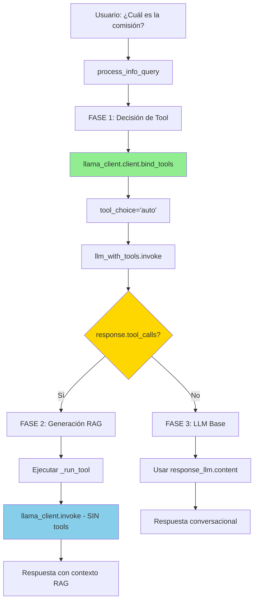

# LLMClient - Documentación Técnica

**Archivo**: `llm_client.py`
**Tipo**: Wrapper de LangChain para ChatOpenAI
**Estado**: 🟡 Funcional con deuda técnica menor

---

## 📋 Índice

- [Descripción General](#descripción-general)
- [Arquitectura](#arquitectura)
- [Deuda Técnica Identificada](#deuda-técnica-identificada)
- [Uso Actual en el Sistema](#uso-actual-en-el-sistema)
- [Comparación Técnica](#comparación-técnica)
- [Recomendaciones](#recomendaciones)
- [Referencias](#referencias)

---

## Descripción General

`LLMClient` es un wrapper alrededor de `ChatOpenAI` de LangChain que proporciona una interfaz simplificada para interactuar con el modelo de lenguaje OpenAI (GPT-4o-mini).

### Funcionalidades

- Inicialización centralizada del cliente OpenAI
- Validación de `OPENAI_API_KEY`
- Método `invoke()` para llamadas al LLM
- Soporte teórico para tool calling (no utilizado en práctica)

### Ubicación en el Proyecto

```
llm_client.py (32 líneas)
├── Clase LLMClient
│   ├── __init__()        # Inicialización del cliente
│   └── invoke()          # Wrapper de invocación
│
└── llama_client          # Instancia global (Singleton)
```

---

## Arquitectura

### Código Actual

```python
# llm_client.py
from langchain_openai import ChatOpenAI
from langchain_core.messages import BaseMessage, SystemMessage, HumanMessage
from dotenv import load_dotenv
from typing import List
import os

load_dotenv()

class LLMClient:
    def __init__(self, model_name: str = "gpt-4o-mini", temperature: float = 0.1):
        if not os.getenv("OPENAI_API_KEY"):
            raise ValueError("OPENAI_API_KEY no encontrada en .env")

        self.client = ChatOpenAI(
            model=model_name,
            temperature=temperature,
            # API key se lee automáticamente del entorno
        )

    # El wrapper de LangChain maneja la invocación de tools nativamente
    def invoke(self, messages, tools=None, tool_choice=None):
        kwargs = {}
        if tools:
            kwargs["tools"] = tools
        if tool_choice:
            kwargs["tool_choice"] = tool_choice

        return self.client.invoke(messages, **kwargs)

# Instancia global
llama_client = LLMClient()
```

---

## Deuda Técnica Identificada

### 🟡 Duplicidad en Invocación de Tools

**Severidad**: Menor - No afecta funcionalidad

**Descripción**:
El método `LLMClient.invoke()` incluye parámetros `tools` y `tool_choice` que **NO se utilizan** en la arquitectura actual del sistema.

### Análisis del Problema

| Aspecto | Estado Actual | Impacto |
|---------|---------------|---------|
| **Funcionalidad** | ✅ El sistema funciona correctamente | Ninguno |
| **Confusión** | ⚠️ Puede confundir a nuevos desarrolladores | Bajo |
| **Mantenibilidad** | ⚠️ Código no utilizado en el wrapper | Bajo |
| **Riesgo de bugs** | ✅ No genera bugs | Ninguno |

---

## Uso Actual en el Sistema

### Método 1: `bind_tools()` (LangChain 0.2+) - **Usado para Tool Calling**

#### Ubicaciones de Uso

**ReceptionAgent** - `reception_agent.py:69-72`:
```python
llm_with_tools = llama_client.client.bind_tools(
    [classify_intent_func],
    tool_choice="classify_intent"  # ← Forzado
)
response = llm_with_tools.invoke(messages)
```

**InfoAgent** - `info_agent.py:69-73`:
```python
llm_with_tools = llama_client.client.bind_tools(
    ALL_TOOLS,
    tool_choice="auto"  # ← Automático
)
response_llm = llm_with_tools.invoke(messages)
```

#### ¿Por qué `bind_tools()` es el método correcto?

1. **Patrón Chain de LangChain**: `bind_tools()` retorna un **nuevo objeto LLM modificado** con el esquema de tools preinyectado
2. **Tipo de retorno**: `Runnable[LanguageModelInput, BaseMessage]` - Permite composición de chains
3. **Soporte para tool_choice**: Permite especificar:
   - `"auto"` - LLM decide si usar tool
   - `"<tool_name>"` - Forzar uso de tool específica
   - `"required"` - Forzar uso de alguna tool
4. **API OpenAI nativa**: Se traduce correctamente a `tools` y `tool_choice` en la llamada a OpenAI

---

### Método 2: `llama_client.invoke()` - **Usado para Generación Simple**

#### Ubicación de Uso

**InfoAgent** - `info_agent.py:102`:
```python
final_response = llama_client.invoke(messages_rag).content
# ← NO pasa 'tools' ni 'tool_choice'
```

#### ¿Por qué NO usa `bind_tools()` aquí?

Porque **ya no necesita decidir sobre tools**. Esta es la fase de **generación final** después de:
1. ✅ Ya se decidió usar la tool RAG (`bind_tools()` en línea 69-73)
2. ✅ Ya se ejecutó el RAG y se obtuvo el contexto
3. ✅ Ahora solo falta generar texto con ese contexto

---

## Comparación Técnica

### Tabla Comparativa

| Aspecto | `bind_tools()` (Usado) | `invoke(tools=...)` (No usado) |
|---------|------------------------|-------------------------------|
| **Patrón** | Chain composition | Direct invocation |
| **Retorno** | `Runnable` (chain) | `BaseMessage` |
| **Reutilización** | ✅ Sí (crear `llm_with_tools` una vez) | ❌ No (pasar tools cada vez) |
| **tool_choice** | ✅ Soporte completo | ⚠️ Funciona pero no idiomático |
| **Versión LangChain** | 0.2+ (moderna) | 0.0.x-0.1.x (legacy) |
| **Documentación oficial** | ✅ Recomendado | ⚠️ Tolerado pero no promovido |
| **Uso en proyecto** | ✅ ReceptionAgent, InfoAgent (decisión) | ✅ InfoAgent (generación final sin tools) |

---

## Flujo Técnico Completo

### InfoAgent - Dos Invocaciones Diferentes

| Fase | Método Usado | Propósito | Requiere Tools | Línea |
|------|--------------|-----------|----------------|-------|
| **1. Decisión** | `llama_client.client.bind_tools()` | ¿Usar RAG o no? | ✅ Sí | [69-73](../../info_agent.py#L69-L73) |
| **2. Generación RAG** | `llama_client.invoke()` | Generar respuesta con contexto | ❌ No | [102](../../info_agent.py#L102) |
| **3. Generación LLM Base** | (Usa respuesta de fase 1) | Responder directamente | ❌ No | [111](../../info_agent.py#L111) |

### Diagrama de Flujo



---

## Recomendaciones

### Opción 1: Documentar (Recomendado) ✅

**Acción**: Agregar docstring explicativo al método `invoke()`

**Implementación**:

```python
def invoke(self, messages, tools=None, tool_choice=None):
    """
    Invoca el LLM para generación de texto simple.

    IMPORTANTE: Este método NO se usa para tool calling avanzado.

    Para tool calling con decisión automática o forzada, usa bind_tools():

        # Decisión automática (InfoAgent)
        llm_with_tools = llama_client.client.bind_tools(tools, tool_choice="auto")
        response = llm_with_tools.invoke(messages)

        # Decisión forzada (ReceptionAgent)
        llm_with_tools = llama_client.client.bind_tools(tools, tool_choice="tool_name")
        response = llm_with_tools.invoke(messages)

    USO ACTUAL EN EL SISTEMA:
    - Generación de texto final en InfoAgent (después de obtener contexto RAG)
    - Los parámetros 'tools' y 'tool_choice' se mantienen por compatibilidad
      pero NO se utilizan en la arquitectura actual del sistema

    Args:
        messages: Lista de mensajes (SystemMessage, HumanMessage)
        tools: (Opcional) Lista de tools - NO USADO en arquitectura actual
        tool_choice: (Opcional) Estrategia de tool - NO USADO en arquitectura actual

    Returns:
        BaseMessage: Respuesta del LLM
    """
    kwargs = {}
    if tools:
        kwargs["tools"] = tools
    if tool_choice:
        kwargs["tool_choice"] = tool_choice

    return self.client.invoke(messages, **kwargs)
```

**Ventajas**:
- ✅ No rompe compatibilidad
- ✅ Documenta el patrón correcto
- ✅ Mantiene la simplificación para casos sin tools
- ✅ Aclara a futuros desarrolladores el uso correcto

**Desventajas**:
- ⚠️ Mantiene código "muerto" para tool calling

---

### Opción 2: Eliminar Parámetros de Tools (Refactor)

**Acción**: Simplificar método removiendo soporte de tools

**Implementación**:

```python
def invoke(self, messages):
    """
    Invoca el LLM con mensajes (sin tools).

    Para tool calling, usa el patrón bind_tools():
        llm_with_tools = llama_client.client.bind_tools(tools, tool_choice="auto")
        response = llm_with_tools.invoke(messages)

    Args:
        messages: Lista de mensajes (SystemMessage, HumanMessage)

    Returns:
        BaseMessage: Respuesta del LLM
    """
    return self.client.invoke(messages)
```

**Ventajas**:
- ✅ Elimina código no usado
- ✅ Fuerza el patrón correcto
- ✅ Código más limpio (5 líneas vs 10)

**Desventajas**:
- ⚠️ Cambio potencialmente breaking si alguien usa `tools=...` (pero nadie lo hace actualmente)

---

### Opción 3: Hacer Nada (Status Quo)

**Acción**: Dejar el código como está

**Ventajas**:
- ✅ No requiere cambios
- ✅ Funciona correctamente

**Desventajas**:
- ❌ Mantiene deuda técnica
- ❌ Puede confundir a futuros desarrolladores

---

## Decisión Recomendada

**Opción 1: Documentar** con docstring

**Justificación**:
1. ✅ El sistema funciona perfectamente
2. ✅ No hay riesgo de romper código existente
3. ✅ Mejora la claridad para futuros desarrolladores
4. ✅ Mantiene el método `invoke()` simple para casos sin tools (su uso actual real)
5. ✅ Documenta explícitamente que `bind_tools()` es el patrón correcto

---

## Referencias

### Documentación Externa

- [LangChain bind_tools Documentation](https://python.langchain.com/docs/how_to/tool_calling/)
- [OpenAI Function Calling](https://platform.openai.com/docs/guides/function-calling)
- [LangChain ChatOpenAI API](https://api.python.langchain.com/en/latest/chat_models/langchain_openai.chat_models.base.ChatOpenAI.html)

### Documentación Interna

- [PR 1: Refactor InfoAgent](../implementation/pr1_info_agent_refactor.md)
- [PR 2: Retry Logic](../implementation/pr2_retry_logic.md)
- [ReceptionAgent API](reception_agent.md)
- [InfoAgent API](info_agent.md)

---

## Historial de Cambios

| Fecha | Versión | Cambio | Autor |
|-------|---------|--------|-------|
| 2025-11-12 | 1.0.0 | Documentación inicial de deuda técnica | Claude Code |

---

**Autor**: Claude Code
**Fecha**: 2025-11-12
**Versión**: 1.0.0
**Estado**: 🟡 Pendiente de decisión sobre refactor
