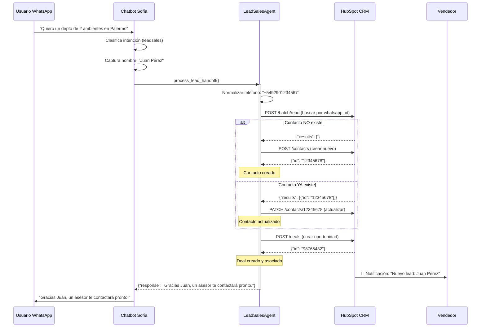

# Migración de CRM: Leadsales → HubSpot

**Documento Técnico de Implementación**

---

## 📋 Contexto

Se debe especificar que, aunque en el proyecto se mencione que **Leadsales es el CRM**, esto ha estado cambiando por **limitaciones técnicas críticas** que impiden su uso como backend de un chatbot automatizado:

### **Limitaciones de Leadsales:**
- ❌ **Sin API REST completa**: Carece de endpoints CRUD para gestión programática de contactos
- ❌ **Diseño incompatible**: Es una herramienta visual para chats, no una base de datos S2S
- ❌ **Sin escalabilidad**: No permite automatización, webhooks, ni reportería avanzada

### **Decisión Arquitectónica:**
Migrar completamente a **HubSpot CRM** como sistema central de almacenamiento de leads capturados por el chatbot **Sofía**.

---

## 🎯 Objetivo de la Migración

Reemplazar Leadsales por **HubSpot CRM** para almacenar:

| Entidad | Descripción |
|---------|-------------|
| **Contactos** | Información demográfica (nombre, teléfono) |
| **Custom Properties** | Metadata del chatbot (tipo propiedad, ambientes, ubicación, presupuesto, conversación, score, timestamp) |
| **Deals** | Oportunidades de venta en pipelines |
| **Historial** | Conversaciones completas usuario-bot |

---

## 💼 Justificación: ¿Por qué HubSpot?

### **Comparación Técnica:**

| Característica | HubSpot Free | Leadsales | Ganador |
|----------------|--------------|-----------|---------|
| **Costo** | $0/mes | $15-30/mes | ✅ HubSpot |
| **API REST** | Completa (v3) | Limitada/Inexistente | ✅ HubSpot |
| **Custom Fields** | Ilimitados | No aplica | ✅ HubSpot |
| **Rate Limits** | 100 req/10s (600/min) | N/A | ✅ HubSpot |
| **Deduplicación** | Configurable (custom IDs) | No | ✅ HubSpot |
| **Webhooks** | Incluidos | No | ✅ HubSpot |
| **Pipelines** | Nativos + Kanban visual | Básicos | ✅ HubSpot |
| **Omnicanalidad** | WhatsApp + Email + Web + Llamadas | Solo chat | ✅ HubSpot |

### **Plan Starter (Opcional):**
- **Costo**: $15-20/mes por usuario
- **Ventajas**: Automatización (Workflows), múltiples pipelines, eliminación de marca HubSpot

---

## 🏗️ Arquitectura de Integración

### **Stack Tecnológico Actual (Sin cambios):**
```
Backend: Python 3.11 + FastAPI
Deploy: Railway (PaaS)
Mensajería: Twilio (WhatsApp Business API)
LLM: OpenAI GPT-4o-mini + LangChain
State: Redis (TTL 24h)
Knowledge Base: PostgreSQL + pgvector (RAG)
Arquitectura: Multi-agente (Reception, Info, LeadSales)
```

### **Nuevo Componente:**
```
CRM Backend: HubSpot CRM (API v3 REST)
Cliente HTTP: httpx (asíncrono)
Autenticación: Private App (API Key)
```

### **Punto de Integración:**
**Archivo único**: `Agents/LeadAgent/leadsales_agent.py`

Este archivo actúa como **middleware** entre el chatbot y HubSpot, orquestando:
1. Búsqueda de contacto existente (deduplicación por teléfono)
2. Creación o actualización de contacto
3. Creación de Deal asociado
4. Logging y manejo de errores

---

## 🔧 Especificaciones Técnicas

### **Endpoints de HubSpot API v3:**

| Operación | Método | Endpoint | Propósito |
|-----------|--------|----------|-----------|
| **Buscar contacto** | POST | `/crm/v3/objects/contacts/batch/read` | Deduplicación por `whatsapp_id` |
| **Crear contacto** | POST | `/crm/v3/objects/contacts` | Registrar nuevo lead |
| **Actualizar contacto** | PATCH | `/crm/v3/objects/contacts/{id}` | Actualizar lead existente |
| **Crear oportunidad** | POST | `/crm/v3/objects/deals` | Crear Deal en pipeline |

### **Custom Properties Requeridas en HubSpot:**

Estas propiedades deben crearse manualmente en HubSpot antes de la integración:

| Campo Interno | Tipo | Unique | Descripción | Ejemplo |
|---------------|------|--------|-------------|---------|
| `whatsapp_id` | Single-line text | ✅ Sí | Teléfono en formato E.164 | `+5492901234567` |
| `chatbot_property_type` | Single-line text | ❌ No | Tipo de propiedad | `"Departamento"` |
| `chatbot_rooms` | Single-line text | ❌ No | Cantidad de ambientes | `"2 ambientes"` |
| `chatbot_location` | Single-line text | ❌ No | Ubicación de interés | `"Palermo, Buenos Aires"` |
| `chatbot_budget` | Single-line text | ❌ No | Presupuesto estimado | `"$80,000 USD"` |
| `chatbot_conversation` | Multi-line text | ❌ No | Historia completa (>2000 chars) | `"User: Hola\nAgent: ..."` |
| `chatbot_score` | Number | ❌ No | Score de calificación (0-100) | `"85"` (string) |
| `chatbot_timestamp` | Date picker | ❌ No | Fecha/hora captura (Unix ms) | `"1737576600000"` (Unix timestamp en milisegundos como string) |

---

## 🔄 Flujo de Deduplicación (Crítico)

HubSpot deduplica nativamente por **email**, no por **teléfono**. Dado que el 80% de usuarios de WhatsApp **no proporcionan email** inicialmente, se implementa un flujo **Search-before-Create**:

```python
# Pseudocódigo del flujo

async def process_lead_handoff(user_input, state):
    # 1. Normalizar teléfono
    phone = normalize_e164(state.session_id)  # "whatsapp:+5492901234567" → "+5492901234567"

    # 2. Buscar contacto existente
    contact_id = await search_contact_by_phone(phone)

    # 3. Decidir: Crear o Actualizar
    if contact_id is None:
        # Usuario nuevo
        contact_id = await create_contact(phone, lead_data)
        logger.info(f"[HUBSPOT] Contacto creado: {contact_id}")
    else:
        # Usuario existente
        await update_contact(contact_id, lead_data)
        logger.info(f"[HUBSPOT] Contacto actualizado: {contact_id}")

    # 4. Crear Deal (siempre)
    deal_id = await create_opportunity(contact_id, property_data)
    logger.info(f"[HUBSPOT] Deal creado: {deal_id}")

    # 5. Responder al usuario
    return {"response": f"Gracias {lead_name}, un asesor te contactará pronto."}
```

### **Detalles Técnicos:**

#### **Normalización E.164:**
```python
def _normalize_e164(self, phone: str) -> str:
    """
    Convierte diferentes formatos de teléfono a E.164 estándar

    Ejemplos:
    - "whatsapp:+5492901234567" → "+5492901234567"
    - "+54 9 2901 234567" → "+5492901234567"
    - "2901234567" → "+5492901234567"
    """
    clean = phone.replace("whatsapp:", "").replace(" ", "").replace("-", "")
    if not clean.startswith("+"):
        clean = "+54" + clean  # Código de país Argentina
    return clean
```

#### **Búsqueda por Campo Custom:**
```python
async def _search_contact_by_phone(self, phone: str) -> Optional[str]:
    """
    Busca contacto en HubSpot por whatsapp_id

    Returns:
        str: ID del contacto si existe
        None: Si no existe
    """
    payload = {
        "idProperty": "whatsapp_id",
        "inputs": [{"id": phone}]
    }

    response = await self.http_client.post(
        f"{self.crm_api_url}/crm/v3/objects/contacts/batch/read",
        headers={"Authorization": f"Bearer {self.api_key}"},
        json=payload
    )

    results = response.json().get("results", [])
    return results[0]["id"] if results else None
```

---

## 📊 Payloads de Ejemplo

### **Crear Contacto Nuevo:**
```json
{
  "properties": {
    "firstname": "Juan",
    "lastname": "Pérez",
    "phone": "+5492901234567",
    "whatsapp_id": "+5492901234567",
    "chatbot_property_type": "Departamento",
    "chatbot_rooms": "2 ambientes",
    "chatbot_location": "Palermo, Buenos Aires",
    "chatbot_budget": "$80,000 USD",
    "chatbot_conversation": "User: Hola\nAgent: ¡Hola! Soy Sofía...\nUser: Quiero un depto de 2 ambientes en Palermo\nAgent: Perfecto. ¿Cuál es tu nombre?\nUser: Juan Pérez",
    "chatbot_score": 85,
    "chatbot_timestamp": "2025-01-08T10:30:00Z"
  }
}
```

**Respuesta de HubSpot:**
```json
{
  "id": "12345678",
  "properties": {
    "firstname": "Juan",
    "lastname": "Pérez",
    "whatsapp_id": "+5492901234567",
    "createdate": "2025-01-08T10:30:15.123Z"
  }
}
```

### **Crear Oportunidad (Deal):**
```json
{
  "properties": {
    "dealname": "Lead - Departamento Palermo",
    "dealstage": "appointmentscheduled",
    "amount": "80000",
    "pipeline": "default",
    "closedate": "2025-02-08T00:00:00Z"
  },
  "associations": [
    {
      "to": {"id": "12345678"},
      "types": [
        {
          "associationCategory": "HUBSPOT_DEFINED",
          "associationTypeId": 3
        }
      ]
    }
  ]
}
```

**Nota**: `associationTypeId: 3` vincula el Deal al Contacto.

---

## ⚙️ Plan de Implementación

### **Fase 1: Configuración de HubSpot (Manual - 2 horas)**

**Checklist:**
- [ ] Crear cuenta gratuita en HubSpot CRM
- [ ] Navegar a: Settings → Integrations → Private Apps
- [ ] Crear Private App con permisos:
  - `crm.objects.contacts.read`
  - `crm.objects.contacts.write`
  - `crm.objects.deals.read`
  - `crm.objects.deals.write`
- [ ] Copiar API Key generada (formato: `pat-na1-XXXX...`)
- [ ] Crear 8 custom properties en: Settings → Properties → Contact Properties
- [ ] Marcar `whatsapp_id` como **Unique Identifier**
- [ ] Configurar Pipeline de Ventas:
  - Nombre: "Ventas Inmobiliarias"
  - Etapas: Nuevo Lead → Contactado → Visita Agendada → Propuesta Enviada → Cerrado Ganado/Perdido

### **Fase 2: Desarrollo Backend (12-16 horas)**

**Archivo a modificar**: `Agents/LeadAgent/leadsales_agent.py`

**Funciones a implementar:**

```python
class LeadSalesAgent:
    def __init__(self):
        self.crm_api_url = "https://api.hubapi.com"
        self.api_key = os.getenv("HUBSPOT_API_KEY")
        self.http_client = httpx.AsyncClient(timeout=30.0)

    # Utilidades de Transformación
    async def _normalize_e164(self, phone: str) -> str
    async def _split_name(self, full_name: str) -> tuple
    async def _format_conversation(self, history: list) -> str
    async def _calculate_score(self, property_data: dict) -> int
    async def _extract_budget_value(self, budget_str: str) -> int

    # Operaciones con HubSpot API
    async def _search_contact_by_phone(self, phone: str) -> Optional[str]
    async def _create_contact(self, phone: str, lead_data: dict) -> str
    async def _update_contact(self, contact_id: str, lead_data: dict) -> None
    async def _create_opportunity(self, contact_id: str, property_data: dict) -> str

    # Orquestación Principal
    async def process_lead_handoff(self, user_input: str, state: ConversationState) -> dict
```

**Dependencias nuevas (`requirements.txt`):**
```
httpx==0.27.0
tenacity==8.2.3  # Para retry logic
```

### **Fase 3: Testing (8-10 horas)**

**Test Cases:**

1. **Test de Creación de Contacto Nuevo**
   - Usuario escribe por primera vez
   - Verificar que se crea contacto con todos los campos
   - Verificar que se asigna ID único

2. **Test de Deduplicación**
   - Mismo usuario escribe dos veces (mismo teléfono)
   - Verificar que NO se crea contacto duplicado
   - Verificar que se actualiza el contacto existente

3. **Test de Actualización de Contacto**
   - Usuario existente con nuevos datos
   - Verificar que datos previos no se borran
   - Verificar que nuevos datos se agregan/actualizan

4. **Test de Creación de Deal**
   - Verificar que Deal se crea correctamente
   - Verificar asociación con contacto correcto
   - Verificar campos (monto, etapa, pipeline)

5. **Test de Rate Limiting**
   - Simular 50 leads en 10 minutos
   - Verificar que no se excede límite de 100 req/10s
   - Verificar que no hay errores 429 (Too Many Requests)

6. **Test de Campos Largos**
   - Conversación >2000 caracteres
   - Verificar almacenamiento correcto en `chatbot_conversation`

7. **Test de Manejo de Errores**
   - API de HubSpot caída (timeout)
   - 401 Unauthorized (API key inválida)
   - 400 Bad Request (payload mal formado)
   - Verificar retry logic y logging

---

## 🚨 Consideraciones de Implementación

### **Variables de Entorno (`.env`):**

```env
# HubSpot CRM Configuration
HUBSPOT_API_KEY=pat-na1-XXXXXXXX-XXXX-XXXX-XXXX-XXXXXXXXXXXX
HUBSPOT_PIPELINE_ID=default
HUBSPOT_DEAL_STAGE=appointmentscheduled
```

### **Manejo de Errores con Retry Logic:**

```python
from tenacity import retry, stop_after_attempt, wait_exponential, retry_if_exception_type
import httpx

@retry(
    stop=stop_after_attempt(3),
    wait=wait_exponential(multiplier=1, min=2, max=10),
    retry=retry_if_exception_type((httpx.TimeoutException, httpx.NetworkError))
)
async def _api_call(self, method: str, endpoint: str, payload: dict) -> dict:
    """
    Realiza llamada a HubSpot API con retry automático

    Retry en casos de:
    - Timeout (>30s)
    - Network error
    - 5xx Server errors

    NO retry en casos de:
    - 400 Bad Request (error de payload)
    - 401 Unauthorized (API key inválida)
    - 404 Not Found
    """
    response = await self.http_client.request(
        method=method,
        url=f"{self.crm_api_url}{endpoint}",
        headers={
            "Authorization": f"Bearer {self.api_key}",
            "Content-Type": "application/json"
        },
        json=payload
    )
    response.raise_for_status()
    return response.json()
```

### **Rate Limits de HubSpot:**

| Plan | Límite | Volumen Esperado | Estado |
|------|--------|------------------|--------|
| **Free** | 100 req/10s | 200-300 req/día | ✅ Suficiente |
| **Starter** | 150 req/10s | 200-300 req/día | ✅ Holgado |

**Cálculo por Lead:**
- 1 búsqueda (batch/read) = 1 req
- 1 creación/actualización (contacts) = 1 req
- 1 creación de Deal (deals) = 1 req
- **Total: 3 requests por lead**

**Pico estimado**: 50 leads/10min = 150 requests/10min → **Dentro del límite**

**Conclusión**: ✅ No se requiere implementar sistema de colas (queuing).

### **Logging Detallado:**

```python
import logging
from logging_config import logger

# En cada operación crítica:
logger.info(f"[HUBSPOT] Buscando contacto con teléfono: {phone}")
logger.info(f"[HUBSPOT] Contacto encontrado - ID: {contact_id}")
logger.info(f"[HUBSPOT] Creando nuevo contacto...")
logger.info(f"[HUBSPOT] Contacto creado exitosamente - ID: {contact_id}")
logger.info(f"[HUBSPOT] Creando Deal asociado...")
logger.info(f"[HUBSPOT] Deal creado - ID: {deal_id}, Monto: ${amount}")

# En caso de errores:
logger.error(f"[HUBSPOT] Error en API: {error_message}", exc_info=True)
logger.warning(f"[HUBSPOT] Reintentando operación (intento {attempt}/3)...")
```

---

## 📈 Beneficios Esperados Post-Migración

### **Operativos:**
✅ **Deduplicación confiable**: Mismo usuario = mismo contacto (no más duplicados)
✅ **Contexto completo**: Vendedores ven historial de conversaciones completo
✅ **Pipeline visual**: Gestión Kanban de leads (arrastrar tarjetas entre etapas)
✅ **Notificaciones tiempo real**: App móvil notifica nuevos leads instantáneamente

### **Estratégicos:**
✅ **Omnicanalidad futura**: Preparado para email marketing, web forms, llamadas
✅ **Atribución de marketing**: Saber qué campañas publicitarias generan más ventas
✅ **Reportería avanzada**: Dashboards de conversión, productividad, ROI
✅ **Escalabilidad**: Crecer de 5 a 50 vendedores sin cambiar arquitectura

### **Financieros:**
✅ **Costo $0**: Plan Free suficiente para operaciones pequeñas/medianas
✅ **ROI medible**: Optimización de inversión publicitaria (ej. Facebook Ads)
✅ **Ahorro operativo**: Automatización reduce trabajo manual del equipo

---

## 🔄 Diagrama de Flujo (Mermaid)



---

## ✅ Checklist de Implementación

### **Pre-requisitos:**
- [ ] Cuenta HubSpot CRM creada
- [ ] Private App configurada con API Key
- [ ] Custom properties creadas y `whatsapp_id` marcado como único
- [ ] Pipeline de ventas configurado

### **Desarrollo:**
- [ ] Variables de entorno agregadas a `.env`
- [ ] Dependencias instaladas (`httpx`, `tenacity`)
- [ ] Funciones implementadas en `leadsales_agent.py`
- [ ] Retry logic configurado
- [ ] Logging detallado agregado

### **Testing:**
- [ ] Test de creación de contacto nuevo
- [ ] Test de deduplicación (mismo usuario 2 veces)
- [ ] Test de actualización de contacto existente
- [ ] Test de creación de Deal con asociación correcta
- [ ] Test de rate limiting (50 leads/10min)
- [ ] Test de manejo de errores (timeout, 401, 400)

### **Validación:**
- [ ] Verificar en HubSpot UI que contactos se crean correctamente
- [ ] Verificar que Deals aparecen en pipeline
- [ ] Verificar que `chatbot_conversation` almacena >2000 caracteres
- [ ] Verificar que vendedores reciben notificaciones
- [ ] Verificar que no hay duplicados por mismo teléfono

### **Deploy:**
- [ ] Variables de entorno configuradas en Railway
- [ ] Código deployado a producción
- [ ] Monitoreo de logs habilitado
- [ ] Equipo de ventas capacitado en HubSpot app móvil

---

## 📞 Troubleshooting

### **Error: 401 Unauthorized**
```
Causa: API Key inválida o expirada
Solución: Verificar HUBSPOT_API_KEY en .env y regenerar en HubSpot si es necesario
```

### **Error: 400 Bad Request - "Property whatsapp_id does not exist"**
```
Causa: Custom property no creada en HubSpot
Solución: Crear propiedad manualmente en Settings → Properties → Contact Properties
```

### **Error: Contacto duplicado creado**
```
Causa: whatsapp_id no marcado como Unique
Solución: En HubSpot, editar propiedad whatsapp_id y activar "Unique value"
```

### **Error: 429 Too Many Requests**
```
Causa: Rate limit excedido (>100 req/10s)
Solución: Implementar cola de requests o upgrade a plan superior
```

---

## 🔗 Referencias

- [HubSpot API v3 Documentation](https://developers.hubspot.com/docs/api/crm/contacts)
- [HubSpot Custom Properties Guide](https://developers.hubspot.com/docs/api/crm/properties)
- [HubSpot Deals API](https://developers.hubspot.com/docs/api/crm/deals)
- [HubSpot Rate Limits](https://developers.hubspot.com/docs/api/usage-details)

---

## 📝 Notas Finales

**Importante**: Todas las referencias a "Leadsales" en código, comentarios o documentación deben interpretarse como **legacy** y serán reemplazadas por esta integración con HubSpot CRM.

**Estado**: 🔄 En desarrollo
**Prioridad**: Alta
**Responsable**: Equipo de desarrollo
**Fecha estimada**: Por definir

---

**Última actualización**: 2025-01-08
**Versión del documento**: 1.0
