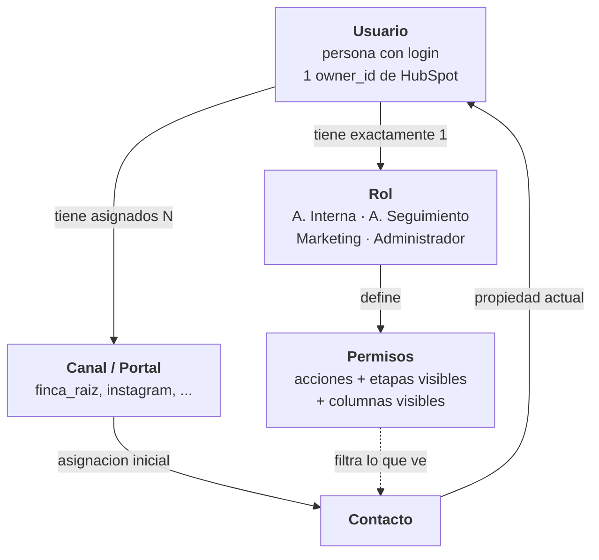
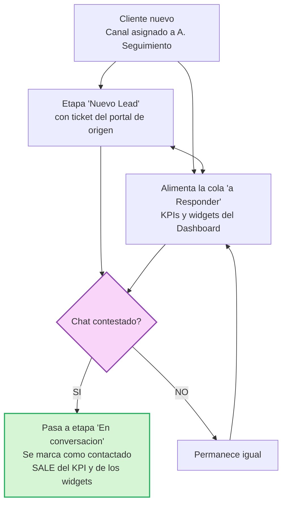
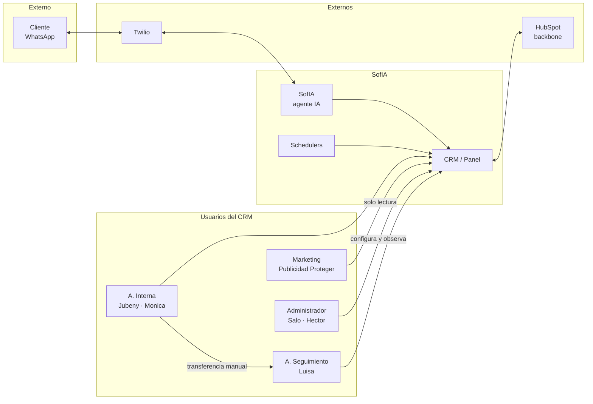
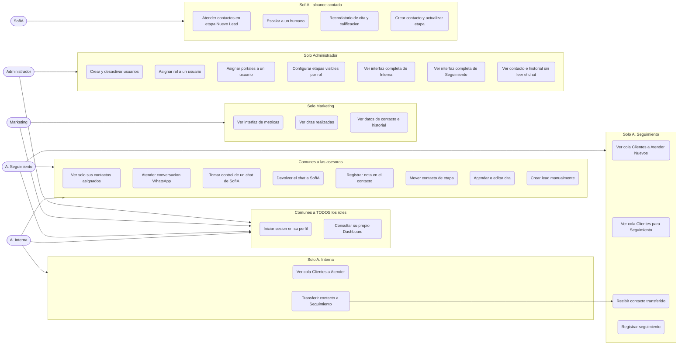
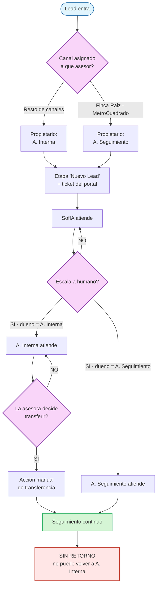
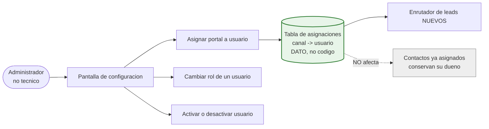
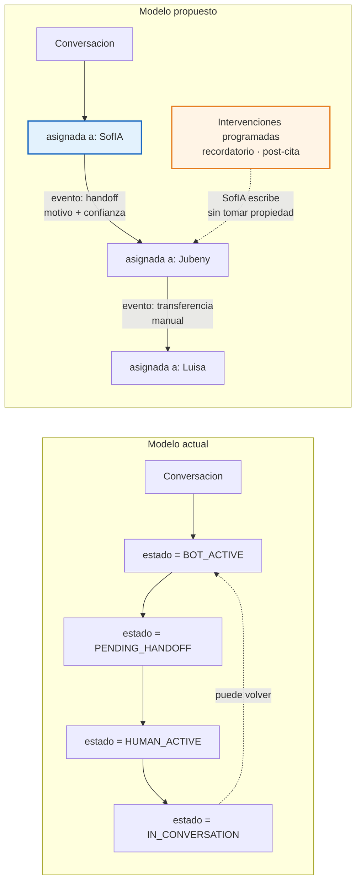
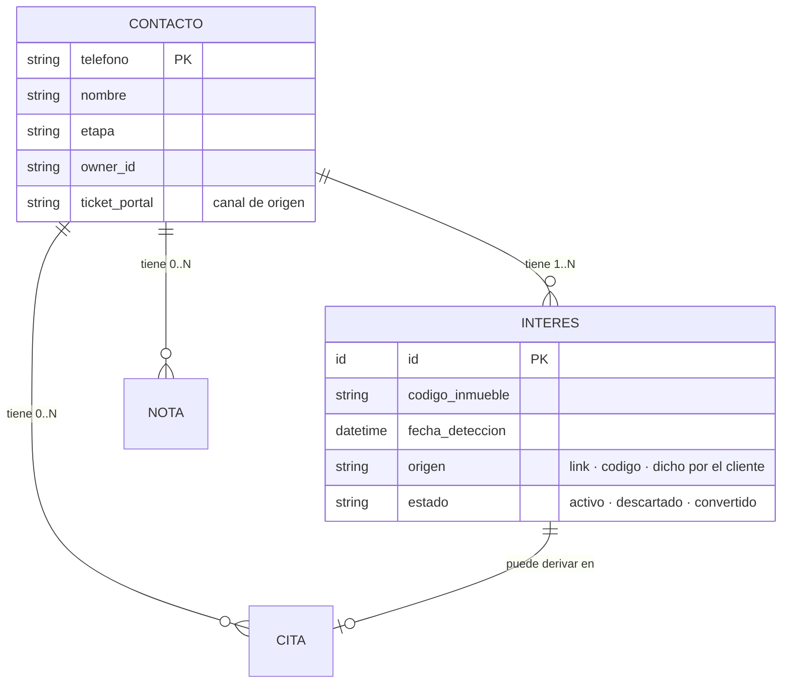
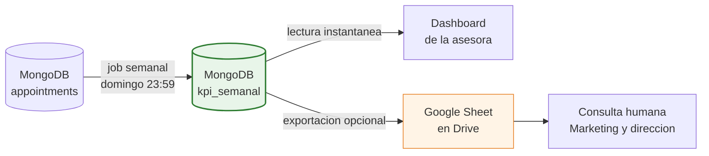

> Estado: ⚠️ Borrador v2 — V-4 resuelta y 9 de 11 puntos cerrados. Pendiente: validación de casos de uso + 3 huecos nuevos.
Actualizado: 2026-08-05 · Owners y etapas verificados en vivo contra la API de HubSpot.
Depende de: [D-01 Glosario](01-glosario.md) · [D-03 Visión](03-vision.md) · Wireframes

---


## 1. Decisión V-4 — RESUELTA ✅

> La organización del trabajo NO se rige por canal *o* por función. Son dos dimensiones ortogonales que conviven.

| Dimensión | Pregunta que responde | Naturaleza |
|---|---|---|
| Canal / Portal | ¿De quién es el lead cuando entra? | Dato configurable por el Administrador |
| Rol | ¿Qué puede hacer y qué ve esa persona? | Definición de permisos |
| Transferencia | ¿Cómo cambia de manos después? | Evento operativo manual |


Consecuencias:
- Un lead de Finca Raíz ya contactado sigue siendo de Luisa. Jubeny nunca atiende Finca Raíz ni MetroCuadrado. ✅
- `channels_registry.py` deja de ser código y pasa a ser dato administrable.
- El concepto "Equipo" queda eliminado: era una indirección canal→persona que ahora es directa y configurable.

---


## 2. Principio rector

> Software configurable / arquitectura basada en datos. Todo lo hardcodeado —usuarios, canales, etapas, reglas de asignación— pasa a ser dato administrable desde una interfaz, sin desplegar código.

---


## 3. Modelo de identidad — 4 conceptos separados




> 🔑 Un usuario tiene un rol Y una lista de canales, independientes entre sí. Luisa es *A. Seguimiento* (rol) y dueña de Finca Raíz + MetroCuadrado (canales). Mónica es *A. Interna* (rol) y hoy no tiene canales asignados — perfectamente válido en este modelo.

---


## 4. Los 4 roles


### 4.1 Asesora Interna


Atiende el primer contacto de los canales que el Administrador le asigne.
- Ve 11 etapas (§6)
- Aislamiento total: solo sus contactos asignados
- Puede transferir manualmente a A. Seguimiento

### 4.2 Asesora de Seguimiento


Da continuidad. Recibe contactos por dos vías independientes:
1. Transferencia manual desde A. Interna
2. Asignación por canal — hoy Finca Raíz y MetroCuadrado, que entran como leads nuevos
- Ve 17 etapas (§6)
- Aislamiento total
- Su Dashboard tiene dos colas separadas, una por cada vía de entrada ✅ *(wireframe "Vista de Seguimiento")*

### 4.3 Marketing

- ✅ Ve datos de contacto (nombre, número, etapa) y su historial
- ❌ NO ve conversaciones
- ✅ Ve métricas de todos los canales y portales — no solo redes sociales ✅ *(P-10)*
- ✅ Ve las citas realizadas por semana
- ❌ No opera, no responde, no tiene contactos asignados
> 🔴 Esto exige rehacer `/metrics`, que hoy filtra solo a `["facebook","instagram","linkedin","youtube","tiktok"]`. Ver §13-bis, requisito M-3.

### 4.4 Administrador


Persona no técnica. Hoy el rol no existe.
- ✅ Ve todos los contactos y qué asesora tiene cada uno
- ✅ Configura: usuarios, roles, canales, etapas visibles
- ❌ NO puede responder conversaciones
- ❌ NO tiene contactos asignados
- Observa, monitorea y configura

### 4.5 SofIA — actor no humano


Atiende de forma autónoma, escala a un humano, crea contactos y actualiza etapas.

---


## 5. Usuarios reales — verificado en HubSpot (2026-08-05)


### 5.1 Owners activos y su rol ✅ CONFIRMADO


| Owner ID | Nombre | Correo | Rol | Canales hoy |
|---|---|---|---|---|
| `89096378` | Jubeny Ocampo | comercial5@ | A. Interna | 14 canales |
| `89096379` | Monica Administracion | pagosadmon@ | A. Interna | ninguno |
| `89096380` | Luisa Muñoz | comercial2@ | A. Seguimiento | finca_raiz, metrocuadrado |
| `82598814` | Publicidad Proteger | publicidad@ | Marketing | — |
| `86909130` | Salo Tovar | tovar18025@ | Administrador | — |
| `90889555` | Hector Guerra | gerencia@ | Administrador | — |


Proyección a 12 meses: 3 A. Interna · 1 A. Seguimiento (sin crecimiento previsto) · 1 Marketing · 2 Administradores.

### 5.2 🔴 Owners inactivos — basura y duplicados


| Owner ID | Nombre | Qué es |
|---|---|---|
| `86997110` | HECTOR GUERRA | Duplicado de `90889555` |
| `87367331` | tovar Salo | Duplicado de `86909130` |
| `88251457` | dsh Prueba | Prueba |
| `88558384` | SLMON | Prueba |
| `90889437` | *(vacío)* | Registro corrupto |

> Regla de sincronización obligatoria: importar solo `isActive = true` · permitir al Administrador ignorar un owner sin tocarlo en HubSpot · detectar duplicados por correo y avisar, nunca fusionar en silencio · nunca borrar un usuario propietario de contactos (desactivar y forzar reasignación).

---


## 6. Matriz de visibilidad de etapas ✅ CONFIRMADO


Cruce de las etapas declaradas contra el inventario real de HubSpot.

| # | Etapa | ID HubSpot | Interna | Seguimiento | Observación |
|---|---|---|---|---|---|
| 1 | Nuevo Lead | ⚠️ hay que crearla | ✅ | ✅ | No existe en HubSpot |
| 2 | En conversacion | `1326623075` | ✅ | ✅ |  |
| 3 | Visita agendada | `marketingqualifiedlead` | ✅ | ✅ |  |
| 4 | Visita Realizada | `salesqualifiedlead` | ✅ | ✅ |  |
| 5 | En estudio | `opportunity` | ✅ | ✅ |  |
| 6 | Aprobado | `lead` | ✅ | ✅ |  |
| 7 | Cerrado Ganado | `customer` | ✅ | ✅ |  |
| 8 | Cerrado Perdido | `evangelist` | ✅ | ✅ |  |
| 9 | Ya encontro | `1326623541` | ✅ | ✅ |  |
| 10 | Otras Areas | `1326632209` | ✅ | ❌ | Solo Interna |
| 11 | Ventas | `1353539189` | ✅ | ❌ | Solo Interna |
| 12 | Post Cita | `1407668893` | ❌ | ✅ | RENOMBRAR desde "Seguimiento" |
| 13 | Hasta 1.5M | `1326623067` | ❌ | ✅ | Recibido de A. Interna |
| 14 | Hasta 2.5M | `1326632625` | ❌ | ✅ | Recibido de A. Interna |
| 15 | De 3M en adelante | `1326631574` | ❌ | ✅ | Recibido de A. Interna |
| 16 | Propietarios | `1326623069` | ❌ | ✅ | Recibido de A. Interna |
| 17 | Otros Municipios | `1326632628` | ❌ | ✅ | Recibido de A. Interna |
| 18 | Local o Bodega | `1326623539` | ❌ | ✅ | Recibido de A. Interna |
| 19 | Reubicados | `subscriber` | ❌ | ✅ |  |
| 20 | Hasta 2M | `1326631573` | ❌ | ✅ | ✅ P-1 resuelto — era un olvido |
| 21 | No Responde | `other` | ❌ | ✅ | ✅ P-2 resuelto — recibido de A. Interna |


Totales: Interna 11 · Seguimiento 19 · Compartidas 9 · Huérfanas 0 · Total 21 ✅
> ✅ Ninguna etapa queda sin dueño. Los cuatro rangos de presupuesto (1.5M, 2M, 2.5M, 3M+) están completos en Seguimiento, y `No Responde` deja de ser un agujero por donde se perdían contactos.

### 🔧 Cambios que hay que aplicar en HubSpot


| Acción | Detalle |
|---|---|
| Renombrar | `1407668893`: "Seguimiento" → "Post Cita" — resuelve la colisión rol/etapa. Semántica: clientes que tras la visita decidieron no quedarse con el inmueble |
| Crear | Etapa "Nuevo Lead" — el ID antiguo `1326631578` ya no existe |


---


## 7. Comportamiento de los canales de A. Seguimiento


Los canales asignados directamente a A. Seguimiento (Finca Raíz, MetroCuadrado) no llegan por transferencia: entran como leads nuevos con su propio ciclo.




Reglas que se derivan:
1. El ticket del portal viaja con el lead y se muestra en la tarjeta del Kanban *(`MetroCuadrado`, `FincaRaiz`)*
2. Los KPIs son una cola de trabajo pendiente, no un contador histórico: el lead sale del KPI al ser contestado
3. La transición `Nuevo Lead → En conversación` la dispara el hecho de contestar

### 7.1 Alcance de SofIA ✅


SofIA interviene ÚNICAMENTE en dos momentos:

| # | Momento | Detalle |
|---|---|---|
| 1 | Contacto nuevo | Mientras el lead está en la etapa `Nuevo Lead` |
| 2 | Recordatorio de cita + calificación | Antes y después de la visita |


El comportamiento de SofIA NO cambia respecto a hoy. Ya funciona así:
1. Llega un contacto nuevo → SofIA atiende y hace el filtro de entrada: nombre, intereses, motivo por el que escribió
2. Terminado el filtro → handoff a la asesora
3. Más adelante, SofIA vuelve en dos momentos programados: recordatorio de cita y calificación post-cita (ya implementado con APScheduler: ventanas de 24 h antes y después)
> Lo que cambia no es el comportamiento, es que la frontera queda escrita. Hoy el modelo de estados *permite* que SofIA recupere una conversación (existe la transición de vuelta a `BOT_ACTIVE` y el conjunto `bot_controlled_conversations`), aunque en la práctica no ocurra. Documentar el límite permite simplificar el modelo de estados sin tocar el flujo.
Consecuencia de diseño: los 4 estados (`BOT_ACTIVE`, `PENDING_HANDOFF`, `HUMAN_ACTIVE`, `IN_CONVERSATION`) se pueden sustituir por asignatario + historial de eventos (patrón #5 del benchmark). Mismo comportamiento, menos piezas. Desarrollo completo en §18.
> ❓ P-3b — Qué cuenta como "contestado" para vaciar el KPI.
El lead entra a `Nuevo Lead` y alimenta el KPI *"a Responder"*. SofIA lo atiende. Después escala o no.
- (a) El KPI se vacía cuando la asesora contesta. Riesgo: si SofIA resuelve sin escalar, el lead se queda en el KPI para siempre.
- (b) El KPI se vacía cuando cualquiera contesta, incluida SofIA. Riesgo: la asesora nunca ve ese lead en su cola.
Mi lectura: (a), pero con salida automática cuando SofIA cierra el caso sin escalar. Confirma o corrige.

---


## 8. Dashboard por rol ✅


El Dashboard no es único: cada rol ve el suyo.

|  | A. Interna — 2 KPIs, 1 cola | A. Seguimiento — 3 KPIs, 2 colas |
|---|---|---|
| KPI 1 | Chat Nuevos | Chat Nuevos Finca Raíz |
| KPI 2 | Citas de la semana | Chat Nuevos Metro Cuadrado |
| KPI 3 | — | Citas de la semana |
| Cola 1 | Clientes a Atender | Clientes a Atender Nuevos — `ID · Nombre · Número · Lead · Portal · Fecha Creación` |
| Cola 2 | — | Clientes para Seguimiento — `ID · Nombre · Número · Lead · Fecha llegada · Fecha Creación` |


"Chat Nuevos" ✅ Contactos que no han recibido respuesta y están en la etapa `Nuevo Lead`. En Seguimiento se parte en dos, uno por portal: es la misma métrica aplicada a distinto canal.

Cola "Clientes a Atender" (A. Interna) ✅ Contactos pendientes de respuesta con mensaje reciente, en cualquier embudo — basta con que el cliente haya escrito. Incluye los recién llegados tras el handoff de SofIA, pero no se limita a ellos.
> 🔑 KPI 1 y la Cola 1 no son lo mismo. El KPI cuenta solo los pendientes en `Nuevo Lead`; la cola lista los pendientes en todos los embudos. El KPI es un subconjunto de la cola.

"Citas de la semana" ✅ — presente en ambos roles
- Citas realizadas por esa asesora (`owner_id` de la sesión)
- Ventana: semana en curso, de lunes a sábado
- Se reinicia a 0 cada semana
> ❓ P-11 — precisar el ciclo. Para A. Seguimiento se definió *"desde el lunes, reinicio semanal"*; para A. Interna se añadió *"empezando desde el 1 del mes"*. Son dos reglas de reinicio distintas.
¿Cuál aplica? (a) Solo semanal lunes→sábado, igual en los dos roles · (b) Semanal, pero la primera semana del mes arranca el día 1 aunque no sea lunes · (c) Hay dos contadores: uno semanal y uno mensual.
Asumo (a) salvo corrección: es lo más simple y lo que dice el rótulo *"Citas de la semana"*.
> 🔴 No es lo que hace el código hoy. El endpoint `/metrics/appointments` calcula `week_threshold = ahora − 7 días` — una ventana móvil, no la semana calendario. Y segmenta por `worker_id` (el trabajador de campo que hizo la visita), no por la asesora dueña del contacto. Ambas cosas hay que cambiarlas. → §14-bis
> ✅ V-5 resuelta. El Dashboard es por rol. La tarjeta vacía del wireframe original era la del Dashboard de A. Interna, que sigue sin definir (ahora en KPI 2).
Las dos colas de Seguimiento corresponden exactamente a sus dos vías de entrada: canal directo y transferencia.
> ✅ P-4 resuelto — la columna `Último Seguimiento` se elimina. Manda el wireframe más reciente: la cola de Seguimiento lleva `Fecha llegada · Fecha Creación`.
⚠️ Ojo: era el único ejemplo confirmado de *permiso a nivel de columna*. Al quitarla, el permiso por campo deja de tener un caso vivo — pero el principio sigue en pie para el Kanban (etapas visibles por rol). Lo registro para que D-06 no lo dé por perdido.

---


## 9. Mapa de actores





---


## 10. Casos de uso por rol

> Óvalos = casos de uso. Versión 2, con tus observaciones aplicadas.




Observaciones aplicadas:

| # | Observación | Efecto en el diagrama |
|---|---|---|
| 1 | *Iniciar sesión* y *Consultar su propio dashboard* son de todos los roles | Nuevo grupo `TODOS`, conectado a los 4 roles humanos |
| 2 | Marketing al iniciar sesión ve su interfaz de métricas | `M01` reformulado como interfaz, no como dato suelto |
| 3 | El Administrador abarca la interfaz completa de A. Interna y A. Seguimiento | `A05` y `A06` |
| 4 | El Administrador ve contacto e historial, pero no lee el chat | `A07` |
| 5 | SofIA solo actúa en `Nuevo Lead` y en recordatorio/calificación de cita | Grupo `SOFIA` reetiquetado y acotado |

> ⚠️ El Administrador sigue sin conectarse a `COMUN`: ve las interfaces de las asesoras pero no responde conversaciones ni tiene contactos asignados. ✅ Confirmado.

---


## 11. Transferencia Interna → Seguimiento ✅ MANUAL

> ✅ Diagrama aprobado por CyberTovar (versión mejorada, 2026-08-05). Corrección aplicada: la escalada de SofIA enruta al dueño ya determinado, no a ambos a la vez.




Mejoras respecto a la versión anterior:

| Cambio | Por qué importa |
|---|---|
| Ambos canales pasan por `Nuevo Lead` + ticket | Unifica la entrada: el ticket del portal viaja siempre, venga de donde venga |
| Ambos canales pasan por SofIA | Coherente con §7.1: SofIA actúa en `Nuevo Lead`, sea de quien sea el lead |
| La escalada enruta al dueño ya determinado | El dueño se fijó en la decisión de canal; SofIA no lo reasigna |


✅ La transferencia es manual y unidireccional. La asesora interna decide y ejecuta. A. Seguimiento no puede devolver el contacto a A. Interna. Sin reglas de tiempo ni disparadores automáticos por etapa.
> ⚠️ Consecuencia operativa a vigilar: al no haber retorno, una transferencia equivocada solo la puede corregir el Administrador mediante reasignación explícita. Conviene que la acción de transferir pida confirmación.

---


## 12. Administración de canales ✅




> ✅ Regla confirmada: reasignar un portal afecta solo a los leads nuevos. Los contactos ya asignados conservan su dueño. Para moverlos hace falta una reasignación explícita, contacto a contacto.

---


## 13. Matriz de visibilidad por rol


| Rol | Sus contactos | Contactos de otras | Historial del contacto | Leer el chat | Métricas | Responde | Configura |
|---|---|---|---|---|---|---|---|
| A. Interna | ✅ | ❌ | ✅ propios | ✅ propios | ❌ | ✅ | ❌ |
| A. Seguimiento | ✅ | ❌ | ✅ propios | ✅ propios | ❌ | ✅ | ❌ |
| Marketing | — | ✅ datos | ✅ | ❌ | ✅ | ❌ | ❌ |
| Administrador | — | ✅ todos | ✅ | ❌ | ✅ | ❌ | ✅ |
| SofIA | ✅ todos | — | ✅ | ✅ | ❌ | ✅ acotado | ❌ |

> ✅ P-6 resuelto. Ni el Administrador ni Marketing pueden leer el contenido de los chats. Ambos ven el contacto y su historial (notas, etapas, citas, actividad), pero no la conversación.
🔑 Esto obliga a una distinción en el modelo de datos: *"historial del contacto"* y *"conversación"* tienen que ser dos recursos separados con permisos independientes. Hoy están mezclados. → entra en D-10 y D-11.
⚠️ Y contradice el wireframe `img05`, donde el panel derecho del chat lleva un enlace *"Ver historial de contacto"* junto a la conversación. Para Administrador y Marketing, esa pantalla tiene que existir sin el hilo de mensajes al lado.

---


## 13-bis. Módulo de métricas — análisis del código actual


Análisis pedido para poder especificar la interfaz de Marketing sobre lo que ya existe.

### Lo que hay hoy — 6 endpoints en middleware/outbound_panel.py


| Endpoint | Línea | Qué hace |
|---|---|---|
| `GET /metrics` | 6419 | Leads de redes sociales de los últimos N días |
| `GET /metrics/export` | 6611 | Exportación |
| `GET /metrics/export-excel` | 6696 | Exportación a Excel |
| `GET /metrics/appointments` | 6877 | Citas completadas, segmentadas por trabajador de campo |
| `GET /metrics/appointments/export-excel` | 6983 | Exportación a Excel |
| `GET /metrics/` | 7135 | Página HTML del dashboard (`metrics.html`) |

> El propósito del rol Marketing ya está escrito en el código. Comentario literal en `/metrics`:
*"Este endpoint es para el analista de redes sociales que solo necesita ver estadísticas, no enviar mensajes ni ver conversaciones detalladas."*
Coincide exactamente con el rol definido en §4.3. Existe la intención, falta el rol.

### 🔴 Hallazgo 1 — la clave de administrador viaja en la URL


```
/whatsapp/panel/metrics/?key=TU_API_KEY
```


El dashboard se abre pasando la clave como parámetro de la URL. Y esa clave es `ADMIN_API_KEY` — la misma que da acceso total al panel.

Consecuencias:
- Marketing tiene hoy, de hecho, credenciales de administrador
- La clave queda en el historial del navegador, en los registros del servidor y en la cabecera `Referer` hacia terceros
- No hay rol, no hay sesión, no hay caducidad, no hay revocación
> Es exactamente el agujero que describiste como *"es muy fácil ingresar por medio de un link"*. Confirmado en el código, y es peor de lo que parecía: no es solo fácil entrar, es que quien entra a métricas entra a todo.

### 🔴 Hallazgo 2 — Marketing no ve los portales


`/metrics` filtra por `SOCIAL_MEDIA_CHANNELS = ["facebook", "instagram", "linkedin", "youtube", "tiktok"]`.

Marketing hoy no ve Finca Raíz, MetroCuadrado, Mercado Libre, Ciencuadras, página web, Google Ads ni referidos. Si el rol debe ver la operación completa, hay que replantear el filtro.

### ⚠️ Hallazgo 3 — lista hardcodeada superviviente


`SOCIAL_MEDIA_CHANNELS` está declarada a mano en `outbound_panel.py:6235`, aunque `utils/channels_registry.py:215` ya expone `get_social_media_channels()` justamente para reemplazarla. Es una de las listas que la auditoría dio por migradas y de la que quedó una copia viva. Evidencia directa de por qué el principio rector de §2 es necesario.

### 🔴 Hallazgo 4 — el KPI 3 no se puede construir con lo que hay


| Aspecto | Código actual | Lo que pide el KPI 3 |
|---|---|---|
| Ventana | `ahora − 7 días` (móvil) | Semana calendario desde el lunes |
| Segmentación | `worker_id` — trabajador de campo | `owner_id` — la asesora dueña |
| Reinicio | No existe | A 0 cada lunes |


Son tres cambios, no un ajuste. El endpoint responde a otra pregunta: *"¿cuántas visitas hizo cada trabajador de campo?"*, no *"¿cuántas citas logró esta asesora esta semana?"*.

### Requisitos derivados para el rediseño


| # | Requisito |
|---|---|
| M-1 | Autenticación por sesión y rol, nunca por clave en la URL |
| M-2 | Marketing con clave propia y permisos propios, desacoplada de `ADMIN_API_KEY` |
| M-3 | Métricas sobre todos los canales, no solo redes sociales |
| M-4 | `SOCIAL_MEDIA_CHANNELS` leído del registro de canales, no hardcodeado |
| M-5 | Citas segmentadas por asesora dueña, con ventana de semana calendario |
| M-6 | Marketing devuelve datos de contacto e historial, nunca contenido de conversaciones (§13) |

> ⚠️ Verificar además si `HUBSPOT_API_KEY` (usada en `/metrics`) sigue viva, ya que la configuración declarada del proyecto usa `HUBSPOT_ACCESS_TOKEN`.

---


## 14. Autenticación — análisis de viabilidad


### 14.1 Tu propuesta

> *"Login HubSpot ↔ CRM propio. Los dos trabajan juntos para autenticar al usuario con su ID o correo registrado en HubSpot."*

### 14.2 🔴 La federación con HubSpot, tal como está descrita, NO es viable


HubSpot no es un proveedor de identidad para aplicaciones de terceros. Su OAuth es *aplicación ↔ portal* —sirve para que una app acceda a los datos de una cuenta—, no *usuario final ↔ app*. No existe un "Iniciar sesión con HubSpot" que tus asesoras puedan usar para entrar a un sistema externo.

Lo que sí se puede hacer es usar HubSpot como lista blanca: la persona se autentica en otro sitio, y SofIA verifica que su correo corresponda a un owner activo de HubSpot.

### 14.3 Dos opciones reales


Opción A — Base propia de usuarios + verificación contra HubSpot
- Tabla propia: correo, contraseña cifrada, `hubspot_owner_id`, rol, activo
- Solo se puede dar de alta a alguien cuyo correo sea un owner activo de HubSpot
- Si el owner se desactiva en HubSpot → el usuario se bloquea en SofIA
- ⚠️ Coste oculto: gestionar contraseñas propias (cifrado, recuperación, bloqueo por intentos, exposición ante filtraciones)

Opción B — Iniciar sesión con Google 🟢 RECOMENDADA
> 🔑 Hallazgo: los 6 owners activos de HubSpot usan correo @gmail.com — `gerencia.inmproteger@`, `comercial5.inmproteger@`, `comercial2.inmproteger@`, `pagosadmon.inmproteger@`, `publicidad.inmproteger@`, `tovar18025@`.
- SofIA delega la autenticación a Google (OIDC estándar, gratuito, maduro)
- SofIA nunca almacena contraseñas → desaparece una clase entera de vulnerabilidad
- El segundo factor lo aporta Google, sin construir nada
- El correo devuelto por Google se busca en la tabla de usuarios → resuelve `owner_id` y rol
- La sesión sigue siendo de SofIA; Google solo prueba *quién eres*

|  | Opción A | Opción B |
|---|---|---|
| Esfuerzo de construcción | Alto | Bajo |
| Superficie de ataque | Contraseñas propias | Ninguna contraseña |
| Segundo factor | Hay que construirlo | Incluido |
| Depende de un tercero | No | Sí (Google) |
| Encaja con los correos actuales | Sí | Sí — todos son Gmail |

> ✅ DECIDIDO: Opción B — Iniciar sesión con Google. Con la A como respaldo si algún usuario futuro no tuviera cuenta de Google. El vínculo con HubSpot es por `owner_id`, y el rol siempre lo resuelve el backend de SofIA, nunca HubSpot ni el cliente. → ADR en D-14.

### 14.4 Requisitos de seguridad — obligatorios en las dos opciones


| # | Requisito | Por qué |
|---|---|---|
| 1 | Eliminar el acceso por enlace sin credenciales | Es el agujero actual |
| 2 | El rol se resuelve en el backend desde la sesión | Si viaja en el cliente, se falsifica |
| 3 | El aislamiento se aplica en la consulta a base de datos | Filtrar en el frontend = cualquiera ve todo con DevTools |
| 4 | Sesión con caducidad corta + renovación | Sesiones eternas en 2 dispositivos |
| 5 | Registro de auditoría de inicios de sesión | Quién entró, cuándo, desde dónde |
| 6 | Revocación inmediata al desactivar un usuario | Hoy no existe forma de expulsar a nadie |

> → ADR obligatorio en D-14.

---


## 15. Multi-dispositivo — 🔵 premisa corregida


### 15.1 El límite de 2 dispositivos no es tu problema


Investigué Leadsales. La limitación de "2 dispositivos" es de la aplicación WhatsApp Business, no de un CRM. Leadsales la evita exactamente igual que SofIA: usando la API de WhatsApp en lugar de la app. Con la API, el número de usuarios y dispositivos simultáneos es ilimitado, con bandeja compartida y permisos por rol.
> SofIA ya tiene la misma arquitectura que Leadsales en este punto (Twilio WhatsApp API). El límite no viene de WhatsApp — viene del backend propio.

### 15.2 Lo que sí hay que resolver en SofIA

- La sesión es por usuario, no por conexión
- WebSocket con difusión a todas las conexiones del mismo usuario
- Estado de lectura sincronizado entre dispositivos
- Aviso de "esta conversación ya está abierta en otro dispositivo" para evitar respuestas duplicadas
- Presupuesto de peticiones por usuario, no por sesión
> ⚠️ Hoy el panel cachea `phone_to_advisor` por worker y enruta por `assigned_owner_id`. Falta verificar si soporta dos conexiones simultáneas del mismo owner sin duplicar ni perder eventos. → D-04.

### 15.3 El límite real de WhatsApp que sí aplica


La API de WhatsApp escalona las conversaciones diarias: 250 → 1.000 → 10.000 → 100.000, subiendo automáticamente si se mantiene la calidad de la cuenta. Es un requisito no funcional real. → D-15.

---


## 16. Microservicios — ⚠️ decisión consciente


| A favor | En contra |
|---|---|
| Aislamiento de fallos | El sistema tendrá ~7 usuarios |
| Escalado independiente | Hoy es un monolito de **2 workers** (`Procfile`) que ya sufrió fugas de memoria y `SIGKILL` |
| Despliegue independiente | Multiplican la complejidad operativa y los puntos de fallo |

> Recomendación: *monolito modular* con límites internos estrictos, extrayendo servicios solo donde haya razón concreta (p. ej. el motor de IA). El 80% del beneficio con el 20% del riesgo. → ADR obligatorio en D-14.

---


## 17. Puntos abiertos


### Resueltos ✅


| # | Punto | Resolución |
|---|---|---|
| P-1 | `Hasta 2M` huérfana | Era un olvido → añadida a A. Seguimiento |
| P-2 | `No Responde` huérfana | Es embudo de Seguimiento, transferido desde A. Interna |
| P-3 | Alcance de SofIA | Solo `Nuevo Lead` + recordatorio/calificación de cita |
| P-4 | Columna `Último Seguimiento` | Se elimina |
| P-5 | ¿Retorno Seguimiento → Interna? | NO. Unidireccional |
| P-6 | ¿Admin lee conversaciones? | NO. Ve contacto e historial, no el chat |
| P-7 | Portal vs. nota en la tarjeta | Conviven |
| P-3b | ¿Qué vacía el KPI *"a Responder"*? | La asesora, con salida automática si SofIA cierra el caso sin escalar |
| P-8 | Alcance del *ticket del portal* | Nivel 1 — etiqueta del portal de origen |
| P-9 | KPI 2 del Dashboard de A. Interna | Citas de la semana. Interna tiene 2 KPIs y 1 cola |
| P-10 | Alcance de las métricas de Marketing | Todos los canales y portales + citas semanales |
| — | Autenticación | Opción B — Iniciar sesión con Google ✅ |
| — | Contrato de autonomía de SofIA (§18.7) | Confirmado — coincide con el sistema actual |
| — | `Historial de Notas` vs `Historial de Contacto` | Son dos cosas distintas — ver §19 |
| — | Casos de uso §10 | Aprobados con 5 observaciones aplicadas |
| — | Diagramas §9, §11, §12 | Aprobados |


### Abiertos


| # | Punto | Bloquea |
|---|---|---|
| P-11 | Ciclo de *Citas de la semana* | ✅ **Solo lunes→sábado.** Reinicio semanal, sin regla mensual |
| P-12 | ¿Se aprueba la entidad `Interés`? | ✅ **APROBADA** — para tener estructurado qué le interesa a cada cliente |
| P-13 | Inmueble nuevo en contacto ya avanzado | ✅ **Se añade una entrada al Historial de Contacto.** La etapa no se mueve. Un contacto tiene varios intereses |
| P-14 | Wireframes faltantes | ✅ Administrador entregado. **Falta solo Marketing (W-1)** |

**Nada bloquea ya la Fase 2.**

### Abierto

| # | Punto | Bloquea |
|---|---|---|
| **P-15** 🟠 | Persistencia del KPI semanal — ¿guardar el histórico o calcularlo al vuelo? Ver §21 | Modelo de datos de métricas |
| **W-1** 🔴 | Wireframe de la interfaz de Marketing | Casos de uso de Marketing |


---


## 18. SofIA — modelo de gestión del agente IA junto a asesoras humanas

> Análisis pedido el 2026-08-05, con el criterio explícito: si lo actual supera el 80% de calidad, se mantiene; si baja de 70-80%, se cambia la estructura.
Evaluado contra el código real: `middleware/sofia_brain.py`, `agents/orchestrator.py`, `agents/*/`, `middleware/webhook_handler.py`, `prompts/`.

### 18.1 Veredicto en una línea

> El modelo de interacción está bien y NO se toca (≈85%). La implementación técnica que lo sostiene sí hay que rehacerla (≈60%) — pero sin cambiar el comportamiento de SofIA.

Son dos cosas distintas y hay que puntuarlas por separado. *Cómo* SofIA convive con las asesoras es correcto. *Cómo está construido* no.

### 18.2 Modelo de interacción — 85 / 100 · se mantiene


| Criterio | Estado | Nota |
|---|---|---|
| El agente atiende el primer contacto y filtra | ✅ | Es el patrón de Intercom y Leadsales. Correcto |
| Handoff a humano al terminar el filtro | ✅ | Correcto |
| Reintervención programada acotada (recordatorio + post-cita) | ✅ | Por encima de la media del mercado. Pocos CRM tienen esto |
| Override humano siempre disponible | ✅ | `sofia_activa=false` por contacto + tomar control desde el panel |
| Autonomía acotada — no borra, no reasigna, no envía masivos | ✅ | Correcto |
| El agente no compite con la asesora por la conversación | 🟡 | En la práctica no ocurre, pero el modelo de estados lo permitiría |

> Supera el umbral del 80%. Se mantiene tal cual.

### 18.3 Implementación técnica — 60 / 100 · se rehace


| Criterio | Puntuación | Hallazgo |
|---|---|---|
| Coherencia arquitectónica | 🔴 3/10 | Dos arquitecturas de agente y dos máquinas de estado, ambas vivas — ver 18.4 |
| Banco de evaluación de prompts | 🔴 2/10 | No existe. Cada cambio de prompt es una apuesta a ciegas |
| Handoff auditable | 🟡 5/10 | El motivo se calcula y se descarta; no se persiste |
| Trazabilidad del análisis | 🟡 5/10 | Emoción, score y prioridad se registran en el log pero no se guardan |
| Guardrails de salida | 🟡 5/10 | `pii_validator.py` existe; sin validación de alucinación sobre precios o inmuebles |
| Degradación ante fallo del LLM | 🟡 6/10 | Devuelve mensaje de error con análisis por defecto — no escala |
| Eficiencia de coste | 🟢 9/10 | Single-Stream: una sola llamada al LLM devuelve respuesta *y* análisis. Excelente decisión |
| Gestión de memoria y contexto | 🟢 8/10 | `RedisChatMessageHistory` + recorte de historial + contexto del lead inyectado |
| Modularidad de prompts | 🟢 8/10 | `prompts/` separado en persona, conversación y middleware |

> No llega al 70%. Hay que rehacerla.

### 18.4 🔴 El hallazgo grave: dos arquitecturas de agente conviviendo


Hay dos formas distintas de generar una respuesta, ambas en producción:

|  | Ruta A — producción WhatsApp | Ruta B — procesamiento en `app.py` |
|---|---|---|
| Entrada | `webhook_handler.py:657` | `app.py:331` |
| Motor | `SofiaBrain.process_message_with_analysis()` — Single-Stream, 1 llamada LLM | `agents/orchestrator.py` — multiagente: Reception → Info → CRM |
| Máquina de estados | `middleware/conversation_state.py` — `BOT_ACTIVE`, `PENDING_HANDOFF`, `HUMAN_ACTIVE`, `IN_CONVERSATION` | `state_manager.py` — `RECEPTION_START`, `CRM_CONVERSATION`, `TRANSFERRED_CRM`, `WELCOME_SENT`… |
| Volumen | ~2.200 líneas | ~1.400 líneas en `agents/` |


Y se mezclan: `app.py` importa `ConversationStatus` de `middleware.conversation_state` (línea 72) para decidir si responde, pero delega la generación al orquestador, que por dentro lleva su propia máquina de estados que nadie más consulta.

Además, `state_manager.py` declara estados marcados como `# DEPRECATED - No usado` (`AWAITING_PROPERTY_DATA`, `AWAITING_LEAD_NAME`) que siguen en el enum.
> Consecuencia: nadie puede responder con certeza a *"¿por qué SofIA contestó esto?"* sin saber antes por cuál de las dos rutas entró el mensaje. Eso hace imposible depurar, medir y mejorar.

### 18.5 El patrón recomendado — agente como compañero de equipo con autonomía acotada


No hay que inventar nada: es el patrón que usan Intercom, Front y los CRM conversacionales serios. Se apoya en una idea sencilla que además encaja con el modelo de propiedad de §3:
> SofIA no es un estado de la conversación. SofIA es un asignatario, igual que Jubeny o Luisa.




Por qué es mejor, en concreto:

| Ventaja | Efecto |
|---|---|
| Un solo modelo de propiedad para humanos y para la IA | Desaparecen los 4 estados y el conjunto auxiliar `bot_controlled_conversations` |
| El inbox muestra *"asignado a SofIA"* igual que *"asignado a Jubeny"* | La asesora ve de un vistazo qué está atendiendo la IA |
| El handoff es un evento, no una transición implícita | Se puede auditar, medir y reproducir |
| Las intervenciones programadas no toman propiedad | SofIA manda el recordatorio sin quitarle el contacto a la asesora — hoy esto es ambiguo |
| Encaja con §3 sin añadir conceptos | Usuario / Rol / Canal / Contacto ya estaban; SofIA entra como un usuario más de tipo agente |


### 18.6 Plan estructurado — 6 pilares


| # | Pilar | Qué implica | Prioridad |
|---|---|---|---|
| 1 | Un solo motor de respuesta | Elegir `SofiaBrain` (Single-Stream) y retirar `agents/orchestrator.py` + `state_manager.py`. Conservar el RAG del InfoAgent como herramienta, no como agente | 🔴 Fundacional |
| 2 | SofIA como asignatario | Sustituir los 4 estados por `assigned_to` + historial de eventos. Sin cambio de comportamiento | 🔴 Fundacional |
| 3 | Contrato de autonomía explícito | Tabla escrita de lo que SofIA puede y no puede hacer (18.7). Hoy es implícito y vive repartido en el código | 🔴 Fundacional |
| 4 | Handoff auditable | Persistir cada handoff con: momento, disparador, motivo estructurado y confianza. Hoy `reason_parts` se construye y se descarta | 🟠 Alta |
| 5 | Banco de evaluación | 30–50 conversaciones reales etiquetadas con el resultado esperado. Se ejecuta antes de publicar cualquier cambio de prompt | 🟠 Alta |
| 6 | Degradación segura | Si el LLM falla: escalar a humano, no responder con un mensaje de error genérico y quedarse callada | 🟠 Alta |


#### Sobre el pilar 5 — el que más falta hace


`CLAUDE.md` ya lo advierte: *"Cambiar prompts sin actualizar el estado del proyecto puede causar regresiones silenciosas."* Hoy no hay forma de saber si un cambio de prompt mejoró o empeoró. Un banco de evaluación responde, por cada conversación de prueba:
- ¿Debía escalar? ¿Escaló?
- ¿Detectó el nombre del cliente?
- ¿Clasificó bien el canal de origen?
- ¿Se inventó un precio o una propiedad?

Con 30–50 casos reales etiquetados se convierte cada cambio de prompt en una medición en lugar de una apuesta. Es lo más barato de construir y lo que más riesgo elimina.

### 18.7 Contrato de autonomía — propuesta


| SofIA puede | SofIA no puede |
|---|---|
| Responder mientras la conversación esté asignada a ella | Responder si la conversación está asignada a una persona |
| Hacer el filtro de entrada: nombre, interés, motivo | Reasignar el dueño de un contacto |
| Crear un contacto nuevo | Borrar contactos, notas o citas |
| Mover el contacto de `Nuevo Lead` a `En conversación` | Mover a etapas de cierre (`Cerrado Ganado/Perdido`) |
| Enviar recordatorio de cita y calificación post-cita | Enviar campañas masivas |
| Escalar a un humano | Prometer precios o condiciones que no estén en la base de conocimiento |

> ✅ Confirmada. Y con un dato importante: así se comporta el sistema hoy. El contrato no exige cambios de comportamiento — solo dejarlo escrito y hacerlo verificable. Eso baja mucho el coste del pilar 3.

### 18.8 Qué NO cambiar


| Se conserva | Por qué |
|---|---|
| Single-Stream (respuesta + análisis en una llamada) | Decisión de coste excelente. La mitad de llamadas al LLM |
| El flujo: nuevo lead → filtro → handoff → intervenciones programadas | Es correcto y está por encima del mercado |
| RAG con PgVector + base de conocimiento | Es la ventaja competitiva frente a Leadsales |
| Historial en Redis con recorte | Sólido |
| Prompts modularizados en `prompts/` | Buena separación |
| APScheduler para recordatorios y post-cita | Funciona; solo hay que hacerlo auditable |


---


## 17-bis. P-8 — Qué puede ser el "ticket del portal"


Preguntaste qué quería decir con *"solo etiqueta visual"* y si se puede hacer algo más. Sí: hay cuatro niveles, de menos a más útil.

| Nivel | Qué es | Qué permite | Coste |
|---|---|---|---|
| 1. Etiqueta | Solo el nombre del portal en color (`FincaRaiz`) | Ver de dónde vino | Ya casi existe |
| 2. + Identificador del anuncio | Guarda el código del inmueble que el cliente estaba viendo | La asesora sabe qué propiedad le interesó antes de saludar | Medio |
| 3. + Enlace de vuelta | Al pulsar el ticket, abre la publicación en el portal | Ver fotos, precio y descripción sin salir del CRM | Medio |
| 4. Objeto completo | Portal + código de inmueble + campaña/UTM + fecha de llegada | Métricas reales de qué anuncio genera qué leads | Alto |

> ✅ DECIDIDO: nivel 1. El ticket es la etiqueta del portal de origen, y se sigue mejorando sobre lo que ya existe.

### 17-ter. 🔴 La consecuencia del nivel 1: un contacto, varios inmuebles


Al elegir el nivel 1, el ticket dice por dónde llegó el cliente, no qué le interesa. Y planteas el caso real:
> *"Varios clientes llegan preguntando por varios inmuebles, y de igual manera, después de un tiempo ese mismo contacto llega preguntando por otro inmueble."*

El modelo actual no puede representar eso. Hoy un Contacto tiene una etapa y un dueño; no tiene dónde guardar *"preguntó por el inmueble A el 3 de marzo y por el B el 20 de abril"*.

#### La solución: Interés como entidad hija del Contacto





| Opción | Veredicto |
|---|---|
| Lista de códigos en un campo de texto | ❌ No permite fecha ni estado por inmueble |
| Un contacto nuevo por cada inmueble | ❌ Rompe la identidad del cliente y duplica el historial |
| Usar *Deals* de HubSpot | ❌ Contradice la decisión de arquitectura contact-centric sin Deals |
| Entidad `Interés` hija del Contacto | ✅ Recomendada |


Por qué encaja sin forzar nada:
1. Ya lo pediste sin darte cuenta. Tu definición de *Historial de Contacto* dice: *"en qué ha estado interesado — SofIA o el sistema detectará los links y/o códigos que ha enviado el cliente"*. Eso es una lista de intereses con fecha.
2. Ya existe media pieza: `utils/property_code_detector.py` detecta códigos de propiedad en los mensajes. Hoy los detecta y los usa para forzar el handoff; no los guarda. Guardarlos crea la entidad casi gratis.
3. No es un Deal. Un Interés es ligero: código, fecha, origen y estado. Sin importe, sin probabilidad, sin pipeline propio.
4. Resuelve los dos casos que planteas con la misma estructura: varios inmuebles el mismo día son varios `Interés` con la misma fecha; meses después es un `Interés` nuevo sobre el mismo contacto.

Consecuencias en la interfaz:
- El panel lateral del contacto muestra la lista de inmuebles por los que ha preguntado, con fecha
- La asesora ve de un vistazo si es un cliente recurrente y qué buscó antes
- Una cita se puede vincular al `Interés` que la originó — así el post-cita sabe *de qué inmueble* preguntar
> ❓ P-12 — ¿Se aprueba la entidad `Interés`? Es la decisión de modelo de datos más importante que queda antes de la Fase 2.
❓ P-13 — ¿Qué hace el sistema cuando detecta un inmueble nuevo en un contacto que ya está en `Visita Realizada`? ¿Vuelve a `En conversación`? ¿Se queda donde está y solo se añade el interés? *(Mi recomendación: solo añadir el interés y avisar a la asesora. Mover la etapa borraría el avance del embudo anterior.)*

---


## 19. Historial de Notas vs. Historial de Contacto ✅


Son dos cosas distintas, no dos vistas de lo mismo. Esto cierra la duda abierta desde el catálogo de wireframes.

|  | Historial de Notas | Historial de Contacto |
|---|---|---|
| Qué registra | Las notas que cada asesora ha escrito sobre el contacto | El recorrido del contacto desde que llegó al CRM |
| Autoría | Humana — se agrupa por rol/asesora | Sistema y asesoras |
| Naturaleza | Aportes subjetivos | Hechos objetivos |
| Contenido | Texto libre + autor + fecha | Etapas por las que ha pasado · inmuebles que le han interesado (links y códigos detectados por SofIA o el sistema) · citas programadas, editadas, canceladas o completadas |

> 🔑 Consecuencia de modelo: el *Historial de Contacto* es un registro de eventos (event log), no una tabla de campos. Cada entrada es un hecho con tipo, fecha y autor. Encaja con el patrón #4 del benchmark (timeline de HubSpot) y con el patrón #5 (handoff como evento).
🔑 Y confirma la entidad `Interés` (§17-ter): *"en qué ha estado interesado"* solo se puede mostrar si los inmuebles detectados se guardan. Hoy `property_code_detector.py` los detecta y los descarta.

Tipos de evento identificados hasta ahora:

| Tipo | Origen | Ejemplo |
|---|---|---|
| Cambio de etapa | Sistema / asesora | `Nuevo Lead → En conversación` |
| Interés detectado | SofIA / sistema | Código o link de inmueble en un mensaje |
| Cita programada | Asesora | Fecha y hora |
| Cita editada | Asesora | Cambio de fecha |
| Cita cancelada | Asesora | Motivo |
| Cita completada | Sistema | Auto-transición 1h30 después |
| Transferencia | Asesora | A. Interna → A. Seguimiento |
| Handoff | SofIA | Motivo + confianza |

> ⚠️ Ni Administrador ni Marketing pueden leer el chat, pero sí ven este historial. Por eso el *Historial de Contacto* tiene que ser un recurso independiente de la conversación, con su propio permiso. → D-10 y D-11.

---


## 20. Wireframes que faltan — P-14


Con lo que hay hoy no alcanza para dos roles completos. Esta es la lista exacta.

### 🔴 Necesarios — no existe nada


| # | Pantalla | Por qué |
|---|---|---|
| W-1 | Marketing — interfaz de métricas | Es la pantalla completa de un rol y no hay ningún wireframe. Ya sabemos qué muestra: métricas de todos los canales, citas por semana, datos de contacto sin conversaciones |
| W-2 | Administrador — pantalla de configuración | Usuarios, roles, asignación de portales, etapas visibles. Es el corazón del principio "nada hardcodeado" — sin este wireframe, desarrollo no sabe qué construir |
| W-3 | Contacto sin conversación | La vista de contacto + historial para Administrador y Marketing. Resuelve la contradicción con `img05`, donde *"Ver historial de contacto"* vive pegado al hilo de mensajes |


### 🟠 Recomendables — existe pero desactualizado


| # | Pantalla | Por qué |
|---|---|---|
| W-4 | Dashboard de A. Interna, actualizado | `img08` dibuja 3 KPIs y 2 tablas. Ahora son 2 KPIs y 1 cola |
| W-5 | Inicio de sesión y perfil | El bloque `USER`. Cambió al decidirse *Iniciar sesión con Google* |


### ✅ Ya cubiertos — no hacen falta


A. Seguimiento (`img10`, `img11`) · Kanban (`img06`, `img10`) · Tabla de leads (`img01`, `img07`, `img09`) · WhatsApp (`img05`) · Chat desde Kanban (`img04`) · Navegación cruzada (`img02`, `img03`)
> Prioridad: W-2 primero. Es la pantalla que materializa el objetivo O-3 y de la que menos idea tiene desarrollo.

---


## Anexo · Cambios frente a la versión anterior


| Cambio | Origen |
|---|---|
| V-4 resuelta: canal y rol son ortogonales | Respuesta del 2026-08-05 |
| Mónica → A. Interna sin canales · Hector Guerra → Administrador | Confirmado |
| Transferencia manual, sin automatismo | Confirmado |
| Reasignar portal afecta solo leads nuevos | Confirmado |
| Administrador no responde ni tiene contactos | Confirmado |
| Marketing ve datos, no conversaciones | Confirmado |
| Etapa `Seguimiento` → `Post Cita` | Confirmado — resuelve R-9 |
| Etapa `Nuevo Lead` hay que crearla en HubSpot | Confirmado |
| Matriz de 21 etapas por rol | Confirmado + verificado contra API |
| Dashboard por rol, con 2 colas en Seguimiento | Wireframe nuevo |
| Flujo de canales directos de Seguimiento | Flowchart nuevo |
| Autenticación: HubSpot no es viable como IdP; se recomienda Google | Análisis |
| Multi-dispositivo: el límite de 2 no aplica vía API | Investigación de Leadsales |

---

## 21. Persistencia del KPI semanal — P-15

Preguntaste si el dato semanal se puede guardar en una base de datos, **preferiblemente en Drive**.

### Lo primero: ¿hace falta guardarlo?

El KPI es un **valor derivado** — se puede calcular en cualquier momento contando las citas realizadas de esa asesora desde el lunes. Guardarlo solo tiene sentido si quieres **conservar la serie histórica**: saber cuántas citas hizo Luisa la semana del 3 de marzo, dentro de un año, aunque los datos de origen hayan cambiado.

| Si quieres… | Entonces |
|---|---|
| Solo mostrar el número de la semana en curso | **No guardes nada.** Se calcula al vuelo |
| Comparar semanas, ver tendencias, evaluar desempeño | **Guarda una foto semanal** |

> Por el rol Marketing —que ve *"las citas realizadas de cada semana"*— la respuesta práctica es **sí, hay que guardar el histórico**.

### ¿Drive sirve como base de datos? No

Google Drive es **almacenamiento de archivos**, no una base de datos. Guardar ahí el KPI operativo implica leer el archivo entero, modificarlo y volver a escribirlo en cada actualización — sin control de concurrencia, sin consultas y con el riesgo de que alguien lo edite a mano y lo rompa.

### Las tres opciones reales

| Opción | Veredicto |
|---|---|
| **Archivo CSV/JSON en Drive** | ❌ Sin concurrencia ni consultas. Se corrompe con dos escrituras a la vez |
| **Google Sheets vía API** | 🟡 Viable para *añadir una fila por semana*. Pero tiene cuota de API, latencia de red y se rompe si alguien edita a mano. **No sirve como fuente operativa** |
| **MongoDB — colección `kpi_semanal`** | ✅ **Recomendada.** Ya está en el sistema, es transaccional, se consulta al instante y no añade infraestructura |

### Recomendación: las dos cosas, cada una en su sitio



- **MongoDB es la fuente operativa**: el Dashboard lee de ahí, rápido y fiable
- **El Sheet en Drive es una copia de lectura**: un job semanal añade una fila para que Marketing y dirección lo consulten y filtren sin entrar al CRM

Así tienes lo que pediste —el dato en Drive— sin que el sistema dependa de Drive para funcionar.

**Registro propuesto:**

| Campo | Ejemplo |
|---|---|
| `owner_id` | `89096380` |
| `semana_inicio` | `2026-08-10` *(lunes)* |
| `semana_fin` | `2026-08-15` *(sábado)* |
| `citas_realizadas` | `7` |
| `generado_en` | marca de tiempo del cierre |

> ❓ **Confirma:** ¿basta con la foto semanal por asesora, o Marketing necesita también el desglose por portal?

---

## 22. Marketing — especificación cerrada + 2 contradicciones

### 22.1 Lo confirmado

**Marketing tiene una sola interfaz**, con navegación propia `Dashboard · Redes · Citas` — distinta de la de asesoras y de la del Administrador.

| Sección | Contenido |
|---|---|
| **Dashboard** | 4 KPIs: Instagram · Facebook · **TikTok** · Citas realizadas |
| **Redes** | Tabla `ID · Nombre · Número · Lead · Portal · Fecha` + detalle con `Historial de Notas` e `Historial de Contacto` |
| **Citas** | Sección propia ⚠️ sin wireframe todavía |

**Además:**
- ✅ **Descarga de Excel** con todos los datos del contacto por portal — ya operativa hoy
- ✅ Cada contacto que **completa una cita** recibe una plantilla automática
- ✅ Marketing accede al **historial de los contactos**
- ✅ Cada contacto lleva **el portal por el que llegó**
- ✅ Para leads de redes: portal **+ el enlace con el que llegó**
- ✅ Para leads de formularios: **el enlace con el que llegó**

> 🔑 El wireframe `img30` muestra en el historial la entrada **"Envío link de instagram"**, anotada como *"Dirige al link enviado por el contacto"*. **El enlace se guarda y es pulsable.**

### 22.2 🔴 Contradicción 1 — el enlace de origen contra el nivel 1 del ticket

En §17-bis se decidió el **nivel 1**: el ticket es solo la etiqueta del portal, *"dice por dónde llegó, no qué le interesa"*.

Pero ahora se pide **guardar el enlace con el que llegó el contacto y poder pulsarlo**. Eso es **nivel 3** de la escala.

| | Nivel 1 decidido | Lo que pide Marketing |
|---|---|---|
| Qué guarda | Nombre del portal | Portal **+ URL de origen** |
| Interacción | Ninguna | **Pulsable, abre el enlace** |

**Dos formas de resolverlo:**

| Opción | Consecuencia |
|---|---|
| **(a)** Subir el ticket a **nivel 3** | Un solo concepto: el ticket lleva portal + URL. Coherente y simple |
| **(b)** Ticket en nivel 1 + el enlace como **evento del Historial de Contacto** | Es lo que dibuja `img30` — el enlace vive como evento, no como propiedad del contacto |

> **Recomiendo (b).** El wireframe ya lo resuelve así, y encaja con el modelo de eventos de §19: un contacto puede enviar **varios** enlaces a lo largo del tiempo, igual que puede tener varios `Interés`. Un campo único no lo permitiría.
> ❓ **Confirma (a) o (b).**

### 22.3 🔴 Contradicción 2 — ¿todos los canales o solo redes?

En **P-10** confirmaste que Marketing ve métricas de **todos los canales y portales**. Pero la especificación de ahora apunta a otra cosa:

| Evidencia | Sugiere |
|---|---|
| La sección se llama **"Redes"** | Solo redes sociales |
| Los 3 KPIs son Instagram, Facebook, TikTok | Solo redes sociales |
| El Excel se descarga por IG / FB / TikTok | Solo redes sociales |
| P-10: *"todos los canales/portales"* | **Todos** |

> ❓ **¿Marketing ve solo redes sociales, o todos los canales?** Si es lo segundo, la sección "Redes" necesita otro nombre o una pestaña adicional para portales inmobiliarios.

### 22.4 Preguntas nuevas

| # | Pregunta |
|---|---|
| **M-1** 🟠 | **"KPI de formularios"** es un concepto nuevo que no existe en el registro de canales. ¿Qué es un formulario — `PaginaWeb`, `Google Ads`, formularios de Meta? |
| **M-2** 🟠 | `linkedin` y `youtube` están en el registro como redes sociales pero **no tienen KPI**. ¿Se retiran del registro o simplemente no generan leads? |
| **M-3** 🟡 | La plantilla post-cita: ¿Marketing necesita ver **si se envió** (estado de entrega), o basta con saber que el proceso existe? |
| **M-4** 🟡 | La sección **`Citas`** de Marketing: ¿qué columnas y qué filtros? |
| **M-5** 🟡 | Marketing ve el historial: ¿de **todos** los contactos o solo de los que llegaron por redes? Su navegación sugiere lo segundo |

---

## 23. Hallazgos de la ronda 3 de wireframes (2026-08-15)

### 23.1 Preguntas cerradas

| # | Pregunta | Resolución |
|---|---|---|
| **W-4** | Dashboard de A. Interna | ✅ Dibujado: 2 KPIs + 1 cola `Clientes a Atender` |
| **W-6** | Sección `Citas` de Marketing | ✅ Dibujada |
| **M-3** | ¿Marketing ve si se envió la plantilla post-cita? | ✅ **Sí** — columna `Fecha de formulario` |
| **M-4** | Columnas de la sección `Citas` | ✅ `ID · Nombre · Número · Lead · Portal · Fecha Creación · Fecha de Cita · Fecha de formulario` |
| — | ¿El Administrador tiene Dashboard? | ✅ **Sí** — no se había preguntado. 3 KPIs y 3 colas |

### 23.2 🆕 El Dashboard del Administrador

**3 KPIs:** `Chat Nuevos` · `Citas Hasta Ahora` · **`Clientes transferidos a Seguimiento`** *{contactos transferidos en la semana}*
**3 colas:** `Clientes a Atender` · `Clientes Nuevo Seguimiento (MC y FR)` · `Clientes para Seguimiento`

> 🔑 **Es la unión de los dashboards de las dos asesoras más una métrica de supervisión.**
> `Clientes transferidos a Seguimiento` **no existe en ningún otro rol**. Es la primera métrica pensada para **supervisar el flujo**, no para operar — mide el traspaso A. Interna → A. Seguimiento por semana.

### 23.3 🔑 Lo que revela la comparación entre roles

**Las pantallas de trabajo son idénticas entre A. Interna y A. Seguimiento.** Tabla, WhatsApp, chat desde el Kanban y navegación cruzada son la misma pantalla.

**Lo único que cambia entre los dos roles es:**
1. El **Dashboard** — 2 KPIs y 1 cola frente a 3 KPIs y 2 colas
2. Las **etapas visibles del Kanban** — 11 frente a 19

> Esto simplifica el desarrollo mucho más de lo previsto: **no hay que construir dos interfaces**, sino una interfaz con un **Dashboard configurable** y un **filtro de etapas por rol**. Refuerza el patrón #2 del benchmark (vistas guardadas): el rol no cambia la aplicación, cambia la vista.

### 23.4 🔴 Problema de diseño: un Kanban de 19 columnas no es usable

A. Seguimiento tiene 19 etapas. Un tablero de 19 columnas obliga a desplazamiento horizontal permanente y anula la razón de ser del Kanban: ver el embudo de un vistazo.

| Solución | Quién la usa |
|---|---|
| Varios embudos, el usuario elige cuál ve | Pipedrive, HubSpot |
| Agrupar etapas en fases plegables | Salesforce |
| Vista guardada con un subconjunto de columnas | Attio |

> ❓ **N-1 — Decisión pendiente.** Recomiendo **separar en varios embudos** (p. ej. *Comercial · Presupuesto · Cierre*). Encaja con el patrón #2 del benchmark y evita rehacer el tablero más adelante.

### 23.5 Discrepancias menores a corregir

| # | Discrepancia | Corrección propuesta |
|---|---|---|
| **N-2** | El Kanban de A. Seguimiento duplica `En Estudio` y omite `Hasta 2M` y `Cerrado Ganado` | Manda la matriz de §6: **19 etapas** |
| **N-3** | La cola de A. Interna se llama `Clientes a Atender` en el dibujo y `Clientes a Atender Nuevos` en el texto | Manda el dibujo: **`Clientes a Atender`** |
| **N-4** | El segundo KPI del Dashboard de A. Interna lleva el subtítulo *"{Número de contactos nuevos}"*, copiado del primero | Debe decir el número de **citas** |

### 23.6 Preguntas nuevas

| # | Pregunta |
|---|---|
| **N-5** 🟠 | `Clientes transferidos a Seguimiento`: ¿es solo del Administrador, o A. Interna también debería ver cuántos transfirió? |
| **N-6** 🟠 | El KPI `Citas Hasta Ahora` del Administrador: ¿es el total de **todas** las asesoras, o desglosado por asesora? |
| **N-7** 🟡 | `Clientes Nuevo Seguimiento (MC y FR)` en el Dashboard del Administrador: ¿es exactamente la cola `Clientes a Atender Nuevos` de A. Seguimiento, o algo distinto? |
| **N-8** 🟡 | El Administrador ve *"TODOS LOS EMBUDOS"*: ¿los 21, incluidos los que no ve ninguna asesora? |

---

## 24. Cierre de la ronda 3 — respuestas del 2026-08-15

| # | Punto | Resolución |
|---|---|---|
| **N-2** | ¿Duplicación en el Kanban de A. Seguimiento? | ✅ **No había duplicación.** Cada rol tiene **un solo embudo**. `Hasta 2M` y `Cerrado Ganado` **sí** son de A. Seguimiento → **19 etapas confirmadas** |
| **N-3** | Nombre de la cola de A. Interna | ✅ **`Clientes a Atender`** — el del dibujo |
| **N-5** | ¿Quién ve `Clientes transferidos a Seguimiento`? | ✅ **Solo el Administrador** |
| **N-6** | KPI `Citas Hasta Ahora` del Administrador | ✅ **Total de citas.** El Administrador no programa citas: monitorea |
| **N-8** | ¿Qué son "TODOS LOS EMBUDOS"? | ✅ **Las 21 etapas** — la unión de las 11 de A. Interna y las 19 de A. Seguimiento |

### 24.1 Las 21 etapas del Administrador

`Nuevo · En Conversación · Visita Agendada · Visita Realizada · En Estudio · Post-Cita · No Responde · Hasta 1.5M · Hasta 2M · Hasta 2.5M · Hasta 3M · Propietarios · Otros Municipios · Otras Áreas · Local o Bodega · Ya encontró · Cerrado Perdido · Cerrado Ganado · Aprobado · Reubicado · Venta`

> ✅ **Coincide exactamente con el inventario verificado contra la API de HubSpot** (§6). La matriz de etapas por rol queda cerrada: **Interna 11 · Seguimiento 19 · Administrador 21**.

### 24.2 🔴 El hallazgo que trae el problema del Kanban

Al ordenar las 21 etapas aparece algo que no se había visto: **solo 7 forman un embudo de verdad.**

| Grupo | Etapas | ¿Es una secuencia? |
|---|---|---|
| **Embudo comercial** | Nuevo → En Conversación → Visita Agendada → Visita Realizada → En Estudio → Aprobado → Cerrado Ganado | ✅ Sí — el cliente avanza |
| **Rango de presupuesto** | Hasta 1.5M · Hasta 2M · Hasta 2.5M · Hasta 3M | ❌ No — es un **atributo** |
| **Segmento** | Propietarios · Otros Municipios · Otras Áreas · Local o Bodega · Reubicado | ❌ No — es un **tipo de cliente** |
| **Salidas** | Post-Cita · No Responde · Ya encontró · Cerrado Perdido · Venta | ❌ No — es un **motivo de cierre** |

> **14 de las 21 no son etapas: son clasificaciones.** Están metidas en `lifecyclestage` porque HubSpot ofrece un solo campo de este tipo, no porque describan un avance.
>
> **La consecuencia práctica hoy:** un contacto solo puede estar en una. Si Luisa lo marca como `Hasta 2M`, **deja de saberse si ya tuvo la visita**. Se pierde información real todos los días.
>
> **La corrección de fondo:** presupuesto y segmento deberían ser **propiedades del contacto**, no etapas. Así un contacto puede estar simultáneamente en `Visita Realizada`, con presupuesto `Hasta 2M` y segmento `Propietarios`. → decisión para **D-10** y **D-14**.

> ❓ **N-1 sigue abierta**, y ahora con dos salidas posibles:
> **(a) Táctica** — dividir el tablero en varios embudos. Resuelve la usabilidad, mantiene el problema de fondo.
> **(b) De fondo** — sacar presupuesto y segmento a propiedades. El Kanban baja a **7 columnas** y se dejan de perder datos.
> Recomiendo **(b)**, con (a) como paso intermedio si hace falta entregar antes.

---

## 25. Ronda 4 — respuestas y dos contradicciones nuevas (2026-08-15)

### 25.1 Resueltas ✅

| # | Punto | Resolución |
|---|---|---|
| **N-1** | Diseño del Kanban | ✅ **Opción B** — 7 columnas de embudo real; presupuesto y segmento pasan a **propiedades del contacto** |
| **M-1** | ¿Qué es un "formulario"? | ✅ **No es un canal de entrada.** Es la plantilla `experiencia_cita` (`HX1f96c23a505ea1b292401dbd7d0de13d`) |
| — | Alcance de Marketing | ✅ Resuelto — ver 25.2 |
| — | Ticket vs enlace | ✅ Resuelto — ver 25.3 |

### 25.2 ✅ Alcance de Marketing — la contradicción se disuelve

Marketing maneja **dos conjuntos de datos distintos**, y cada sección cubre uno:

| Sección | Alcance | Por qué |
|---|---|---|
| **`Redes`** | **Solo** Instagram, Facebook, TikTok | Mide qué anuncio de redes genera leads |
| **`Citas`** | **Todos** los portales | Mide a cuántos se les envió el formulario de experiencia, venga de donde venga |

> **Regla:** *a Marketing se le muestran todos los portales **únicamente si el contacto tuvo cita**.*
> Fuera de eso, solo ve redes sociales. Queda cerrada la contradicción con P-10.

### 25.3 ✅ Ticket y enlace son cosas distintas — no hay que subir el nivel

Preguntaste si había que subir el ticket de nivel para poder guardar el enlace. **No.** Son dos piezas separadas:

| Pieza | Qué es | Cardinalidad | Dónde vive |
|---|---|---|---|
| **Ticket del portal** *(nivel 1)* | Etiqueta del canal de origen | **1 por contacto** | Propiedad del contacto |
| **Enlace enviado** | La URL que mandó el cliente | **N por contacto** | **Evento del Historial de Contacto** |

**El motivo:** un contacto puede enviar **varios enlaces** a lo largo del tiempo — hoy uno de Instagram, en dos meses otro. Un ticket es una etiqueta, no puede guardar una lista. Por eso el enlace es un evento, no una propiedad del ticket.

> ✅ **Los wireframes ya lo resuelven así, y de dos formas complementarias:**
> - Columna **`Link`** en la cola `Clientes Nuevos a atender` → el enlace **con el que llegó** (el primero)
> - Entrada **"Envío link de instagram"** en el `Historial de Contacto` → **todos** los enlaces, con fecha y pulsables
>
> El ticket se queda en **nivel 1**. Nada que subir.

### 25.4 ✅ M-1 — el "formulario" es la encuesta post-cita

Plantilla **`experiencia_cita`** · `HX1f96c23a505ea1b292401dbd7d0de13d`

- Se envía **automáticamente** X tiempo después de la cita
- Sirve para **calificar a los asesores externos** y la experiencia de atención
- **Antes se enviaba a mano** — la automatización ahorra tiempo a Marketing

> Esto **elimina la pregunta M-1**: no existe un canal llamado "formulario". `Fecha de formulario` = cuándo se envió esta plantilla.
> ⚠️ Verificar contra el código: la documentación previa registra `seguimiento_cita` (`HX9696fc73c…`) como plantilla post-cita. **Hay dos identificadores distintos** — hay que confirmar cuál está vivo. → D-04

---

## 26. 🔴 Contradicciones abiertas de la ronda 4

### 26.1 Login: el wireframe contradice la decisión de autenticación

| | Decidido en §14 | Lo que dibuja el wireframe |
|---|---|---|
| Método | **Iniciar sesión con Google** (Opción B, confirmada) | **Email + Password** (Opción A) |
| Contraseñas | SofIA **nunca** las almacena | SofIA las almacena y gestiona |
| Segundo factor | Lo aporta Google | Hay que construirlo |
| Recuperación de acceso | La resuelve Google | Hay que construirla |

El wireframe muestra: título `SofIA Inm. Proteger`, campo `Email`, campo `Password`, botón `ENTRAR`.

> ❓ **C-1 — ¿Cuál manda?**
> **(a)** El wireframe: base propia con contraseñas. Hay que construir cifrado, recuperación, bloqueo por intentos y cargar con el riesgo de filtración.
> **(b)** La decisión de §14: botón *"Continuar con Google"* en lugar de los dos campos. Los 6 owners activos ya usan Gmail.
> **(c)** Ambos: Google como principal y correo/contraseña como alternativa.
>
> **Recomiendo (b).** Si prefieres el aspecto del wireframe, el cambio es mínimo: mismo recuadro, un solo botón en vez de dos campos.

### 26.2 ¿De quién es el Dashboard nuevo?

El wireframe entregado como *"dashboard del admin"* lleva la barra lateral **`Dashboard · Redes · Citas`**, que es la de **Marketing**. La del Administrador es `Dashboard · Lead` + ⚙.

**Contenido del wireframe:**

| KPI | Definición |
|---|---|
| `Chats Nuevos` | Nuevos chats de los **últimos 7 días** |
| `Citas hasta ahora` | Contactos con cita en los **últimos 7 días** |
| `Clientes Transferidos a seguimiento` | Contactos transferidos a seguimiento |

| Cola | Columnas |
|---|---|
| `Citas Realizadas hasta ahora` | `ID · Nombre · Número · Lead · Portal · Fecha Creación · **Fecha Formulario**` |
| `Clientes Nuevos a atender` | `ID · Nombre · Número · Lead · Portal · Fecha Creación · **Link**` |
| `Clientes transferidos a seguimiento` | `ID · Nombre · Número · Lead · Portal · Fecha Creación` |

> ❓ **C-2 — Dos lecturas posibles:**
> **(a)** Es el **Dashboard de Marketing** (W-1b, el que faltaba). La barra lateral encaja, `Fecha Formulario` y `Link` son datos de Marketing. **Pero entonces contradice N-5**, donde confirmaste que `Clientes transferidos a Seguimiento` es *"solo a admin"*.
> **(b)** Es el **Dashboard del Administrador** con la barra lateral equivocada.
>
> **Mi lectura: (a).** El contenido es de Marketing de principio a fin. Si es así, hay que corregir N-5: la métrica de transferencias la ven **Administrador y Marketing**.

> ❓ **C-3 — La ventana de tiempo cambió.**
> Los KPIs del wireframe dicen **"últimos 7 días"** (ventana móvil). En §8 quedó definido **"semana calendario de lunes a sábado, reinicio semanal"**.
> Son cosas distintas: la ventana móvil nunca se reinicia, la semana calendario sí. ¿Cuál aplica?
> *(Nota: la ventana móvil es justo lo que hace el código hoy y que §13-bis marcaba como algo a cambiar.)*

### 26.3 Lo que sí confirma el wireframe

- ✅ La columna **`Link`** existe en la cola de nuevos → confirma 25.3
- ✅ **`Fecha Formulario`** en la cola de citas → confirma que se registra el envío de `experiencia_cita`
- ✅ Las tres colas llevan **`Portal`** → confirma que el ticket viaja siempre

---

## 25. Cierre de la ronda 4 — 2026-08-15

### 25.1 ✅ N-1 · Kanban — se adopta la **Opción B**

Presupuesto y segmento **dejan de ser etapas y pasan a ser propiedades del contacto**.

| Concepto | Antes | Después |
|---|---|---|
| Etapas del embudo | 21 en un solo campo | **7** — `Nuevo → En Conversación → Visita Agendada → Visita Realizada → En Estudio → Aprobado → Cerrado Ganado` |
| Rango de presupuesto | Etapa (excluyente) | **Propiedad** — `Hasta 1.5M · 2M · 2.5M · 3M+` |
| Segmento | Etapa (excluyente) | **Propiedad** — `Propietarios · Otros Municipios · Otras Áreas · Local o Bodega · Reubicado` |
| Motivo de salida | Etapa (excluyente) | **Propiedad de cierre** — `Post-Cita · No Responde · Ya encontró · Cerrado Perdido · Venta` |

**Lo que se gana:** un contacto puede estar simultáneamente en `Visita Realizada`, con presupuesto `Hasta 2M` y segmento `Propietarios`. Hoy eso es imposible y **se pierde información a diario**.

> 🔴 **Consecuencia de migración — va a D-18.** Hay que repartir el valor actual de `lifecyclestage` en tres campos. Un contacto que hoy está en `Hasta 2M` **no dice en qué punto del embudo está**: ese dato ya se perdió y hay que reconstruirlo desde el historial de la conversación o dejarlo en `En Conversación` por defecto.

### 25.2 ✅ El ticket **no sube de nivel** — respuesta a tu pregunta

Preguntaste si había que subir el nivel del ticket para poder guardar el enlace. **No.** Son dos cosas distintas:

| | **Ticket del portal** | **Enlace enviado** |
|---|---|---|
| Qué responde | ¿De qué portal vino? | ¿Qué publicación le interesó? |
| Cuántos por contacto | **Uno** | **Varios**, con fecha |
| Naturaleza | Etiqueta del contacto | **Evento del historial** |
| Dónde se ve | Chip en la tarjeta y columna `Portal` | Entrada del `Historial de Contacto` + columna `Link` |

El ticket **se queda en nivel 1**. Lo que se añade es un **tipo de evento nuevo** al `Historial de Contacto`: *"Envío link de instagram"*, con su URL y su fecha.

> 🔑 **La columna `Link` de las tablas es una proyección de ese evento**, no un campo aparte: muestra el enlace más reciente. El historial guarda todos.
> Así un contacto que envía tres enlaces distintos en tres meses genera tres eventos, y la tabla muestra el último. Un campo único no lo permitiría.

### 25.3 ✅ Marketing — contradicción resuelta

Marketing maneja **dos conjuntos de datos**, no uno:

| Sección | Qué contiene | Alcance de canales |
|---|---|---|
| **`Redes`** | Contactos que llegaron por un **enlace de redes** | Solo **Instagram · Facebook · TikTok** |
| **`Citas`** | Contactos que **tuvieron cita**, para saber a cuántos se les envió el formulario de experiencia | **Todos los portales** |

> ✅ **Resuelve la contradicción con P-10.** Marketing no ve todos los canales de forma general: ve **todos los portales filtrados por cita**. El alcance depende de la cola, no del rol.

### 25.4 ✅ M-1 · Qué es el "formulario"

**No es un canal.** Es la plantilla **`experiencia_cita`** — `HX1f96c23a505ea1b292401dbd7d0de13d`.

Se envía automáticamente al cliente un tiempo después de la cita para que **califique al asesor externo y su experiencia de atención**. Antes se enviaba a mano; automatizarlo le ahorra tiempo a Marketing.

Por eso `Fecha Formulario` = **cuándo se envió `experiencia_cita`**, y aparece tanto en la sección `Citas` de Marketing como en el Dashboard del Administrador.

> ⚠️ **Verificar antes de implementar:** el registro del proyecto tiene anotada la plantilla `seguimiento_cita` (`HX9696fc73c…`) como reemplazo de `experiencia_post_cita`. Puede que sean dos plantillas distintas (recordatorio y encuesta) o que una haya sustituido a la otra. **Hay que confirmar cuál está viva en Twilio.**

### 25.5 🔴 Contradicción del inicio de sesión

El wireframe entregado dibuja **email + contraseña propia** (Opción A). La decisión registrada en §14.3 fue **Opción B — Iniciar sesión con Google**.

**Recomiendo mantener la Opción B** y conservar el diseño de la tarjeta tal cual, sustituyendo los dos campos por un botón *Continuar con Google*. Se conserva la marca y el aspecto; cambia solo el mecanismo, y SofIA CRM no tiene que almacenar ni una sola contraseña.

> ❓ **Decisión pendiente. Es lo único 🔴 que queda en Fase 0.**

### 25.6 Nueva discrepancia detectada

> ⚠️ **Dos ventanas temporales conviven.** El Dashboard del Administrador declara **últimos 7 días** (ventana móvil) en sus tres KPIs. Las asesoras usan **semana lunes→sábado con reinicio** (P-11).
> Si el Administrador debe cuadrar con lo que ve cada asesora, **las dos ventanas tienen que ser la misma**. ❓ Confirmar.

### 25.7 Estado de las preguntas

| # | Estado |
|---|---|
| N-1 Kanban | ✅ Opción B |
| Contradicción ticket vs enlace | ✅ Resuelta — el ticket no cambia, el enlace es evento |
| Contradicción Marketing | ✅ Resuelta — `Redes` solo redes, `Citas` todos los portales |
| M-1 formulario | ✅ Es `experiencia_cita` |
| N-7 Dashboard del Admin | ✅ Wireframe v2 recibido |
| W-5 login | ✅ Wireframe recibido — 🔴 pero contradice la decisión |
| **M-2** LinkedIn y YouTube sin KPI | ⏳ **Sin responder** |
| **Ventanas de 7 días vs semana** | ⏳ **Nueva** |
| **"¿Por qué ahora?"** y los tres números | ⏳ Sin responder |

---

## 26. Cierre de la ronda 5 — 2026-08-15

| # | Punto | Resolución |
|---|---|---|
| **M-2** | LinkedIn y YouTube sin KPI | ✅ **Sí generan leads**, pero **no generan KPI propio**. El único KPI que alimentan es `Chat Nuevos` / contacto nuevo a atender. **Se quedan en el registro de canales** |
| **Ventanas temporales** | 7 días móviles vs semana | ✅ **Lunes a sábado (6 días)** para **todos** los roles, incluido el Administrador |
| **"¿Por qué ahora?"** | — | ✅ Respondido — seis razones, ver [D-03 §10](03-vision.md) |
| **Login** | Mecanismo | ✅ **Google** — formalizado en [ADR-001](14-adrs.md) |

### 26.1 Consecuencia de M-2 — dos tipos de canal

La respuesta separa una distinción que no estaba escrita:

| Tipo | Canales | Qué alimenta |
|---|---|---|
| **Con KPI propio en Marketing** | `instagram` · `facebook` · `tiktok` | Un KPI por canal en el Dashboard de Marketing + sección `Redes` |
| **Sin KPI propio** | `linkedin` · `youtube` · portales inmobiliarios · `pagina_web` · `google_ads` · `referido` · `whatsapp_directo` | Solo el contador general `Chat Nuevos` y la cola de contactos a atender |

> 🔑 **Es un atributo del canal, no una lista aparte.** En el registro de canales, cada canal declara si genera KPI propio en Marketing. Añadir mañana un KPI de LinkedIn sería cambiar un dato, no tocar código — coherente con el principio rector de §2.
> ⚠️ Hoy `outbound_panel.py:6235` tiene la lista hardcodeada `["facebook","instagram","linkedin","youtube","tiktok"]`, que **no coincide** con los tres canales que sí tienen KPI. Otra razón para que salga del código.

### 26.2 Consecuencia de la ventana única

Todos los contadores de periodo usan la **misma ventana: lunes a sábado, seis días, con reinicio semanal**. Aplica a:

- `Citas de la semana` — A. Interna y A. Seguimiento
- `Chats Nuevos`, `Citas hasta ahora`, `Clientes Transferidos a seguimiento` — Administrador
- `Citas realizadas` — Marketing

> 🔑 **Un solo concepto de "semana" en todo el sistema.** El Administrador cuadra con lo que ve cada asesora, y el KPI semanal de §21 usa exactamente el mismo corte.
> ⚠️ El domingo queda **fuera** de la ventana. Si entra una cita en domingo, no se cuenta en ninguna semana. ❓ ¿Es intencional o el domingo debe sumarse al lunes siguiente?

---

## 27. Cierre de la ronda 6 — 2026-08-20

| # | Punto | Resolucion |
|---|---|---|
| **A-3** | Sesion | ✅ **Cookie `HttpOnly` + `Secure` + `SameSite=Lax`**, 12 h con renovacion deslizante. `sessionStorage` descartado: es por pestana, una pestana nueva obligaria a iniciar sesion otra vez. Ver [ADR-001](14-adrs.md) |
| **A-4** | Cambiar el correo de un usuario | ✅ **Si.** El correo es credencial, no identificador. Los contactos y portales se enlazan al `user_id` interno |
| **A-5** | Google Workspace | ✅ Por ahora no |
| **A-6** | Correos compartidos | ✅ **No se permiten.** Consecuencia: "Publicidad Proteger" debe pasar a ser la cuenta de una persona real |
| **D11-1** | Retardo de sincronizacion | ✅ Definido por entidad en [D-11](11-fuentes-de-verdad.md) |
| **D15-1** | Automatizaciones | ✅ **Se quedan en codigo**, pero se externalizan los parametros de tiempo. Ver [D-15](15-nfr.md) |
| **D08-1** | ¿Hace falta posponer una conversacion? | ✅ **No.** No habra funcion de posponer |

### 27.1 ⚠️ Correccion sobre D08-1 (2026-08-20)

La conclusion anterior eliminaba de mas. **Habia tres mecanismos mezclados en uno:**

| # | Mecanismo | ¿Hace falta? |
|---|---|---|
| 1 | Ventana de 24 h de WhatsApp — que se puede enviar | ✅ **Si**, es restriccion externa |
| 2 | Limpieza de bandeja (`bot_controlled_conversations`, 48 h) | 🟡 Probablemente no |
| 3 | Posponer manual (snooze) | ❌ No — era lo que respondia D08-1 |

**El requisito real es el 1:** fuera de la ventana de 24 h solo se pueden enviar plantillas, y SofIA es quien las envia.

> ✅ **RESUELTO — Opcion A (2026-08-20).** Al cerrarse la ventana de 24 h cambia **el modo de envio** (solo plantillas, las manda SofIA), **no el asignatario**. El contacto sigue siendo de su asesora y sigue en su cola.
> Se conservan la ventana de 24 h (eventos `E-21` / `E-22`) y desaparecen `bot_controlled_conversations`, el umbral de 48 h y las claves `conv_was_panel`.
> Desarrollo completo en [D-08 §1-bis](08-maquinas-de-estado.md).

