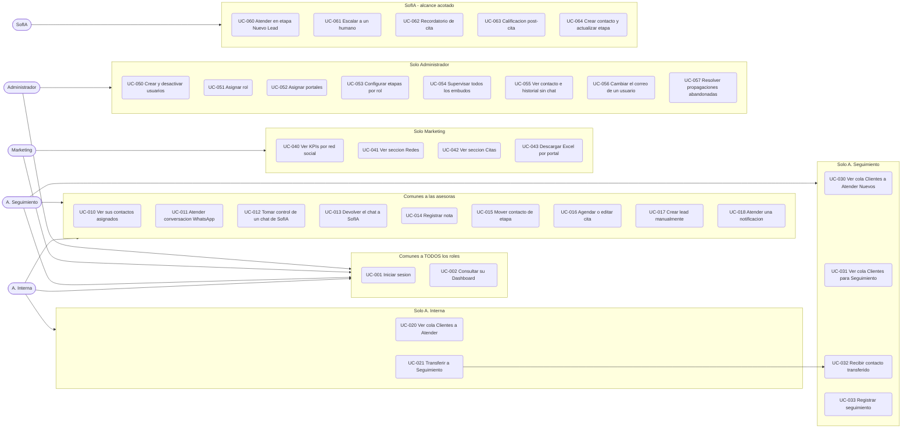

# D-05 · Casos de uso

> **Estado:** ✅ **v2 — cerrado el 2026-08-27.** Los 34 casos tienen criterios de aceptación verificables.
> Extraído de [D-02 §10](02-actores-y-roles.md), ampliado con criterios y con los dos casos que nacen de [ADR-006](14-adrs.md) y del rediseño de notificaciones.
> **Depende de:** [D-01 Glosario](01-glosario.md) · [D-02 Actores y roles](02-actores-y-roles.md) · [D-06 Permisos](06-matriz-permisos.md)
> **Diagrama aprobado por CyberTovar** el 2026-08-15.

---

## 1. Mapa de casos de uso



> ⚠️ **El Administrador no se conecta a `COMUN`**: ve las interfaces de las asesoras pero **no responde conversaciones ni tiene contactos asignados**.

---

## 2. Inventario

| # | Caso de uso | Actor | Prioridad |
|---|---|---|---|
| UC-001 | Iniciar sesión | Todos | 🔴 |
| UC-002 | Consultar su Dashboard | Todos | 🔴 |
| UC-010 | Ver sus contactos asignados | Asesoras | 🔴 |
| UC-011 | Atender conversación de WhatsApp | Asesoras | 🔴 |
| UC-012 | Tomar control de un chat de SofIA | Asesoras | 🟠 |
| UC-013 | Devolver el chat a SofIA | Asesoras | 🟡 |
| UC-014 | Registrar nota en el contacto | Asesoras | 🟠 |
| UC-015 | Mover contacto de etapa | Asesoras | 🔴 |
| UC-016 | Agendar o editar cita | Asesoras | 🟠 |
| UC-017 | Crear lead manualmente | Asesoras | 🟡 |
| **UC-018** | **Atender una notificación** | Asesoras | 🔴 |
| UC-020 | Ver cola `Clientes a Atender` | A. Interna | 🔴 |
| UC-021 | Transferir contacto a Seguimiento | A. Interna | 🔴 |
| UC-030 | Ver cola `Clientes a Atender Nuevos` | A. Seguimiento | 🔴 |
| UC-031 | Ver cola `Clientes para Seguimiento` | A. Seguimiento | 🔴 |
| UC-032 | Recibir contacto transferido | A. Seguimiento | 🔴 |
| UC-033 | Registrar seguimiento | A. Seguimiento | 🟠 |
| UC-040 | Ver KPIs por red social | Marketing | 🟠 |
| UC-041 | Ver sección `Redes` | Marketing | 🟠 |
| UC-042 | Ver sección `Citas` | Marketing | 🟠 |
| UC-043 | Descargar Excel por portal | Marketing | 🟡 |
| UC-050 | Crear y desactivar usuarios | Administrador | 🔴 |
| UC-051 | Asignar rol a un usuario | Administrador | 🔴 |
| UC-052 | Asignar portales a un usuario | Administrador | 🔴 |
| UC-053 | Configurar etapas visibles por rol | Administrador | 🟠 |
| UC-054 | Supervisar todos los embudos | Administrador | 🟠 |
| UC-055 | Ver contacto e historial sin chat | Administrador · Marketing | 🟠 |
| UC-056 | Cambiar el correo de un usuario | Administrador | 🟡 |
| **UC-057** | **Resolver propagaciones abandonadas** | Administrador | 🟠 |
| UC-060 | Atender contactos en `Nuevo Lead` | SofIA | 🔴 |
| UC-061 | Escalar a un humano | SofIA | 🔴 |
| UC-062 | Enviar recordatorio de cita | SofIA | 🟠 |
| UC-063 | Enviar calificación post-cita | SofIA | 🟠 |
| UC-064 | Crear contacto y actualizar etapa | SofIA | 🔴 |

**34 casos de uso · 5 actores.** Los dos últimos nacen del rediseño, no del sistema actual:

| # | Por qué es nuevo |
|---|---|
| **UC-018** | Las notificaciones existen hoy, pero repartidas en **6 archivos y 3 persistencias**. Al rediseñarlas como entidad derivada de eventos ([D-18 §3](18-migracion.md)) hace falta describir qué significa "atender" una |
| **UC-057** | Lo crea [ADR-006](14-adrs.md). Si una propagación falla de forma permanente, **alguien tiene que poder resolverla** — es lo que impide volver a la pérdida silenciosa de hoy |

---

## 3. Criterios de aceptación — casos críticos

### UC-001 · Iniciar sesión

**Actor:** cualquier rol · **Precondición:** el correo está dado de alta y activo

```gherkin
Dado que soy una asesora con correo registrado y activo
Cuando pulso "Continuar con Google" y me autentico
Entonces entro a la interfaz de MI rol
Y mi sesion dura 12 horas con renovacion mientras haya actividad

Dado que mi correo NO esta en la tabla de usuarios
Cuando me autentico correctamente en Google
Entonces se me deniega el acceso
Y el mensaje de error es identico al de cualquier otro fallo

Dado que el Administrador desactivo mi usuario
Cuando intento usar una sesion ya abierta
Entonces la sesion queda invalidada de inmediato
```

> 🔑 El mensaje de error debe ser **idéntico** en todos los casos para no permitir enumerar correos válidos.

### UC-010 · Ver sus contactos asignados

```gherkin
Dado que soy A. Interna
Cuando abro la seccion Lead
Entonces veo UNICAMENTE los contactos cuyo propietario soy yo
Y veo las 7 etapas del embudo y solo los grupos de propiedades de mi rol

Dado que manipulo la peticion para pedir contactos de otra asesora
Cuando el servidor la procesa
Entonces no devuelve ningun contacto ajeno
```

> 🔴 **El aislamiento se aplica en la consulta a base de datos, no en el filtro del frontend.**

### UC-015 · Mover contacto de etapa

```gherkin
Dado que arrastro una tarjeta a otra columna del Kanban
Cuando suelto la tarjeta
Entonces la etapa cambia en menos de 5 segundos
Y se registra un evento "cambio de etapa" en el Historial de Contacto
Y el cambio se propaga a HubSpot en segundo plano

Dado que la propagacion a HubSpot falla
Cuando reviso el contacto
Entonces la etapa sigue mostrando el valor nuevo
Y la propagacion se reintenta sin intervencion
```

### UC-021 · Transferir contacto a Seguimiento

```gherkin
Dado que soy A. Interna y tengo un contacto asignado
Cuando ejecuto la transferencia a A. Seguimiento
Entonces se me pide confirmacion
Y el contacto cambia de propietario
Y aparece en la cola "Clientes para Seguimiento"
Y desaparece de mi cola
Y se registra un evento de transferencia

Dado que soy A. Seguimiento
Cuando intento devolver un contacto a A. Interna
Entonces la accion no esta disponible
```

> ⚠️ **Sin retorno.** Una transferencia equivocada solo la corrige el Administrador. Por eso se pide confirmación.

> 🔴 **Cambio respecto de hoy — decidido el 2026-08-28 (P-6.7).** Hoy esta transferencia **no tiene botón**: se dispara sola al mover el contacto a cualquiera de las 10 etapas de `STAGES_TRANSFER_TO_LUISA` (`outbound_panel.py:129`). Cambiar el presupuesto a `Hasta 2M` **regala el contacto sin avisar**.
> En el destino, **cambiar una propiedad no transfiere nada**: la transferencia es esta acción explícita. Ver [D-06 §12](06-matriz-permisos.md).

### UC-061 · SofIA escala a un humano

```gherkin
Dado que un contacto esta en etapa "Nuevo Lead" y lo atiende SofIA
Cuando SofIA detecta que debe escalar
Entonces el contacto queda asignado a la persona duena del canal
Y se registra un evento de escalamiento con motivo y confianza
Y el contacto entra en la cola de esa asesora

Dado que el LLM no responde
Cuando SofIA no puede procesar el mensaje
Entonces escala a un humano en lugar de quedarse en silencio
```

> 🔴 **Degradación segura**: si el motor de IA falla, se escala. Nunca se deja al cliente sin respuesta.

### UC-052 · Asignar portales a un usuario

```gherkin
Dado que soy Administrador
Cuando asigno el portal "FincaRaiz" a un usuario
Entonces los leads NUEVOS de ese portal se le asignan a el
Y los contactos YA asignados conservan su propietario actual

Dado que abro el selector de portales
Entonces la lista proviene del registro de canales
Y no de una lista escrita a mano en el frontend
```

### UC-055 · Ver contacto e historial sin chat

```gherkin
Dado que soy Administrador o Marketing
Cuando abro el detalle de un contacto
Entonces veo Historial de Notas e Historial de Contacto
Y NO veo el hilo de mensajes de la conversacion

Dado que intento acceder directamente al recurso de conversacion
Cuando el servidor procesa la peticion
Entonces la deniega
```

> 🔑 `Historial de Contacto` y `Conversación` son **dos recursos separados con permisos independientes**.

---

## 4. Criterios de aceptación — resto del inventario

> ✅ **Completado el 2026-08-27.** Este documento ya no deja casos sin criterio: los 34 tienen condición de aceptación verificable.

### 4.1 Comunes a todos los roles

#### UC-002 · Consultar su Dashboard

```gherkin
Dado que inicio sesion con cualquier rol
Cuando se abre la aplicacion
Entonces aterrizo en el Dashboard de MI rol, no en uno generico
Y las cifras corresponden unicamente al alcance que mi rol puede ver
Y la ventana semanal va de lunes a sabado para todos los roles

Dado que el domingo no pertenece a ninguna semana
Cuando ocurre una cita en domingo
Entonces se declara explicitamente como no contabilizada
```

> ⚠️ El domingo fuera de ventana es una decisión tomada, no un descuido. Está señalado en [D-02 §26](02-actores-y-roles.md) por si se quiere revisar.

### 4.2 Comunes a las asesoras

#### UC-011 · Atender conversación de WhatsApp

```gherkin
Dado que tengo una conversacion asignada a mi
Cuando escribo y envio un mensaje
Entonces el cliente lo recibe y el mensaje queda en el historial
Y la conversacion sube al principio de mi bandeja

Dado que han pasado mas de 24 h desde el ultimo mensaje del cliente
Cuando abro esa conversacion
Entonces el modo de envio es "solo plantillas" y se me indica por que
Y la conversacion NO cambia de dueno: sigue siendo mia
```

> 🔑 Esta es la decisión **Opción A**: la ventana de 24 h cambia **el modo de envío**, no el asignatario.

#### UC-012 · Tomar control de un chat de SofIA

```gherkin
Dado que SofIA esta atendiendo un contacto que me pertenece
Cuando tomo el control
Entonces el asignatario pasa de "sofia" a mi usuario
Y SofIA deja de responder de inmediato en esa conversacion
Y se registra un evento de escalamiento manual

Dado que dos asesoras intentan tomar el mismo chat a la vez
Cuando ambas pulsan tomar control
Entonces solo una lo consigue y la otra recibe un aviso claro
```

#### UC-013 · Devolver el chat a SofIA

```gherkin
Dado que tengo un contacto asignado a mi
Cuando lo devuelvo a SofIA
Entonces el asignatario pasa a "sofia" y ella retoma la conversacion
Y se registra el evento con quien lo devolvio

Dado que el contacto esta en una etapa donde SofIA no opera
Cuando intento devolverlo
Entonces la accion no esta disponible y se explica el motivo
```

> 🔑 SofIA tiene **alcance acotado** (UC-060). Devolverle un contacto en `En Estudio` no tendría sentido.

#### UC-014 · Registrar nota en el contacto

```gherkin
Dado que abro un contacto mio
Cuando escribo una nota y la guardo
Entonces queda con mi nombre y la fecha, y es inmediatamente visible
Y no puede editarse ni borrarse despues

Dado que la nota contiene datos del cliente
Cuando se propaga a HubSpot
Entonces viaja por la cola de propagacion, no dentro de mi peticion
```

> ⚠️ **Las notas no se editan ni se borran.** Es un registro, no un documento — el mismo criterio que el Historial de Contacto.

#### UC-016 · Agendar o editar cita

```gherkin
Dado que tengo un contacto asignado
Cuando agendo una cita con fecha, hora y asesora
Entonces el contacto pasa a "Visita Agendada"
Y se programa el recordatorio previo (UC-062)
Y se programa la calificacion post-cita (UC-063)

Dado que cambio la fecha de una cita ya agendada
Cuando guardo el cambio
Entonces el recordatorio y la calificacion se reprograman con la fecha nueva
Y NO se envia el recordatorio de la fecha anterior

Dado que cancelo la cita
Entonces se cancelan ambos envios programados
Y la etapa NO retrocede sola: la decide la asesora
```

> 🔴 **Reprogramar y cancelar son la parte que más falla en este tipo de módulo.** El ciclo de citas actual ya lo resuelve —es el módulo de mayor cohesión del sistema, 0,747— y `was_notification_sent` ya evita el envío doble. Se conserva.

#### UC-017 · Crear lead manualmente

```gherkin
Dado que un cliente me escribe por un canal no integrado
Cuando creo el contacto a mano con su telefono
Entonces el telefono se normaliza antes de guardarse
Y si ya existe un contacto con ese telefono, se me avisa y NO se duplica
Y el contacto queda asignado a mi
Y su canal de origen se marca como creado manualmente
```

> 🔑 `phone_normalizer` (fan-in 31) es la base de la identidad del contacto. Con la clave pasando de `(teléfono, canal)` a `teléfono`, **la deduplicación deja de ser opcional**.

#### UC-018 · Atender una notificación 🆕

```gherkin
Dado que ocurre algo que requiere mi atencion
Cuando se genera la notificacion
Entonces aparece en la campana, en el contador y en el chip del contacto
Y las tres vistas muestran SIEMPRE lo mismo

Dado que abro la conversacion o el contacto notificado
Cuando termino de verlo
Entonces la notificacion queda atendida en las tres vistas a la vez

Dado que el mismo hecho se produce dos veces seguidas
Cuando se generan las notificaciones
Entonces NO recibo dos avisos duplicados del mismo hecho

Dado que recargo la pagina o entro desde otro dispositivo
Cuando se dibuja la interfaz
Entonces veo exactamente las mismas notificaciones pendientes
```

> 🔴 **Este caso de uso es la especificación del módulo que hay que rediseñar.** Hoy las notificaciones viven en 6 archivos y 3 persistencias (memoria del frontend, DOM y Redis), y existe un endpoint —`cleanup_stale_inbox`— dedicado a limpiar la basura que ese diseño genera.
>
> Los dos últimos escenarios son los que hoy fallan: **la deduplicación y la persistencia real**. El patrón `was_notification_sent` del ciclo de citas ya resuelve el primero — se extiende aquí.

### 4.3 Solo A. Interna

#### UC-020 · Ver cola `Clientes a Atender`

```gherkin
Dado que soy A. Interna
Cuando abro mi cola
Entonces veo mis contactos que esperan primera atencion, mas antiguo primero
Y cada uno muestra cuanto lleva esperando

Dado que un contacto lleva mas de la ventana acordada sin respuesta
Entonces se destaca visualmente
```

> 🔑 **Es el caso de uso que ataca el número que duele:** mediana de 30 min, pero **p90 de 24,1 h**. 1 de cada 10 clientes espera más de un día.

### 4.4 Solo A. Seguimiento

#### UC-030 · Ver cola `Clientes a Atender Nuevos` · UC-031 · Ver cola `Clientes para Seguimiento`

```gherkin
Dado que soy A. Seguimiento
Cuando abro mi interfaz
Entonces veo DOS colas separadas y no mezcladas:
  · los leads nuevos que entran por mis portales (Finca Raiz, MetroCuadrado)
  · los contactos que me transfirio A. Interna
Y cada cola tiene su propio orden y su propio contador
```

> 🔑 **Es la prueba de que canal y rol son ortogonales.** Luisa recibe leads nuevos **por canal** y contactos transferidos **por rol**. Las dos colas son las dos dimensiones.

#### UC-032 · Recibir contacto transferido

```gherkin
Dado que A. Interna me transfiere un contacto
Cuando se completa la transferencia
Entonces aparece en mi cola de seguimiento con TODO su historial previo
Y veo quien me lo transfirio y cuando
Y recibo una notificacion (UC-018)
```

#### UC-033 · Registrar seguimiento

```gherkin
Dado que atiendo un contacto transferido
Cuando registro el resultado del seguimiento
Entonces queda como nota y como evento en el Historial de Contacto
Y si corresponde, actualizo presupuesto, segmento o motivo de cierre
Y esos tres campos son independientes de la etapa del embudo
```

### 4.5 Solo Marketing

#### UC-040 · KPIs por red social · UC-041 · Sección `Redes` · UC-042 · Sección `Citas`

```gherkin
Dado que soy Marketing
Cuando abro mi Dashboard
Entonces veo dos conjuntos de datos separados:
  · rendimiento por canal de captacion
  · citas generadas
Y en ningun momento puedo abrir el hilo de una conversacion

Dado que un canal genera leads pero no tiene indicador propio
Cuando reviso la seccion Redes
Entonces ese canal aparece igualmente, con sus leads contados
```

> ⚠️ **M-2:** LinkedIn y YouTube generan leads hoy y **no tienen ningún indicador**. La sección debe listarlos, no omitirlos por no tener KPI definido.

#### UC-043 · Descargar Excel por portal

```gherkin
Dado que soy Marketing o Administrador
Cuando exporto los datos de un portal
Entonces el archivo contiene solo columnas que mi rol puede ver
Y NO contiene contenido de mensajes
Y la descarga queda registrada como evento con quien la hizo
```

> 🔴 **Una exportación es una salida de PII fuera del sistema.** Registrar quién exportó qué no es burocracia: es lo que permite responder si un día hay que hacerlo.

### 4.6 Solo Administrador

#### UC-050 · Crear y desactivar usuarios

```gherkin
Dado que soy Administrador
Cuando doy de alta un usuario con su correo y su rol
Entonces puede iniciar sesion de inmediato (UC-001)
Y queda registrado quien lo creo y cuando

Dado que desactivo un usuario
Entonces su sesion abierta se invalida de inmediato
Y sus contactos NO se quedan sin dueno: se me exige reasignarlos
Y el usuario no se borra, se marca inactivo
```

> 🔴 **"Se me exige reasignarlos" es deliberado.** Hoy hay 0 contactos sin dueño y esa cifra no debe romperse al desactivar a alguien.

#### UC-051 · Asignar rol · UC-053 · Configurar etapas y propiedades por rol

```gherkin
Dado que cambio el rol de un usuario
Cuando guardo
Entonces su navegacion y sus permisos cambian sin necesidad de desplegar
Y si tiene sesion abierta, se le aplican los permisos nuevos

Dado que configuro que ve cada rol
Entonces manejo etapas del embudo y grupos de propiedades por separado
Y el cambio se aplica en la consulta a base de datos, no en el frontend
```

> 🔑 **Esto es lo que hoy exige editar código y desplegar.** `advisors_registry.py` ya declara `receives_leads`, `uses_panel` y `receives_transfers` — un modelo de roles embrionario. Este caso de uso lo saca del código a la base de datos.

#### UC-054 · Supervisar todos los embudos

```gherkin
Dado que soy Administrador
Cuando abro la supervision
Entonces veo el embudo completo de todas las asesoras
Y puedo filtrar por asesora, canal y periodo
Y NO puedo abrir ninguna conversacion

Dado que quiero comparar el rendimiento entre asesoras
Entonces la ventana semanal es la MISMA que ve cada asesora
```

> ⚠️ Si las ventanas no coinciden, el Administrador y la asesora ven números distintos del mismo periodo y **ninguno de los dos se fía del sistema**.

#### UC-056 · Cambiar el correo de un usuario

```gherkin
Dado que una asesora cambia de correo
Cuando actualizo su correo
Entonces conserva su identidad, su historial y sus contactos
Y su sesion anterior se invalida
Y queda registrado el cambio con el correo antiguo y el nuevo
```

> 🔑 Cubre **A-4**: qué pasa si alguien pierde el acceso a su Gmail. El usuario es la persona, no el correo.

#### UC-057 · Resolver propagaciones abandonadas 🆕

```gherkin
Dado que una escritura hacia HubSpot agoto sus reintentos
Cuando entro en la pantalla de administracion
Entonces la veo listada con la entidad, el contacto y el ultimo error
Y puedo reencolarla o descartarla dejando constancia

Dado que decido reencolarla
Entonces vuelve a "pendiente" con los intentos a cero

Dado que hay elementos abandonados sin resolver
Entonces se me avisa de forma activa, sin depender de que abra la pantalla

Dado que un elemento queda abandonado
Entonces la cola NO se bloquea: el resto sigue entregandose
```

> 🔴 **Es la garantía que elimina la pérdida silenciosa.** Hoy, si HubSpot falla, el cambio se esfuma sin dejar rastro en ninguna parte. Ver [ADR-006 §3.4](14-adrs.md).

### 4.7 SofIA

#### UC-060 · Atender contactos en `Nuevo Lead`

```gherkin
Dado que entra un lead nuevo por cualquier canal
Cuando SofIA lo atiende
Entonces responde en menos de 5 minutos
Y opera UNICAMENTE mientras el contacto esta en "Nuevo Lead"
Y nunca mueve el contacto a una etapa de cierre
```

> ✅ **Este criterio ya se cumple hoy:** 0,7 min de mediana y 95 % bajo 5 minutos. **El problema del sistema nunca fue SofIA.**

#### UC-062 · Recordatorio de cita · UC-063 · Calificación post-cita

```gherkin
Dado que un contacto tiene una cita agendada
Cuando llega el momento del recordatorio
Entonces se envia una sola vez, aunque el proceso se reinicie
Y si la cita se movio o cancelo, no se envia

Dado que la cita ya paso
Cuando se cumple el plazo posterior
Entonces se envia la calificacion vinculada al inmueble concreto
Y solo una vez
```

> 🔑 **"Una sola vez, aunque el proceso se reinicie"** es lo que garantiza `was_notification_sent`. Railway reinicia procesos con normalidad; sin esa marca, un reinicio a mitad de tanda reenvía.

#### UC-064 · Crear contacto y actualizar etapa

```gherkin
Dado que llega un mensaje de un telefono desconocido
Cuando SofIA lo procesa
Entonces crea el contacto con el canal de origen correcto
Y lo asigna a la persona duena de ese canal
Y lo situa en "Nuevo Lead"

Dado que el contacto YA existe
Cuando SofIA lo procesa
Entonces NO cambia su etapa ni su propietario
```

> 🔴 **El segundo escenario corrige un fallo real y confirmado.** Hoy `crm_agent.py:592` escribe `lifecyclestage = En Conversacion` al actualizar contactos existentes: **saca leads del embudo de entrada sin que ninguna asesora haya contestado.**

## 5. Fuera de alcance

| No es caso de uso | Motivo |
|---|---|
| Posponer una conversación | ✅ Decidido: no habrá esa función |
| Archivar una conversación | ✅ Decidido: no habrá módulo de archivado |
| Devolver un contacto de Seguimiento a Interna | ✅ Decidido: la transferencia es unidireccional |
| Que el Administrador responda conversaciones | ✅ Decidido: observa y configura, no conversa |
