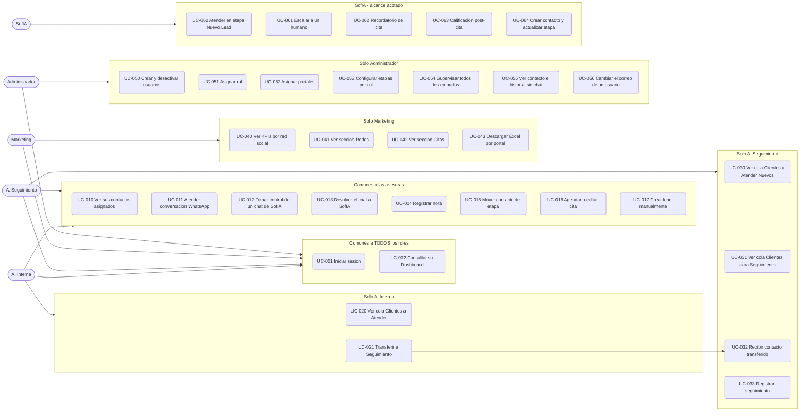

# D-05 · Casos de uso

> **Estado:** v1 — extraído de [D-02 §10](02-actores-y-roles.md) y ampliado con criterios de aceptación.
> **Depende de:** [D-01 Glosario](01-glosario.md) · [D-02 Actores y roles](02-actores-y-roles.md) · [D-06 Permisos](06-matriz-permisos.md)
> **Diagrama aprobado por CyberTovar** el 2026-08-15.

---

## 1. Mapa de casos de uso



> ⚠️ **El Administrador no se conecta a `COMUN`**: ve las interfaces de las asesoras pero **no responde conversaciones ni tiene contactos asignados**.

---

## 2. Inventario

| # | Caso de uso | Actor | Prioridad |
|---|---|---|---|
| UC-001 | Iniciar sesión | Todos | 🔴 |
| UC-002 | Consultar su Dashboard | Todos | 🔴 |
| UC-010 | Ver sus contactos asignados | Asesoras | 🔴 |
| UC-011 | Atender conversación de WhatsApp | Asesoras | 🔴 |
| UC-012 | Tomar control de un chat de SofIA | Asesoras | 🟠 |
| UC-013 | Devolver el chat a SofIA | Asesoras | 🟡 |
| UC-014 | Registrar nota en el contacto | Asesoras | 🟠 |
| UC-015 | Mover contacto de etapa | Asesoras | 🔴 |
| UC-016 | Agendar o editar cita | Asesoras | 🟠 |
| UC-017 | Crear lead manualmente | Asesoras | 🟡 |
| UC-020 | Ver cola `Clientes a Atender` | A. Interna | 🔴 |
| UC-021 | Transferir contacto a Seguimiento | A. Interna | 🔴 |
| UC-030 | Ver cola `Clientes a Atender Nuevos` | A. Seguimiento | 🔴 |
| UC-031 | Ver cola `Clientes para Seguimiento` | A. Seguimiento | 🔴 |
| UC-032 | Recibir contacto transferido | A. Seguimiento | 🔴 |
| UC-033 | Registrar seguimiento | A. Seguimiento | 🟠 |
| UC-040 | Ver KPIs por red social | Marketing | 🟠 |
| UC-041 | Ver sección `Redes` | Marketing | 🟠 |
| UC-042 | Ver sección `Citas` | Marketing | 🟠 |
| UC-043 | Descargar Excel por portal | Marketing | 🟡 |
| UC-050 | Crear y desactivar usuarios | Administrador | 🔴 |
| UC-051 | Asignar rol a un usuario | Administrador | 🔴 |
| UC-052 | Asignar portales a un usuario | Administrador | 🔴 |
| UC-053 | Configurar etapas visibles por rol | Administrador | 🟠 |
| UC-054 | Supervisar todos los embudos | Administrador | 🟠 |
| UC-055 | Ver contacto e historial sin chat | Administrador · Marketing | 🟠 |
| UC-056 | Cambiar el correo de un usuario | Administrador | 🟡 |
| UC-060 | Atender contactos en `Nuevo Lead` | SofIA | 🔴 |
| UC-061 | Escalar a un humano | SofIA | 🔴 |
| UC-062 | Enviar recordatorio de cita | SofIA | 🟠 |
| UC-063 | Enviar calificación post-cita | SofIA | 🟠 |
| UC-064 | Crear contacto y actualizar etapa | SofIA | 🔴 |

**32 casos de uso · 5 actores.**

---

## 3. Criterios de aceptación — casos críticos

### UC-001 · Iniciar sesión

**Actor:** cualquier rol · **Precondición:** el correo está dado de alta y activo

```gherkin
Dado que soy una asesora con correo registrado y activo
Cuando pulso "Continuar con Google" y me autentico
Entonces entro a la interfaz de MI rol
Y mi sesion dura 12 horas con renovacion mientras haya actividad

Dado que mi correo NO esta en la tabla de usuarios
Cuando me autentico correctamente en Google
Entonces se me deniega el acceso
Y el mensaje de error es identico al de cualquier otro fallo

Dado que el Administrador desactivo mi usuario
Cuando intento usar una sesion ya abierta
Entonces la sesion queda invalidada de inmediato
```

> 🔑 El mensaje de error debe ser **idéntico** en todos los casos para no permitir enumerar correos válidos.

### UC-010 · Ver sus contactos asignados

```gherkin
Dado que soy A. Interna
Cuando abro la seccion Lead
Entonces veo UNICAMENTE los contactos cuyo propietario soy yo
Y veo unicamente las 11 etapas de mi rol

Dado que manipulo la peticion para pedir contactos de otra asesora
Cuando el servidor la procesa
Entonces no devuelve ningun contacto ajeno
```

> 🔴 **El aislamiento se aplica en la consulta a base de datos, no en el filtro del frontend.**

### UC-015 · Mover contacto de etapa

```gherkin
Dado que arrastro una tarjeta a otra columna del Kanban
Cuando suelto la tarjeta
Entonces la etapa cambia en menos de 5 segundos
Y se registra un evento "cambio de etapa" en el Historial de Contacto
Y el cambio se propaga a HubSpot en segundo plano

Dado que la propagacion a HubSpot falla
Cuando reviso el contacto
Entonces la etapa sigue mostrando el valor nuevo
Y la propagacion se reintenta sin intervencion
```

### UC-021 · Transferir contacto a Seguimiento

```gherkin
Dado que soy A. Interna y tengo un contacto asignado
Cuando ejecuto la transferencia a A. Seguimiento
Entonces se me pide confirmacion
Y el contacto cambia de propietario
Y aparece en la cola "Clientes para Seguimiento"
Y desaparece de mi cola
Y se registra un evento de transferencia

Dado que soy A. Seguimiento
Cuando intento devolver un contacto a A. Interna
Entonces la accion no esta disponible
```

> ⚠️ **Sin retorno.** Una transferencia equivocada solo la corrige el Administrador. Por eso se pide confirmación.

### UC-061 · SofIA escala a un humano

```gherkin
Dado que un contacto esta en etapa "Nuevo Lead" y lo atiende SofIA
Cuando SofIA detecta que debe escalar
Entonces el contacto queda asignado a la persona duena del canal
Y se registra un evento de escalamiento con motivo y confianza
Y el contacto entra en la cola de esa asesora

Dado que el LLM no responde
Cuando SofIA no puede procesar el mensaje
Entonces escala a un humano en lugar de quedarse en silencio
```

> 🔴 **Degradación segura**: si el motor de IA falla, se escala. Nunca se deja al cliente sin respuesta.

### UC-052 · Asignar portales a un usuario

```gherkin
Dado que soy Administrador
Cuando asigno el portal "FincaRaiz" a un usuario
Entonces los leads NUEVOS de ese portal se le asignan a el
Y los contactos YA asignados conservan su propietario actual

Dado que abro el selector de portales
Entonces la lista proviene del registro de canales
Y no de una lista escrita a mano en el frontend
```

### UC-055 · Ver contacto e historial sin chat

```gherkin
Dado que soy Administrador o Marketing
Cuando abro el detalle de un contacto
Entonces veo Historial de Notas e Historial de Contacto
Y NO veo el hilo de mensajes de la conversacion

Dado que intento acceder directamente al recurso de conversacion
Cuando el servidor procesa la peticion
Entonces la deniega
```

> 🔑 `Historial de Contacto` y `Conversación` son **dos recursos separados con permisos independientes**.

---

## 4. Casos de uso pendientes de detallar

Los 25 restantes tienen actor y prioridad definidos, pero aún **sin criterios de aceptación**. Se escriben antes de pasar a desarrollo — forman parte de la *Definition of Ready* (D-21).

## 5. Fuera de alcance

| No es caso de uso | Motivo |
|---|---|
| Posponer una conversación | ✅ Decidido: no habrá esa función |
| Archivar una conversación | ✅ Decidido: no habrá módulo de archivado |
| Devolver un contacto de Seguimiento a Interna | ✅ Decidido: la transferencia es unidireccional |
| Que el Administrador responda conversaciones | ✅ Decidido: observa y configura, no conversa |
