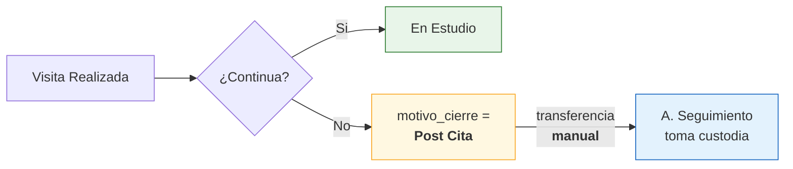
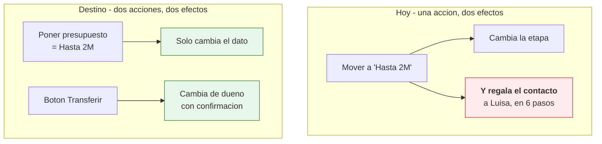

# D-06 · Matriz de permisos

> **Estado:** ✅ **v2 — cerrado el 2026-08-27.** §4 reescrita para el modelo de 7 etapas + 3 grupos de propiedades; auditoria definida; recursos nuevos incorporados.
> Extraído de [D-02 §6 y §13](02-actores-y-roles.md).
> **Depende de:** [D-02 Actores y roles](02-actores-y-roles.md) · [ADR-001 Autenticación](14-adrs.md)
> **Principio rector:** el rol se resuelve **en el backend** desde la sesión, y el aislamiento se aplica **en la consulta a base de datos**. Nunca en el frontend.

---

## 1. Los cuatro roles

| Rol | Quién es hoy | Naturaleza |
|---|---|---|
| **A. Interna** | Jubeny Ocampo · Monica Administracion | Opera: atiende el primer contacto |
| **A. Seguimiento** | Luisa Muñoz | Opera: da continuidad |
| **Marketing** | Publicidad Proteger ⚠️ | Solo lectura: métricas y datos, sin conversaciones |
| **Administrador** | Salo Tovar · Hector Guerra | Configura y supervisa. **No conversa** |

> ⚠️ "Publicidad Proteger" es hoy un owner que no es una persona. Con la regla de correo único (A-6) debe pasar a ser la cuenta de alguien real.

---

## 2. Navegación por rol

**La navegación es distinta por rol** — no es la misma pantalla con botones desactivados.

| Rol | Secciones |
|---|---|
| A. Interna · A. Seguimiento | `Dashboard` · `Lead` · `WhatsApp` |
| Administrador | `Dashboard` · `Lead` + ⚙ configuración |
| Marketing | `Dashboard` · `Redes` · `Citas` |

---

## 3. Matriz rol × recurso × acción

**Leyenda:** ✅ permitido · ❌ denegado · 🔵 solo los propios · — no aplica

| Recurso | Acción | A. Interna | A. Seguimiento | Marketing | Administrador | SofIA |
|---|---|---|---|---|---|---|
| **Contacto** | Ver | 🔵 propios | 🔵 propios | ✅ todos | ✅ todos | ✅ todos |
| | Crear | ✅ | ✅ | ❌ | ❌ | ✅ |
| | Editar datos | 🔵 | 🔵 | ❌ | ✅ | ✅ |
| | Eliminar | ❌ | ❌ | ❌ | ❌ | ❌ |
| | Reasignar propietario | ❌ | ❌ | ❌ | ✅ | ❌ |
| **Conversación** | Leer el hilo | 🔵 | 🔵 | ❌ | ❌ | ✅ |
| | Responder | 🔵 | 🔵 | ❌ | ❌ | ✅ acotado |
| **Historial de Contacto** | Ver | 🔵 | 🔵 | ✅ | ✅ | ✅ |
| **Historial de Notas** | Ver | 🔵 | 🔵 | ✅ | ✅ | ❌ |
| | Crear nota | ✅ | ✅ | ❌ | ❌ | ❌ |
| **Etapa** | Cambiar | 🔵 | 🔵 | ❌ | ✅ | ✅ acotado |
| **Cita** | Agendar · editar · cancelar | 🔵 | 🔵 | ❌ | ❌ | ❌ |
| | Ver | 🔵 | 🔵 | ✅ | ✅ | ✅ |
| **Transferencia** | A. Interna → A. Seguimiento | ✅ | ❌ | ❌ | — | ❌ |
| **Métricas** | Ver | ❌ | ❌ | ✅ | ✅ | ❌ |
| | Exportar a Excel | ❌ | ❌ | ✅ | ✅ | ❌ |
| **Usuario** | Crear · desactivar · editar correo | ❌ | ❌ | ❌ | ✅ | ❌ |
| | Asignar rol · asignar portales | ❌ | ❌ | ❌ | ✅ | ❌ |
| **Canal** | Configurar | ❌ | ❌ | ❌ | ✅ | ❌ |
| **Interés** 🆕 | Ver | 🔵 | 🔵 | ✅ agregado | ✅ | ✅ |
| | Crear · editar | 🔵 | 🔵 | ❌ | ✅ | ✅ detectado |
| | Eliminar | ❌ | ❌ | ❌ | ❌ | ❌ |
| **Evento** 🆕 | Ver | 🔵 | 🔵 | ✅ | ✅ | ❌ |
| | Crear · editar · borrar | ❌ **nadie** | ❌ | ❌ | ❌ | ❌ |
| **Notificación** 🆕 | Ver · marcar atendida | 🔵 propias | 🔵 propias | ❌ | 🔵 propias | ❌ |
| **Cola de propagación** 🆕 | Ver · reencolar · descartar | ❌ | ❌ | ❌ | ✅ | ❌ |

### Reglas transversales

| # | Regla |
|---|---|
| 1 | **Aislamiento entre asesoras: total.** Ninguna ve los contactos de otra |
| 2 | **Marketing y Administrador nunca leen conversaciones.** Ven el contacto y su historial, no el chat |
| 3 | **El Administrador no tiene contactos asignados** y no puede responder |
| 4 | **Nadie elimina contactos.** Ni siquiera el Administrador |
| 5 | Solo A. Interna transfiere, y **solo en un sentido** |
| 6 | SofIA nunca reasigna propietarios ni mueve a etapas de cierre |
| 7 | 🆕 **`Evento` es de solo lectura para todo el mundo.** Nadie lo crea, edita ni borra a mano — lo escribe el sistema. Es lo que lo hace utilizable como registro de auditoría |
| 8 | 🆕 **La cola de propagación es exclusiva del Administrador.** Una asesora no puede hacer nada útil con un `400` de HubSpot |
| 9 | 🆕 Las notas **no se editan ni se borran** una vez guardadas. Mismo criterio que `Evento` |

---

## 4. Matriz de etapas y propiedades por rol

> ✅ **Reescrita el 2026-08-27**, ahora que [D-10 §4.1](10-modelo-de-datos.md) cerró el modelo. La versión anterior listaba las 21 etapas excluyentes de HubSpot; **ese modelo ya no existe en el destino.**

**El permiso cambia de naturaleza.** Antes era *"qué etapas ve cada rol"*. Ahora son dos preguntas distintas:

| | |
|---|---|
| **Las 7 etapas del embudo** | Las ve **todo el mundo**. Es el recorrido comercial y es el mismo para todos |
| **Los 3 grupos de propiedades** | **Ahí está el permiso.** Quién puede leerlos y quién puede escribirlos |

### 4.1 Etapas del embudo — comunes a todos los roles

| # | Etapa | ID HubSpot | Quién la ve | Quién la escribe |
|---|---|---|---|---|
| 1 | **Nuevo Lead** | `1417459250` | Todos | SofIA · Administrador |
| 2 | En Conversación | `1326623075` | Todos | Asesoras · SofIA · Admin |
| 3 | Visita Agendada | `marketingqualifiedlead` | Todos | Asesoras · Admin |
| 4 | Visita Realizada | `salesqualifiedlead` | Todos | Asesoras · Admin *(auto 1h30 post-cita)* |
| 5 | En Estudio | `opportunity` | Todos | Asesoras · Admin |
| 6 | Aprobado | `lead` | Todos | Asesoras · Admin |
| 7 | **Cerrado Ganado** | `customer` | Todos | Asesoras · Admin |

> ⚠️ **`Nuevo Lead` volvió a existir** el 12-ago-2026 con el ID `1417459250`. El anterior (`1326631578`) ya no existe. La carga 7 de migración en [D-18 §6](18-migracion.md) queda **resuelta**: no hay que crear la etapa, hay que apuntar al ID correcto.
>
> 🔑 **SofIA nunca escribe de la 2 en adelante.** Su alcance es `Nuevo Lead`, y de ahí escala (UC-061).

### 4.2 Grupos de propiedades — aquí sí hay permiso

| Grupo | Campo | Valores | Interna | Seguimiento | Marketing | Admin |
|---|---|---|---|---|---|---|
| **Presupuesto** | `presupuesto` | Hasta 1.5M · Hasta 2M · Hasta 2.5M · 3M+ | 👁 lee | ✅ **lee y escribe** | 👁 agregado | ✅ |
| **Segmento** | `segmento` | Propietarios · Otros Municipios · Otras Áreas · Local o Bodega · Reubicado | ✅ **lee y escribe** | ✅ **lee y escribe** | 👁 agregado | ✅ |
| **Cierre** | `motivo_cierre` | Post Cita · No Responde · Ya encontró · Cerrado Perdido · Venta | 👁 lee | ✅ **lee y escribe** | 👁 agregado | ✅ |

**Leyenda:** ✅ lee y escribe · 👁 solo lectura · *agregado* = ve totales, no contactos individuales

#### Por qué el reparto es ese

| Decisión | Motivo |
|---|---|
| **A. Interna escribe `segmento`** | Es lo que califica en el primer contacto: si es propietario, si busca en otro municipio, si es local o bodega |
| **A. Interna solo lee `presupuesto` y `motivo_cierre`** | Cuando cierra o afina presupuesto, el contacto **ya pasó a Seguimiento**. Si necesitara escribirlos, la transferencia estaría llegando tarde |
| **A. Seguimiento escribe los tres** | Es quien da continuidad hasta el cierre |
| **Marketing ve solo agregados** | Necesita *"cuántos leads de Finca Raíz cerraron"*, no quién es cada uno |

> 🔑 **Y esto es lo que arregla la incoherencia de fondo del modelo actual.** Hoy un contacto que es propietario **y** tiene presupuesto de 2M **y** ya hizo la visita solo puede ocupar **una** de esas tres casillas: `lifecyclestage` es excluyente. Con el reparto, las tres conviven.

### 4.3 De dónde sale cada valor — trazabilidad de la migración

Las 21 etapas de hoy no se pierden: se reparten. Es la carga 1 de [D-18 §6](18-migracion.md).

| Etapa de hoy | ID | Va a |
|---|---|---|
| Hasta 1.5M · Hasta 2M · Hasta 2.5M · De 3M en adelante | `1326623067` `1326631573` `1326632625` `1326631574` | `presupuesto` |
| Propietarios · Otros Municipios · Otras Áreas · Local o Bodega · Reubicados | `1326623069` `1326632628` `1326632209` `1326623539` `subscriber` | `segmento` |
| Post Cita · No Responde · Ya encontró · Cerrado Perdido · Ventas | `1407668893` `other` `1326623541` `evangelist` `1353539189` | `motivo_cierre` |

> 🔴 **Y aquí está la dificultad real:** un contacto que hoy está en `Hasta 2M` **no dice en qué punto del embudo está**. Su `etapa` hay que inferirla — la recomendación es hacerlo desde las **496 citas** de `appointments`, que es una fuente objetiva. Ver [D-18 §6](18-migracion.md).
>
> ⚠️ **`Post Cita` es un caso especial.** No es un motivo de cierre real: es un estado de seguimiento. Se conserva como valor por continuidad con lo que ya usan las asesoras, pero **conviene revisarlo** — ver §9.

---

## 5. Permisos a nivel de campo

| Campo | Quién lo ve |
|---|---|
| `Portal` (ticket de origen) | Todos los roles |
| `Link` (enlace de origen) | A. Interna · A. Seguimiento · Marketing · Administrador |
| `Fecha Formulario` | Marketing · Administrador |
| `Asignado` (propietario) | Administrador siempre; asesoras solo en sus contactos |
| Contenido de mensajes | Solo la asesora dueña y SofIA |
| 🆕 `presupuesto` · `motivo_cierre` | Escribe A. Seguimiento y Admin. A. Interna solo lee — ver §4.2 |
| 🆕 `segmento` | Escriben ambas asesoras y Admin |
| 🆕 `Interés` (inmueble consultado) | La asesora dueña, Admin y SofIA. Marketing solo en agregado |
| 🆕 Último error de la cola de propagación | **Solo Administrador.** Puede contener respuestas crudas de HubSpot |

> El caso de `Fecha Último Seguimiento` se retiró del diseño, pero el **principio de permiso por campo sigue vigente** — lo demuestran `Fecha Formulario` y `Link`.

---

## 6. Dónde se aplica cada control

| Capa | Qué controla | Riesgo si se omite |
|---|---|---|
| **Sesión** (cookie `HttpOnly`) | Quién eres | Suplantación |
| **Backend — resolución de rol** | Qué puedes hacer | Un rol falsificado desde el cliente |
| **Consulta a base de datos** | Qué registros ves | 🔴 **Filtrar en el frontend = cualquiera ve todo con DevTools** |
| **Frontend** | Qué se dibuja | Solo comodidad. **Nunca es seguridad** |

---

## 7. Estado actual — punto de partida

| | Hoy | Destino |
|---|---|---|
| Control de acceso | **No existe** | Autorización en el backend por rol |
| Acceso al panel | Por enlace, sin credenciales | Google + sesión |
| Acceso a métricas | Clave de administrador **en la URL** | Rol Marketing con su propia sesión |
| Aislamiento entre asesoras | Depende del frontend | En la consulta a base de datos |
| Revocación | No existe | Inmediata al desactivar el usuario |

> 🔴 Hoy quien abre `/metrics/?key=…` tiene, de hecho, **credenciales de administrador**: es la misma `ADMIN_API_KEY` que da acceso total al panel.

---

## 8. Política de auditoría

> ✅ **Cerrada el 2026-08-27.** Era el último pendiente de este documento.

**No hace falta un registro de auditoría aparte: `EVENTO` ya lo es.** Los 22 tipos de [D-09](09-catalogo-eventos.md) cubren el recorrido del contacto, y la regla 7 de §3 —**nadie puede crear, editar ni borrar eventos a mano**— es exactamente lo que hace que un registro sirva como auditoría.

### Qué se registra siempre

| Categoría | Ejemplos |
|---|---|
| **Sobre el contacto** | Cambio de etapa · cambio de propietario · transferencia · escalamiento · nota · cita |
| **Sobre el acceso** 🆕 | Inicio de sesión · intento denegado · sesión invalidada por desactivación |
| **Sobre la configuración** 🆕 | Alta y baja de usuarios · cambio de rol · cambio de correo · reasignación de portal |
| **Sobre la salida de datos** 🆕 | Exportación a Excel: quién, qué portal, cuándo (UC-043) |

> 🔴 **Las tres últimas categorías no existen hoy** porque hoy no hay ni autenticación ni administración. Nacen con el rediseño y hay que declararlas desde el principio: añadir auditoría después obliga a reconstruir lo que ya pasó, y eso no se puede.

### Quién consulta qué

| Rol | Alcance |
|---|---|
| Asesoras | El historial de **sus** contactos. No ven eventos de acceso ni de configuración |
| Marketing | Eventos de contacto en **agregado**. No ve acceso ni configuración |
| **Administrador** | **Todo**, incluidos acceso, configuración y exportaciones |

### Retención

| Tipo | Cuánto |
|---|---|
| Eventos de contacto | **Indefinido** — son el historial del cliente |
| Eventos de acceso y configuración | **12 meses** |
| Elementos entregados de la cola de propagación | **30 días** — ver Q6-2 en [ADR-006](14-adrs.md) |

> ⚠️ **Los eventos no se pueden reconstruir hacia atrás.** Es la carga de migración marcada como *imposible* en [D-18 §6](18-migracion.md): **las métricas del sistema arrancan desde cero el día del despliegue.** No es un fallo del plan, es una consecuencia de que hoy no se registre nada.

---

## 9. `Post Cita` — aclarado el 2026-08-27

> ✅ **P-6.1 resuelta por CyberTovar. Mi recomendación era incorrecta.**

**Yo supuse** que `Post Cita` era seguimiento activo, y recomendé sacarlo de `motivo_cierre`. **Es al revés.**

### Qué es realmente

> **`Post Cita` marca al contacto que tuvo su cita y, después de ella, decidió no continuar con el inmueble.** Es un **cierre real** para A. Interna: su trabajo con ese contacto terminó.

Y a la vez señala un traspaso:

| | |
|---|---|
| **Es un motivo de cierre** | ✅ Correcto donde está. El cliente declinó |
| **Y es el disparador de una transferencia** | A. Interna → A. Seguimiento |
| **La transferencia es manual** | La ejecuta la asesora, no el sistema |
| **Sin automatización** | ⚠️ **Explícito:** no se construye ninguna automatización sobre este dato |

### Por qué la confusión es entendible — y qué revela

`Post Cita` es el único valor de `motivo_cierre` que **cierra para un rol y abre para otro**. Los otros cuatro cierran para todos.



> 🔑 **Y esto valida el modelo de 7 etapas + 3 propiedades.** Con el `lifecyclestage` excluyente de hoy, un contacto en `Post Cita` **pierde el rastro de que llegó a hacer la visita**. Con el reparto, conserva `etapa = Visita Realizada` **y** `motivo_cierre = Post Cita`: se sabe que llegó hasta el final y por qué no siguió.

### Consecuencia para las métricas

⚠️ **Al medir el embudo, `Post Cita` cuenta como visita realizada, no como fracaso de visita.** El contacto sí llegó a la cita — el `6,1 %` de conversión a visita **no debe descontarlo**.

---

## 10. Respuestas de CyberTovar y hallazgo en el código — 2026-08-27

### 10.1 Lo respondido

| # | Respuesta |
|---|---|
| **P-6.4** | **Ambos.** A. Seguimiento **custodia y trabaja activamente**: habla con ellos constantemente para intentar recuperarlos. No es un archivo, es una cola viva |
| **P-6.5** | **`motivo_cierre` convive con `Cerrado Ganado`.** Es **decisión manual** de la asesora, no del sistema |
| **P-6.6** | **`Cerrado Perdido`** = el contacto **definitivamente** no tiene interés en arrendar ni nada similar. También lo marca la asesora a mano |
| **P-6.3** | **Al transferir, el contacto desaparece del panel de quien transfiere.** Ya se cumple hoy — verificado en el código, ver §10.3 |

#### Consecuencia de P-6.5 — hay que decirlo claro

> ⚠️ **Un contacto puede acabar con `motivo_cierre = Post Cita` y `etapa = Cerrado Ganado` a la vez.** Es válido y es deseado: significa *"declinó tras la visita, Seguimiento lo recuperó y compró"*. **Es la historia completa, y es justo lo que hoy se pierde.**
>
> **Pero obliga a una regla de conteo:** al medir el embudo, **manda la `etapa`, no el `motivo_cierre`**. Ese contacto cuenta como **ganado**. Si se contaran los motivos de cierre como cierres, el mismo contacto aparecería en dos sitios y los totales no cuadrarían.

#### Consecuencia de P-6.4

`Post Cita` **no es una papelera**. Es la cola de trabajo de A. Seguimiento, y eso significa que **necesita sus propios indicadores** — cuántos hay, cuánto llevan, cuántos se recuperan. Hoy no existe esa medición.

### 10.2 P-6.2 — la palabra "marcar" era mía

Revisé toda la documentación: **"marcar `Post Cita`" no aparece en ninguna decisión previa.** Lo introduje yo al redactar la pregunta. No hay nada que recordar porque nunca se decidió.

**Y la pregunta se responde sola al mirar el código: hoy es UNA sola acción.**

### 10.3 🔴 Hallazgo — hoy la transferencia está automatizada

Verificado en `middleware/outbound_panel.py`:

```python
# outbound_panel.py:129 — 10 etapas
STAGES_TRANSFER_TO_LUISA = {
    "1407668893": "Seguimiento",      # ← es nuestro Post Cita
    "1326623067": "Hasta 1.5M",
    "1326631573": "Hasta 2M",
    "1326632625": "Hasta 2.5M",
    "1326631574": "De 3M en adelante",
    HUBSPOT_STAGE_NO_RESPONDE: "No responde",
    "1326623069": "Propietarios",
    "1326632628": "Otros Municipios",
    "1326623539": "Local o Bodega",
    "subscriber": "Reubicados",
}
```

```python
# outbound_panel.py:4249 — al cambiar de etapa
if stage_id in STAGES_TRANSFER_TO_LUISA and phone:
    transfer_result = await _transfer_to_luisa(phone, canal, contact_id, stage_id)
```

**Qué hace `_transfer_to_luisa` (línea 3989), en cadena atómica:**

1. Cierra la conversación en el panel de quien transfiere
2. `transfer_ownership()` — Redis + MongoDB + HubSpot en una sola llamada
3. Activa en el panel de Luisa
4. Guarda `transfer_origin` en la metadata
5. La añade al inbox de Luisa
6. Notifica por WebSocket a **ambas** asesoras

Y en modo `exclusive`, `transfer_contact()` reescribe `assigned_owner_id`, `primary_owner_id` y `assigned_owner_ids`, más `remove_from_advisor_inbox(from_owner)`.

> ✅ **Confirma P-6.3 al 100 %:** el contacto **desaparece** de quien transfiere. No es una impresión: son seis pasos explícitos.

#### Y esto responde P-6.2

| | |
|---|---|
| **Hoy** | **Una sola acción.** La asesora mueve la etapa; la transferencia ocurre sola |
| **Lo "manual"** | Es el **movimiento de etapa**, no la transferencia |

> 🔑 **Tu frase *"esta transferencia se hace manualmente"* y el código no se contradicen: describen la misma cosa desde dos sitios.** Para la asesora es manual —ella decide y hace un gesto—. Para el sistema, ese gesto dispara una cadena de seis pasos.

### 10.4 🔴 El problema que esto abre para el rediseño

**Las 10 etapas que hoy disparan la transferencia dejan de ser etapas.** Se convierten en los 3 grupos de propiedades de §4.2.

| Hoy | En el destino |
|---|---|
| `Hasta 2M` es una **etapa** → mover a ella dispara la transferencia | `presupuesto = Hasta 2M` es una **propiedad** |
| `Seguimiento` es una **etapa** → dispara transferencia | `motivo_cierre = Post Cita` es una **propiedad** |

> ⚠️ **Si nadie decide nada, el rediseño rompe la transferencia en silencio**: al dejar de ser etapas, el disparador desaparece y los contactos se quedarían en el panel de A. Interna.

**Y aquí tu instrucción es la que manda:** dijiste **"no se tiene que hacer ninguna automatización con esta información"**. Eso apunta a separar las dos cosas:

| | |
|---|---|
| **Cambiar `presupuesto`, `segmento` o `motivo_cierre`** | Solo actualiza el dato. **No transfiere nada** |
| **Transferir a Seguimiento** | Acción explícita y aparte, con su confirmación (UC-021) |

> 🔑 **Es un botón más, pero elimina una clase entera de sorpresas.** Hoy, cambiar `presupuesto` a `Hasta 2M` **regala el contacto** — y eso no se lee en ninguna parte de la interfaz.

### 10.5 Otros dos hallazgos sobre transferencias

| # | Hallazgo | Qué hacer |
|---|---|---|
| **1** | **Existe modo `collaborative`**: `transfer_contact(mode="collaborative")` mantiene a las dos asesoras en `assigned_owner_ids` | ⚠️ Ya decidimos **sin colaboradores**. Es código a retirar en la fase E de [D-18](18-migracion.md) |
| **2** | **`transfer-accept` y `transfer-reject` (líneas 3606 y 3679) parecen muertos.** El propio `transfer-request` dice en su docstring que transfiere *"de forma inmediata"* y que el ex-propietario recibe *"una notificación informativa (no de aprobación)"* | Verificar y retirar. Son restos de un diseño de aprobación que se abandonó |

> ✅ **Una buena noticia:** `transfer_contact()` ya guarda un `transfer_history` en la metadata con `from`, `to`, `mode`, `reason` y marca de tiempo. **Es un registro de eventos embrionario** — igual que `advisors_registry` era un modelo de roles embrionario. Migrar a `EVENTO` formaliza algo que ya existe.

---

## 11. Estado de las preguntas · todas resueltas

| # | Estado |
|---|---|
| P-6.1 | ✅ `Post Cita` **sí** es motivo de cierre, y además dispara el traspaso a Seguimiento |
| P-6.2 | ✅ **Una sola accion hoy** — la etapa dispara la transferencia. "Marcar" era palabra mia, no una decision previa |
| P-6.3 | ✅ El contacto **desaparece** de quien transfiere. Verificado en codigo |
| P-6.4 | ✅ **Custodia y trabajo activo.** Es cola viva, no archivo |
| P-6.5 | ✅ **Conviven.** Decision manual de la asesora |
| P-6.6 | ✅ `Cerrado Perdido` = sin interes **definitivo** en arrendar. Tambien manual |

### La frontera entre los tres valores de cierre

| Valor | Cuando | Quien decide |
|---|---|---|
| **`Post Cita`** | Tuvo cita, la hizo, y **despues** decidio no seguir con ese inmueble | Asesora, a mano |
| **`Cerrado Perdido`** | **Definitivamente** no tiene interes en arrendar ni nada similar | Asesora, a mano |
| **`No Responde`** | Dejo de contestar | Automatico (cierre por inactividad) |

> 🔑 **La diferencia no es el momento, es la intencion.** `Post Cita` es *"este inmueble no, quiza otro"* — por eso pasa a Seguimiento y se le sigue hablando. `Cerrado Perdido` es *"ninguno"* — y por eso hoy dispara cierre puro (`STAGES_AUTO_CLOSE`), sin cambiar de dueno.

---

## 12. P-6.7 — Decision: la transferencia se separa del dato

> ✅ **Resuelta el 2026-08-28**, aplicando tu instruccion: *"no se tiene que hacer ninguna automatizacion con esta informacion"*.

### La decision

| | |
|---|---|
| **Cambiar `presupuesto`, `segmento` o `motivo_cierre`** | **Solo actualiza el dato.** No transfiere, no cierra, no mueve de etapa |
| **Transferir a A. Seguimiento** | **Accion explicita y aparte**, con confirmacion — UC-021 |
| **`STAGES_TRANSFER_TO_LUISA`** | 🔴 **Desaparece.** Sus 10 entradas dejan de ser etapas y pasan a ser valores de propiedad |



### Por que

| # | Razon |
|---|---|
| 1 | **Hoy el efecto es invisible.** Cambiar `presupuesto` a `Hasta 2M` regala el contacto, y eso no se lee en ninguna parte de la interfaz. Una asesora que solo queria anotar el presupuesto pierde el contacto sin enterarse |
| 2 | **Un dato no es una orden.** `presupuesto` describe al cliente; transferir es una decision sobre quien trabaja el caso. Que lo primero dispare lo segundo mezcla dos cosas distintas |
| 3 | **Es tu instruccion.** Dijiste que no debe haber automatizacion sobre esta informacion |
| 4 | **Sin decidirlo, el rediseno rompia la transferencia en silencio.** Al dejar de ser etapas, el disparador desaparece y los contactos se quedarian en el panel de A. Interna sin que nadie lo note |
| 5 | **La transferencia gana confirmacion.** Es unidireccional y sin retorno (UC-021): merece un gesto deliberado, no un efecto secundario |

### Lo que cuesta

> **Un boton mas y un clic mas por transferencia.** A cambio: desaparece una clase entera de sorpresas, y la accion mas irreversible del sistema deja de ocurrir por accidente.

### Que hay que hacer al implementarlo

| # | Tarea | Fase de [D-18](18-migracion.md) |
|---|---|---|
| 1 | Boton **Transferir a Seguimiento** con confirmacion, en el detalle del contacto | D · Interfaz |
| 2 | Conservar la cadena de 6 pasos de `_transfer_to_luisa()` — **funciona**; solo cambia quien la dispara | B · Datos |
| 3 | Retirar `STAGES_TRANSFER_TO_LUISA` **el mismo dia** que las 10 etapas pasen a propiedades | C · Modelo |
| 4 | Registrar la transferencia como `EVENTO` — el `transfer_history` de hoy es la semilla | A · Cimientos |
| 5 | Retirar el modo `collaborative` y los endpoints `transfer-accept` / `transfer-reject` | E · Limpieza |

> 🔴 **El paso 3 es el critico.** Si las etapas se convierten en propiedades **antes** de que exista el boton, la transferencia deja de funcionar y nadie recibe un error: simplemente los contactos no llegan a Luisa. Los pasos 1 y 3 van en el mismo despliegue.

---

## 13. Estado del documento

**Cerrado. Sin preguntas abiertas.**

| Bloque | Estado |
|---|---|
| Roles, navegacion y matriz rol x recurso | ✅ |
| Etapas y propiedades (modelo 7 + 3) | ✅ |
| Permisos a nivel de campo | ✅ |
| Politica de auditoria | ✅ |
| `Post Cita` — P-6.1 a P-6.6 | ✅ |
| Transferencia — P-6.7 | ✅ |
