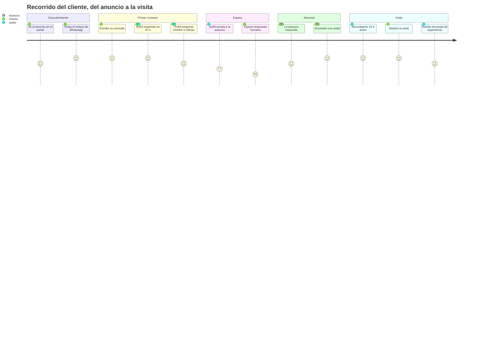
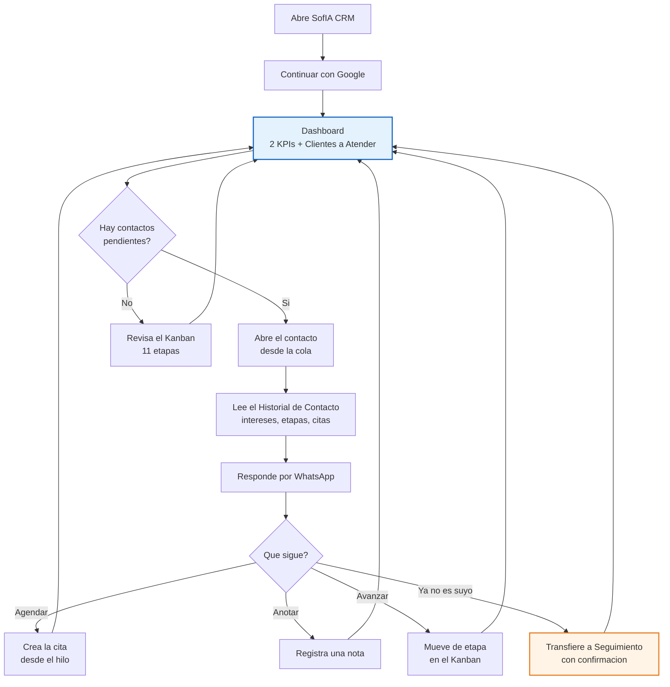
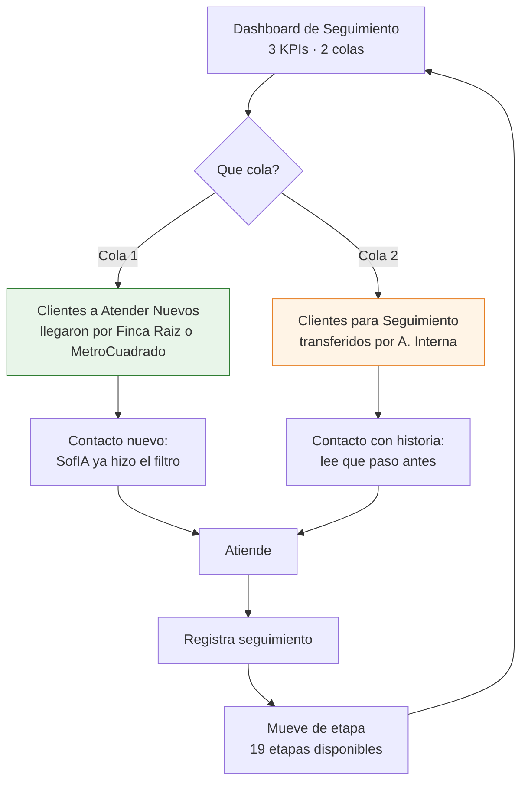
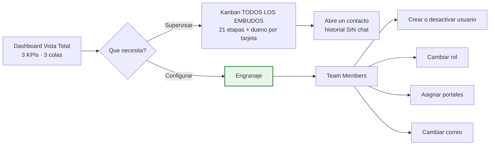
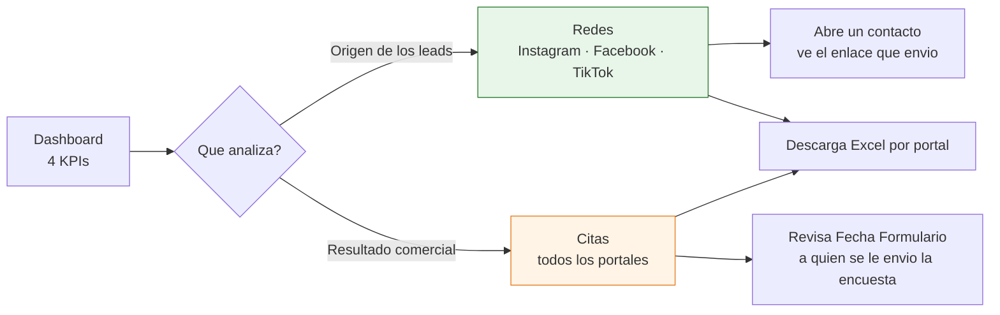
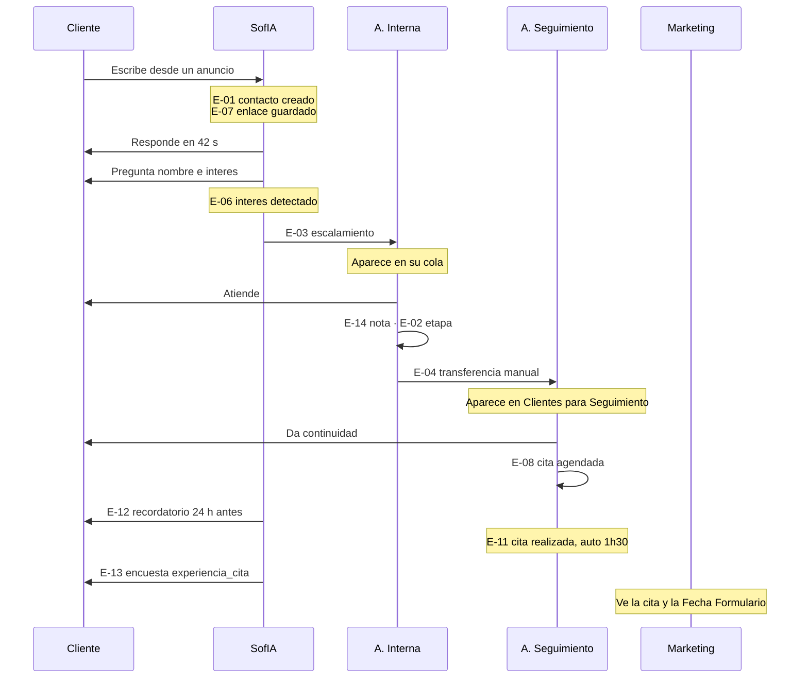

# D-07 · Journey maps

> **Estado:** v1 — construido sobre los wireframes, las decisiones cerradas y **los tiempos medidos en producción** (D-03 §12).
> **Depende de:** [D-04 Inventario](04-inventario-actual.md) · [D-05 Casos de uso](05-casos-de-uso.md) · [D-08 Máquinas de estado](08-maquinas-de-estado.md)

---

## 1. Journey del cliente

### Los momentos que deciden

| # | Momento | Hoy | Riesgo |
|---|---|---|---|
| 1 | **Primer contacto** | SofIA responde en **42 s** · 95 % bajo 5 min | 🟢 Resuelto |
| 2 | **Espera tras el escalamiento** | Mediana 30 min · **p90 24,1 h** | 🔴 **El punto crítico** |
| 3 | Ventana de 24 h | Si el cliente tarda, solo plantillas | 🟠 Restricción externa |
| 4 | Recordatorio de cita | Automático, 24 h antes | 🟢 |
| 5 | Encuesta post-cita | `experiencia_cita`, automática | 🟢 |

> 🔴 **El único hueco real del recorrido del cliente es el momento 2.** SofIA le contesta en 42 segundos y le genera una expectativa; **1 de cada 10 veces la respuesta humana tarda más de 24 horas.** El contraste entre ambos es lo que hace que la espera se note tanto.

---

## 2. Journey de la Asesora Interna — un día

### Qué cambia respecto de hoy

| Dolor documentado | Cómo se resuelve |
|---|---|
| *"Perdía media hora al día buscando contactos"* | La **cola `Clientes a Atender`** le dice qué atender. No busca: abre y trabaja |
| *"No me gusta cambiar de pestaña constantemente"* | Tres secciones en una sola aplicación. HubSpot desaparece de su día |
| *"No se visualizaban contactos con badge"* | El contacto pendiente está **en la cola**, no depende de un indicador visual |
| *"Había leads que nunca aparecían"* | Resuelto en la arquitectura actual; el asignatario explícito lo hace estructural |

> 🔑 **El cambio de fondo: pasa de *buscar* a *atender una cola*.** Hoy la asesora decide qué mirar; en el destino el sistema se lo dice.

---

## 3. Journey de la Asesora de Seguimiento

Su Dashboard tiene **dos colas porque tiene dos vías de entrada** — no es un capricho de diseño.

**La diferencia entre las dos colas es de contexto, no de acción:**

| | Cola 1 — nuevos por canal | Cola 2 — transferidos |
|---|---|---|
| De dónde viene | Portal directo | A. Interna |
| Qué sabe la asesora | Solo el filtro de SofIA | **Todo el recorrido previo** |
| Qué mira primero | El enlace de origen | El `Historial de Contacto` |

> ⚠️ **Aquí es donde `E-04 Transferencia` gana valor.** Sin ese evento, un contacto transferido llega sin explicación de por qué. Con él, la asesora ve quién se lo pasó y cuándo.

---

## 4. Journey del Administrador

Dos recorridos distintos, y **ninguno incluye conversar**.

> 🔑 **El recorrido de configuración es el que materializa el objetivo O-3.** Hoy cada una de esas cuatro acciones exige editar código y desplegar. En el destino son cuatro clics.
> Y hay un dato que lo hace más urgente: [D-04](04-inventario-actual.md) encontró que **cuatro sitios distintos definen hoy quién es una asesora**. Esta pantalla debe sustituir a los cuatro.

---

## 5. Journey de Marketing

**Las dos secciones responden a dos preguntas distintas:**

| Sección | Pregunta que responde | Alcance |
|---|---|---|
| `Redes` | *¿Qué anuncio trae leads?* | Solo Instagram, Facebook y TikTok |
| `Citas` | *¿Cuántos llegaron a visita y a quién se le envió la encuesta?* | **Todos** los portales |

> ⚠️ Marketing **nunca lee conversaciones**. Ve el contacto, su historial, sus enlaces y sus citas — pero no el chat.

---

## 6. El recorrido de un lead, extremo a extremo

Cruce de los cinco journeys sobre un mismo contacto:

> 🔑 **Cada paso del recorrido deja un evento.** Es lo que permite que Marketing y el Administrador reconstruyan la historia **sin leer una sola conversación** — y lo que hace posible medir el embudo, que hoy no se puede.

---

## 7. Puntos de fricción — ordenados por impacto

| # | Fricción | Evidencia | Se resuelve con |
|---|---|---|---|
| 1 | **Espera tras el escalamiento** | p90 = **24,1 h** medido | Colas por rol + `E-03` para poder medirlo |
| 2 | **Buscar contactos manualmente** | *"media hora al día"* | Cola `Clientes a Atender` |
| 3 | **Cambiar de pestaña** | Reportado por las asesoras | Tres secciones en una app |
| 4 | **Un cambio menor exige desplegar** | Owners en **4 sitios** | Pantalla *Team Members* |
| 5 | **Contexto perdido al transferir** | Sin evento de transferencia | `E-04` + Historial de Contacto |
| 6 | **Marketing no puede medir por anuncio** | La URL se detecta y se tira | `E-07` enlace guardado |

---

## 8. Pendiente

- Journey del cliente **que no responde** — qué pasa entre la ventana de 24 h y el cierre
- Journey de reactivación: cliente que vuelve meses después por otro inmueble
- Recorrido de error: qué ve la asesora si falla el envío de un mensaje
