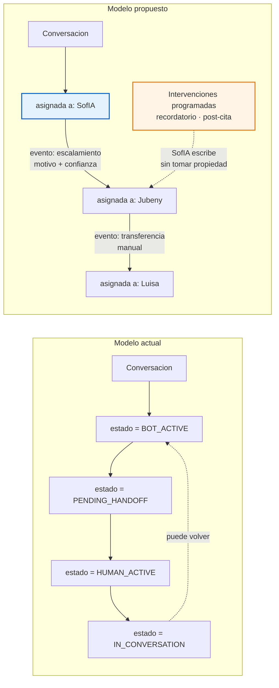
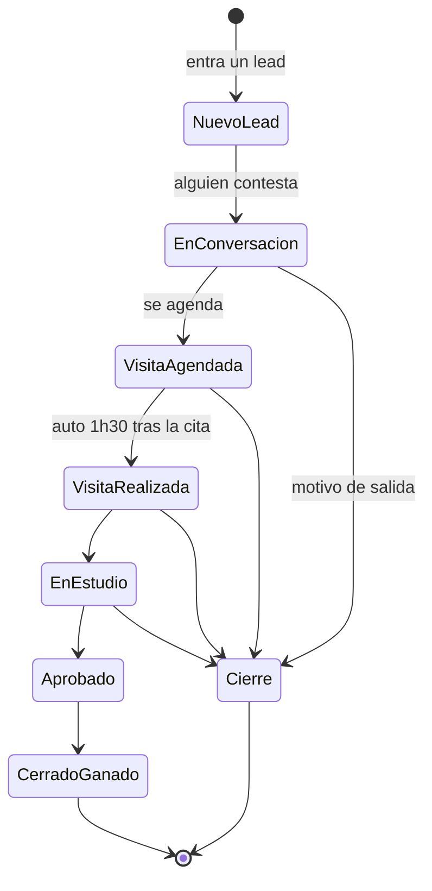
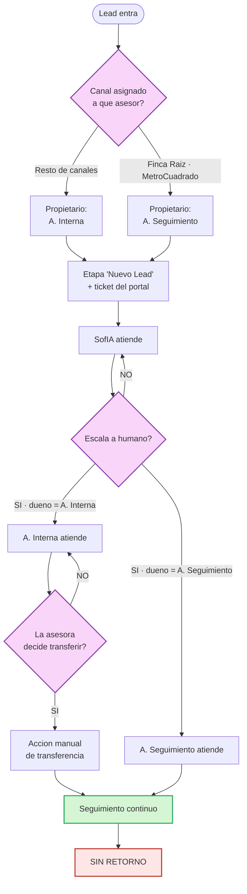
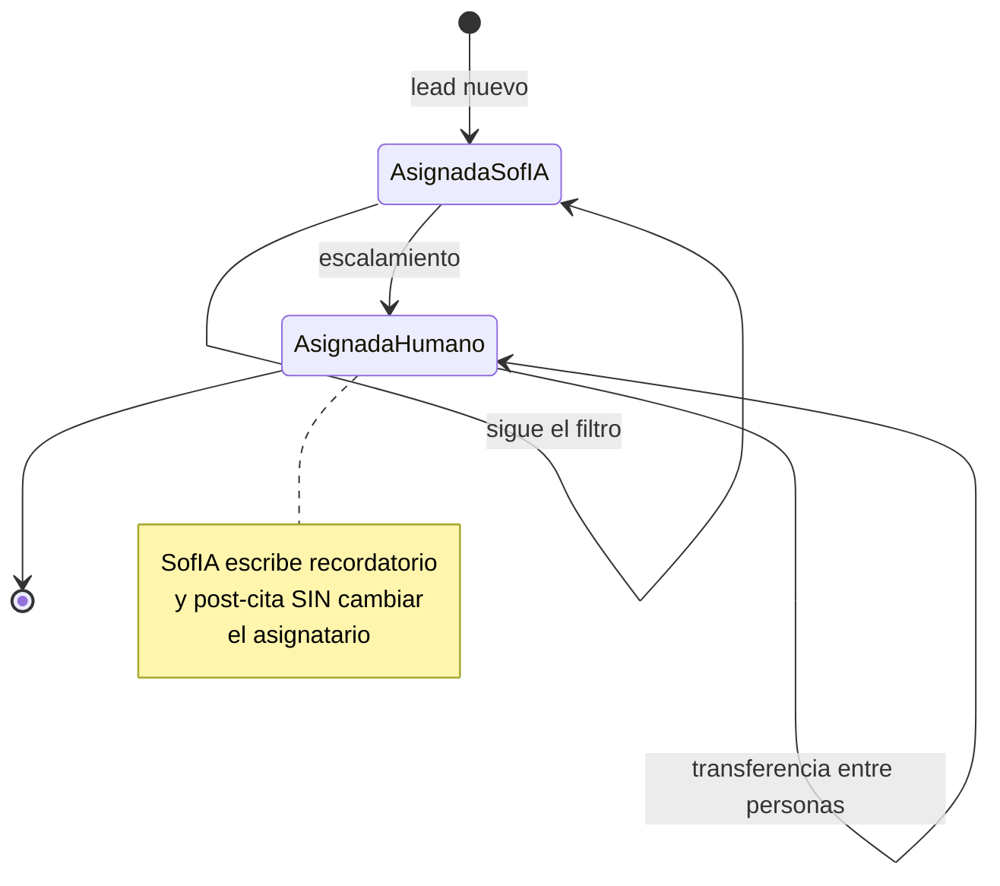
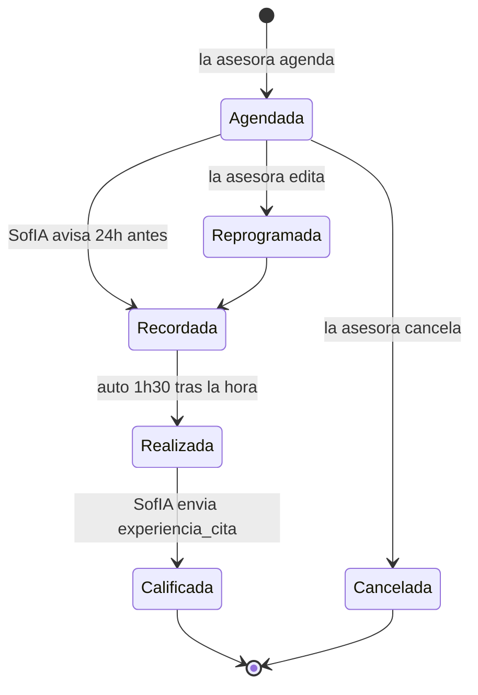

# D-08 · Máquinas de estado

> **Estado:** v1 — extraído de [D-02 §7, §11, §18.5, §25.1, §27](02-actores-y-roles.md).
> **Depende de:** [D-02 Actores y roles](02-actores-y-roles.md) · [D-09 Catálogo de eventos](09-catalogo-eventos.md)

---

## 1. El cambio de fondo: de estados a asignatario

> **SofIA no es un estado de la conversación. SofIA es un asignatario, igual que Jubeny o Luisa.**

### Lo que desaparece

| Pieza | Por qué se elimina |
|---|---|
| `BOT_ACTIVE` · `PENDING_HANDOFF` · `HUMAN_ACTIVE` · `IN_CONVERSATION` | Se sustituyen por un campo `assigned_to` + historial de eventos |
| Conjunto `bot_controlled_conversations` | Era limpieza de bandeja. Las colas ya filtran por mensaje reciente — ver §1-bis |
| Umbral de inactividad de 48 h | Solo servía para alimentar ese conjunto |
| Lógica de reentrada al panel | Sin salida no hace falta reentrada |
| Claves `conv_was_panel:*` | Marcadores heredados del modelo antiguo |

> **El comportamiento no cambia.** Lo que cambia es cuántas piezas hacen falta para representarlo.

---

## 1-bis. ✅ Los tres mecanismos, separados

En la versión anterior de este documento se eliminó de más. Hay **tres cosas distintas**:

| # | Mecanismo | Qué controla | En el código hoy | ¿Hace falta? |
|---|---|---|---|---|
| 1 | **Ventana de 24 h de WhatsApp** | Qué se **puede enviar**: libre o solo plantillas | `last_client_msg` TTL 25 h | ✅ **Sí — es una restricción externa de WhatsApp** |
| 2 | **Limpieza de bandeja** | Qué se **ve** en el inbox | `bot_controlled_conversations` + umbral de 48 h | 🟡 Probablemente no: las colas del Dashboard ya filtran por "mensaje reciente" |
| 3 | **Posponer manual (snooze)** | La asesora oculta una conversación hasta mañana | No existe | ❌ **No** — decidido en D08-1 |

La respuesta "no" de D08-1 era al **mecanismo 3**. Se eliminaron por error el 1 y el 2.

### El requisito real

> *"SofIA aún debe tener el control de la conversación después de que se acaba la ventana de 24 horas."*

Es el **mecanismo 1**. Fuera de la ventana solo se pueden enviar plantillas aprobadas, y **SofIA es quien las envía** — recordatorio de cita y calificación post-cita.

### ✅ RESUELTO — Opción A (2026-08-20)

| | **Opción A** — cambia quién escribe | **Opción B** — cambia el dueño |
|---|---|---|
| Asignatario tras 24 h | **No cambia** — sigue la asesora | **Vuelve a SofIA** |
| ¿Sale de la cola de la asesora? | No | **Sí** |
| Qué puede enviarse | Solo plantillas, las manda SofIA | Solo plantillas, las manda SofIA |
| Riesgo | Ninguno | Una asesora **pierde** un contacto por no recibir respuesta en 24 h |

> ✅ **CONFIRMADO: Opción A.** Al cerrarse la ventana de 24 h cambia **qué se puede enviar**, no de quién es el contacto. El contacto **sigue asignado a su asesora y sigue en su cola**.

**Fundamento de la decisión:**

1. Es lo que hace el código hoy — `bot_controlled_conversations` solo recoge contactos que **ya estaban** en `BOT_ACTIVE`. Una conversación en manos humanas nunca vuelve al bot
2. La ventana de 24 h restringe **qué se puede enviar**, no **de quién es el contacto**. Mezclarlas convierte una regla de mensajería en una regla de propiedad
3. Con la B, un cliente que tarda un día en contestar hace que su asesora lo pierda

En el modelo de asignatario, la A es simplemente un evento más — **`E-21 · Ventana de 24 h cerrada`** — que cambia el **modo de envío**, no el asignatario.

### Qué implica la Opción A

| Pieza | Destino |
|---|---|
| **Ventana de 24 h** | ✅ **Se conserva** como concepto de primer nivel: eventos `E-21` y `E-22` |
| **Modo de envío** de la conversación | 🆕 Campo derivado: `libre` o `solo_plantillas` |
| **Asignatario** | Nunca cambia por el paso del tiempo. Solo por escalamiento, transferencia o reasignación |
| `bot_controlled_conversations` | ❌ Desaparece — era limpieza de bandeja, no ventana |
| Umbral de 48 h | ❌ Desaparece |
| Claves `conv_was_panel:*` | ❌ Desaparecen |

> 🔑 **Quién puede escribir y de quién es el contacto son dos cosas distintas.** Fuera de la ventana, solo SofIA actúa —enviando plantillas aprobadas— pero el contacto sigue siendo de la asesora, sigue en su cola y sigue siendo su responsabilidad.
> Las colas del Dashboard **no cambian**: un contacto no desaparece de la vista de su asesora por el paso del tiempo.

---

## 2. Ciclo de vida del contacto — el embudo real

Con la Opción B, solo **7 etapas** forman una secuencia.

**Las otras 14 dejan de ser etapas:**

| Grupo | Pasa a ser | Valores |
|---|---|---|
| Presupuesto | **Propiedad** | Hasta 1.5M · 2M · 2.5M · 3M+ |
| Segmento | **Propiedad** | Propietarios · Otros Municipios · Otras Áreas · Local o Bodega · Reubicado |
| Motivo de cierre | **Propiedad de cierre** | Post Cita · No Responde · Ya encontró · Cerrado Perdido · Venta |

> 🔑 **Lo que se gana:** un contacto puede estar en `Visita Realizada` **y** tener presupuesto `Hasta 2M` **y** ser `Propietario`, todo a la vez. Hoy solo puede ser una de las tres, y **se pierde información a diario**.

---

## 3. Asignación y transferencia

**Reglas:**
1. El **canal** determina el propietario inicial. Es configurable por el Administrador
2. Reasignar un portal afecta **solo a los leads nuevos**
3. SofIA **nunca** reasigna: escala al propietario ya determinado
4. La transferencia es **manual y unidireccional**
5. Una conversación **siempre** tiene asignatario. Nunca queda sin dueño

---

## 4. Alcance de SofIA

SofIA es asignataria **solo en dos momentos**:

| Momento | Condición | Qué hace |
|---|---|---|
| **Contacto nuevo** | El contacto está en `Nuevo Lead` | Filtro de entrada: nombre, interés, motivo |
| **Recordatorio y post-cita** | Hay una cita agendada o realizada | Escribe **sin tomar propiedad** |

> 🔑 **Fuera de `Nuevo Lead`, la conversación siempre tiene dueño humano.** Las intervenciones programadas no cambian eso — es la diferencia clave con el modelo actual, donde el bot podía recuperar la conversación.

---

## 5. Ciclo de vida de la cita

> La transición `Realizada` es **automática**, 1 h 30 min después de la hora agendada. `Fecha Formulario` registra cuándo se envió `experiencia_cita`.

---

## 6. Comparación

| Dimensión | Hoy | Destino |
|---|---|---|
| Estados conversacionales | 4 + 1 conjunto auxiliar | **0** — `assigned_to` + eventos |
| ¿Quién atiende? | Se deduce del estado | Campo explícito |
| Escalamiento | Cambio de estado silencioso | **Evento auditable** |
| Etapas del embudo | 21 excluyentes | **7** + tres grupos de propiedades |
| Conversación sin dueño | Posible | Imposible |
| Posponer | Simulado con inactividad | **No existe** |
| Máquinas de estado en el código | **2** — `state_manager.py` y `conversation_state.py` | **1** |

---

## 7. Pendiente

- Estados de la entidad `Interés` — ¿activo, descartado, convertido?
- Comportamiento de la propiedad de cierre: ¿un contacto cerrado puede reabrirse?
- Transiciones permitidas por rol: ¿puede A. Interna saltar de `Nuevo Lead` a `Cerrado Ganado`?
