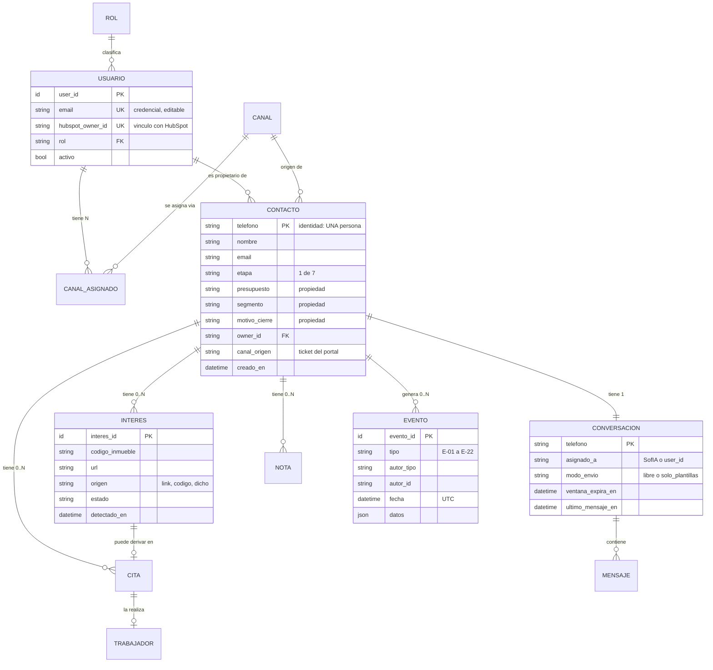

# D-10 · Modelo de dominio y datos

> **Estado:** v1 — construido sobre las decisiones cerradas y **los esquemas reales de MongoDB** levantados el 2026-08-20.
> **Depende de:** [D-01 Glosario](01-glosario.md) · [D-04 Inventario](04-inventario-actual.md) · [D-08 Máquinas de estado](08-maquinas-de-estado.md) · [D-09 Eventos](09-catalogo-eventos.md)
> **Alimenta a:** [D-11 Fuentes de verdad](11-fuentes-de-verdad.md) · [D-13 Contratos de API](13-contratos-api.md) · [D-18 Migración](18-migracion.md)

---

## 1. Diagrama de entidades

---

## 2. Las cuatro decisiones que dan forma al modelo

| # | Decisión | Consecuencia estructural |
|---|---|---|
| 1 | **Un Contacto es una persona** | La clave es el teléfono. Desaparece la clave compuesta `(teléfono, canal)` |
| 2 | **Usuario / Rol / Canal / Propietario separados** | Cuatro conceptos, cuatro tablas. Hoy son un solo campo |
| 3 | **7 etapas + 3 propiedades** | El embudo deja de ser excluyente |
| 4 | **El historial es un registro de eventos** | Tabla `EVENTO`, no columnas |

---

## 3. Entidades nuevas

### 3.1 `USUARIO` — no existe hoy

| Campo | Tipo | Notas |
|---|---|---|
| `user_id` | id | **Identidad permanente.** Nunca cambia |
| `email` | texto único | **Credencial, no identificador.** El Administrador puede cambiarlo |
| `hubspot_owner_id` | texto único | Vínculo con HubSpot |
| `rol` | enum | `interna` · `seguimiento` · `marketing` · `administrador` |
| `activo` | booleano | Desactivar invalida la sesión al instante |

> ✅ **Formaliza lo que ya existe.** `utils/advisors_registry.py` ya es la fuente única de identidad y declara `receives_leads`, `uses_panel` y `receives_transfers` — un modelo de roles en embrión. `USUARIO` lo saca del código a la base de datos. Ver [D-18 §2](18-migracion.md).
> Es la tabla que alimenta la pantalla *Team Members*.

### 3.2 `INTERES` — no existe hoy

| Campo | Tipo | Notas |
|---|---|---|
| `interes_id` | id | |
| `contacto_id` | FK | |
| `codigo_inmueble` | texto | Lo detecta `property_code_detector.py` |
| `url` | texto | Lo detecta `link_detector.py` |
| `origen` | enum | `link` · `codigo` · `dicho_por_el_cliente` |
| `estado` | enum | `activo` · `descartado` · `convertido` |
| `detectado_en` | fecha | |

> 🔑 Resuelve el caso real: *"varios clientes llegan preguntando por varios inmuebles, y después de un tiempo el mismo contacto pregunta por otro"*. **N intereses por contacto, con fecha.**
> No es un *Deal*: sin importe, sin probabilidad, sin pipeline propio.

### 3.3 `EVENTO` — no existe hoy

| Campo | Tipo | Notas |
|---|---|---|
| `evento_id` | id | |
| `tipo` | enum | Los 22 del catálogo D-09 |
| `contacto_id` | FK | Nulo en E-17 a E-20 (eventos de sistema) |
| `autor_tipo` | enum | `asesora` · `sofia` · `sistema` · `administrador` |
| `autor_id` | texto | |
| `fecha` | fecha **UTC** | |
| `datos` | JSON | Campos propios de cada tipo |

> ⚠️ **Siempre UTC.** El sistema ya sufrió errores de 5 horas por comparar fechas sin zona de Mongo con hora local de Bogotá.
> 🔴 **Es la tabla que permite medir.** Hoy no se puede calcular ni la conversión del embudo ni el tiempo real de respuesta.

### 3.4 `CANAL` y `CANAL_ASIGNADO` — hoy son código

| `CANAL` | |
|---|---|
| `codigo` | `finca_raiz`, `instagram`… |
| `nombre` | Para mostrar |
| `categoria` | `portal` · `red_social` · `directo` |
| `genera_kpi_marketing` | booleano — **solo Instagram, Facebook y TikTok** |
| `patrones_enlace` | Regex de detección |
| `activo` | booleano |

| `CANAL_ASIGNADO` | |
|---|---|
| `canal_codigo` + `user_id` | Quién recibe los leads nuevos de ese canal |

> 🔑 **Reasignar un canal afecta solo a los leads nuevos.** Los contactos existentes conservan su propietario.
> `genera_kpi_marketing` como campo evita la lista escrita a mano de `outbound_panel.py:6235`, que hoy **ni siquiera coincide** con los tres canales que sí tienen KPI.

---

## 4. Entidades que cambian

### 4.1 `CONTACTO` — el cambio más profundo

| Campo | Hoy | Destino |
|---|---|---|
| Identidad | `(teléfono, canal)` | **`teléfono`** |
| `lifecyclestage` | **21 valores excluyentes** | `etapa` — **7 valores** |
| — | — | 🆕 `presupuesto` — 4 valores o vacío |
| — | — | 🆕 `segmento` — 5 valores o vacío |
| — | — | 🆕 `motivo_cierre` — 5 valores o vacío |
| `owner_id` | `hubspot_owner_id` | FK a `USUARIO` |
| `canal_origen` | Existe | Se conserva — es el ticket del portal |

**Reparto de las 21 etapas:**

| Grupo | Destino | Valores |
|---|---|---|
| **Embudo** | `etapa` | Nuevo Lead · En Conversación · Visita Agendada · Visita Realizada · En Estudio · Aprobado · Cerrado Ganado |
| **Presupuesto** | `presupuesto` | Hasta 1.5M · Hasta 2M · Hasta 2.5M · 3M+ |
| **Segmento** | `segmento` | Propietarios · Otros Municipios · Otras Áreas · Local o Bodega · Reubicado |
| **Cierre** | `motivo_cierre` | Post Cita · No Responde · Ya encontró · Cerrado Perdido · Venta |

> 🔑 Un contacto puede estar en `Visita Realizada` **y** tener presupuesto `Hasta 2M` **y** ser `Propietario`. Hoy solo puede ser una de las tres.

### 4.2 `CONVERSACION`

Esquema real hoy: `phone · canal · canal_origen · contact_id · owner_id · status · archived · message_count · first_message_at · last_message_at · last_message_preview · last_message_sender · created_at · updated_at`

| Campo | Destino |
|---|---|
| `status` (4 estados) | ❌ **Se elimina** → `asignado_a` |
| `canal` (parte de la clave) | ❌ Deja de ser clave; pasa a `CONTACTO.canal_origen` |
| `archived` | ❌ Se elimina — no habrá archivado |
| — | 🆕 `asignado_a` — `sofia` o `user_id` |
| — | 🆕 `modo_envio` — `libre` o `solo_plantillas` |
| — | 🆕 `ventana_expira_en` — hoy vive en Redis con TTL |
| El resto | ✅ Se conserva |

### 4.3 `NOTA` y `CITA` — casi sin cambios

`contact_notes` (164 docs) y `appointments` (496 docs) ya tienen la estructura correcta.

| Entidad | Cambio |
|---|---|
| `NOTA` | `advisor_id` → FK a `USUARIO`. Todo lo demás igual |
| `CITA` | `advisor_id` y `worker_id` → FK. 🆕 `interes_id` opcional, para saber **de qué inmueble** era la visita |

> 🔑 Vincular la cita al `Interés` permite que la encuesta post-cita pregunte por **el inmueble concreto**.

---

## 5. Lo que se elimina

| Pieza | Motivo |
|---|---|
| Colección `contacts` | **Vacía — 0 documentos.** Código muerto |
| Colección `panel_advisors` | La sustituye `USUARIO` |
| `OWNERS_CONFIG` en `lead_assigner.py` | La sustituye `USUARIO` + `CANAL_ASIGNADO` |
| Diccionario `CHANNELS` en código | La sustituye la tabla `CANAL` |
| `status` de 4 estados | Lo sustituye `asignado_a` |
| `bot_controlled_conversations` | Era limpieza de bandeja |
| Claves `conv_was_panel:*` | Heredadas |
| Campo `archived` | No habrá archivado |

---

## 6. Reparto por almacén

| Entidad | Base propia | HubSpot | Redis |
|---|---|---|---|
| `USUARIO` · `ROL` | ✅ **autoritativa** | Espejo del `owner_id` | Sesión |
| `CANAL` · `CANAL_ASIGNADO` | ✅ **autoritativa** | ❌ | Caché |
| `CONTACTO` — datos y etapa | ✅ | ✅ Espejo | Caché |
| `CONTACTO` — presupuesto y segmento | ✅ **autoritativa** | ⚠️ Requiere propiedades nuevas | — |
| `INTERES` | ✅ **autoritativa** | ❌ No tiene dónde | — |
| `EVENTO` | ✅ **autoritativa** | Parcial vía timeline | — |
| `CONVERSACION` · `MENSAJE` | ✅ | Espejo | Estado vivo |
| `NOTA` · `CITA` | ✅ | Espejo | — |

> 🔴 **Tres entidades no tienen dónde vivir en HubSpot:** `INTERES`, `EVENTO` y `CANAL_ASIGNADO`. Son **exclusivas de la base propia**.
> Eso matiza la decisión A-02: **HubSpot es el backbone de los contactos, no de todo el modelo.** Hay que registrarlo en [D-11](11-fuentes-de-verdad.md).

---

## 7. Consecuencias para la migración

| # | Migración | Volumen | Dificultad |
|---|---|---|---|
| 1 | Repartir `lifecyclestage` en cuatro campos | **3.209 contactos** — 1.220 solo en `No Responde` | 🔴 Alta — hay que inferir la etapa de los que están en una clasificación |
| 2 | Colapsar `(teléfono, canal)` a `teléfono` | 3.146 conversaciones | 🟠 Media — hay teléfonos con varios canales |
| 3 | Crear `USUARIO` desde los 4 orígenes | 6 owners activos | 🟢 Baja |
| 4 | Fusionar `whatsapp` y `whatsapp_directo` | Por contar | 🟢 Baja |
| 5 | Renombrar `Seguimiento` → `Post Cita` en HubSpot | 1 etapa | 🟢 Baja — el ID no cambia |
| 6 | Crear la etapa `Nuevo Lead` en HubSpot | — | 🟠 Toca producción |
| 7 | Poblar `EVENTO` con el histórico | ❌ **No se puede** | Los eventos pasados no se registraron |

> 🔴 **La migración 1 es la difícil.** Un contacto que hoy está en `Hasta 2M` **no dice en qué punto del embudo está** — ese dato ya se perdió. Opciones: inferirlo del historial de mensajes, o dejarlo en `En Conversación` por defecto. → decisión de [D-18](18-migracion.md).
> ⚠️ **La 7 tiene una consecuencia práctica:** las métricas del embudo empiezan a contar **desde la puesta en marcha**, no antes. No hay histórico que recuperar.

---

## 8. Pendiente

- Índices y claves — se define con D-12 y D-13
- Nombres físicos de tablas y colecciones
- ¿`presupuesto` y `segmento` se replican a HubSpot como propiedades nuevas, o viven solo en la base propia?
- ✅ **Cerrada 2026-08-28.** Indefinida para eventos de contacto; 12 meses para acceso y configuración. Ver [D-15 §5.3](15-nfr.md)
- Esquema exacto del campo `datos` por tipo de evento
