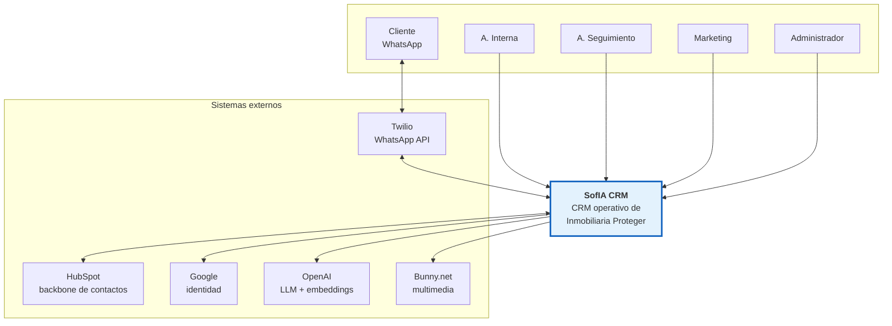
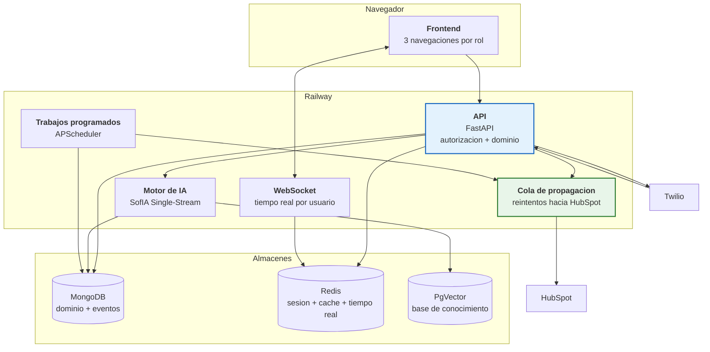
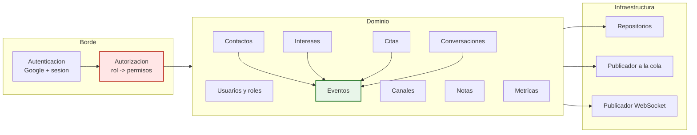
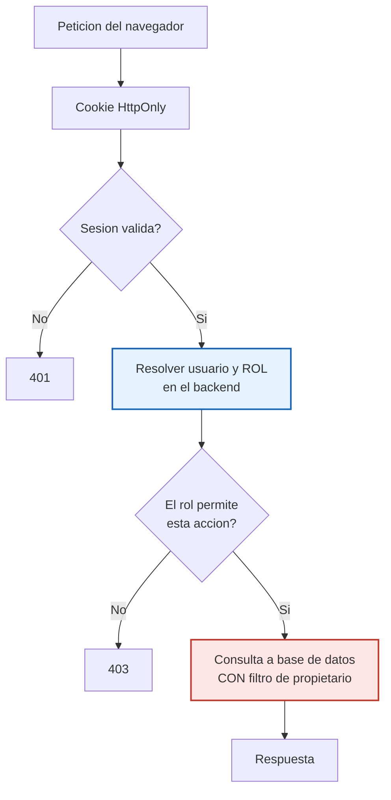

# D-12 · Arquitectura objetivo

> **Estado:** v1 — 2026-08-20.
> **Depende de:** [D-10 Modelo de datos](10-modelo-de-datos.md) · [D-11 Fuentes de verdad](11-fuentes-de-verdad.md) · [ADR-001](14-adrs.md)
> **Notación:** C4 — contexto, contenedores, componentes.

---

## 1. Nivel 1 · Contexto

**Lo que cambia respecto de hoy:** aparece **Google** como proveedor de identidad, y **HubSpot deja de ser una interfaz** para las asesoras — pasa a ser solo un sistema con el que SofIA CRM habla.

---

## 2. Nivel 2 · Contenedores

### El contenedor nuevo: cola de propagación

| | |
|---|---|
| **Qué hace** | Recibe los cambios ya escritos en la base propia y los propaga a HubSpot con reintentos |
| **Por qué hace falta** | Es la pieza que sostiene la política de D-11: *la escritura local es síncrona, lo que se difiere es la propagación* |
| **Qué resuelve** | Si HubSpot está caído o limitado, la operación sigue y la cola retiene |
| **Qué sustituye** | La reconciliación de 6 h deja de ser el mecanismo principal y pasa a ser red de seguridad |

> 🔴 **Es el único contenedor genuinamente nuevo**, y no existe hoy. Sin él, D-11 no se puede implementar.

---

## 3. Nivel 3 · Componentes de la API

### Dos reglas que no se negocian

| # | Regla | Por qué |
|---|---|---|
| 1 | **Toda petición pasa por Autorización antes de tocar el dominio** | Si un módulo consulta la base sin pasar por ahí, el aislamiento se rompe |
| 2 | **Todo cambio de dominio emite un evento** | Es lo que hace medible el sistema. Si un módulo escribe sin emitir, se pierde el rastro |

---

## 4. Decisión estructural: monolito modular

> ✅ **Un solo despliegue, con límites internos estrictos.** No microservicios.

| A favor del monolito modular | Riesgo de microservicios aquí |
|---|---|
| ~7 usuarios y ~19 leads/día | Multiplican los puntos de fallo |
| El sistema ya sufrió fugas de memoria y `SIGKILL` con **un** worker | Operar 5 servicios con ese historial es peor, no mejor |
| Un despliegue, un registro de errores | Trazas distribuidas que nadie va a leer |
| Los módulos se pueden extraer después | Extraer es fácil; volver a juntar no |

**Si algún día hay que extraer algo, el candidato es el motor de IA** — es el único con un perfil de carga distinto y dependencias propias.

> Se formaliza en **ADR-002**.

---

## 5. Cómo se aplica el aislamiento

> 🔴 **El paso crítico es el filtro en la consulta.** El frontend **nunca** filtra por seguridad: solo decide qué dibuja.
> Hoy no existe ninguno de estos pasos — se entra por enlace y el panel muestra lo que el JavaScript decida.

---

## 6. Descomposición de `outbound_panel.py`

El archivo de **10.222 líneas** y 72 endpoints es lo que hay que partir.

| Módulo destino | Qué se lleva | Endpoints aprox. |
|---|---|---|
| `contactos` | Lista, detalle, búsqueda, alta, etapa, canal | ~14 |
| `conversaciones` | Hilo, envío, plantillas, ventana de 24 h | ~10 |
| `citas` | CRUD + trabajadores de campo | ~10 |
| `notas` | CRUD | ~4 |
| `usuarios` 🆕 | Team Members, roles, portales | ~8 |
| `metricas` | Dashboards y exportaciones | ~7 |
| `campanas` | Masivos | ~5 |
| `eventos` 🆕 | Historial de contacto | ~3 |
| `intereses` 🆕 | Inmuebles consultados | ~3 |
| `admin` | Recuperación y diagnóstico | ~8 |

> ⚠️ **Los 5 endpoints de recuperación** (`recover-outage`, `restore-panel`…) merecen una revisión aparte: existen porque el estado se corrompía. Con la cola de propagación y el asignatario explícito, varios deberían dejar de hacer falta.

---

## 7. Qué se conserva del sistema actual

> ✅ **Actualizado el 2026-08-27** con el análisis de módulos de [D-18 §3](18-migracion.md), hecho sobre el índice del grafo de código (2.504 nodos, 9.470 aristas). Lo de abajo ya no es una intención: es una lista medida.

| Se conserva | Cohesión | Notas |
|---|---|---|
| FastAPI + Gunicorn en Railway | — | Sin motivo para cambiar |
| MongoDB como almacén principal | — | Se le añaden `USUARIO`, `INTERES`, `EVENTO`, `PROPAGACION` |
| Redis para sesión, caché y tiempo real | — | Cambia su papel: **deja de guardar estado de negocio** |
| PgVector + base de conocimiento | — | Intacto |
| `sofia_brain.py` Single-Stream | — | Intacto — es la ventaja competitiva |
| **Ciclo de citas** | **0,747** | ✅ **El módulo mejor construido del sistema.** Se conserva casi intacto |
| **HubSpot outbound** | **0,784** | ✅ Se conserva; pasa a entregarse por la cola de propagación |
| Envíos masivos · mensajes programados | — | ✅ Se conservan. **Y son la base de ADR-006** |
| Twilio, Bunny, detectores | — | Intactos. Los detectores dejan de descartar lo que detectan |
| `phone_normalizer` | fan-in 31 | Es la base de la identidad del contacto |
| `media_processor` · `message_aggregator` · `timeline_logger` | — | ✅ Rescatados |
| **`query_profiler`** | — | ✅ **La observabilidad del rediseño ya existe**, con enmascarado de PII incluido |
| APScheduler | 0,389 | Se conserva; **sale de `app.py`** y sus parámetros van a configuración |
| Citaciones de mensajes | — | 🟡 Se conserva y se mejora |

### Lo que sí se rediseña

| | Por qué |
|---|---|
| 🔴 **Notificaciones a las asesoras** | Están repartidas en **6 archivos y 3 persistencias**. No hay una definición común de qué es una notificación ni de cuándo se considera atendida. Existe hasta un endpoint (`cleanup_stale_inbox`) dedicado a limpiar la basura que ese diseño genera |
| 🔴 Autorización · modelo de datos · `outbound_panel.py` | Es el núcleo del rediseño |
| ⚠️ **Frontend del panel** | Cohesión **0,992** — calidad excelente. **Se rehace por diseño de producto, no por calidad del código** |

### El reparto real

| | % del sistema |
|---|---|
| ✅ Intacto | **~55 %** |
| 🟡 Se mueve o ajusta | ~15 % |
| 🔴 Se reescribe | **~30 %** |

> 🔑 **El cambio de papel de Redis es importante.** Hoy guarda el estado conversacional —la fuente de verdad operativa—. En el destino guarda **sesión, caché y tiempo real**, y el estado de negocio vive en MongoDB. Eso elimina la clase de fallo que obligó a construir los cinco endpoints de recuperación.
>
> 🔑 **Y menos de un tercio del código se reescribe.** El "80 % de rediseño" es de **producto**, no de código.

---

## 8. La cola de propagación — diseño cerrado

> ✅ **Resuelto en [ADR-006](14-adrs.md).** Era el único contenedor nuevo del diagrama y el único sin diseño interno.

**Patrón *outbox*.** La escritura local es síncrona; la propagación a HubSpot se registra como fila en `PROPAGACION` y un trabajador la entrega con reintentos de espera creciente, con tope en ~9 h y estado terminal `abandonado` visible para el Administrador.

**Se generaliza el motor de envíos masivos**, que ya resuelve reclamo atómico, arrendamiento, idempotencia y exclusión mutua — y que ya sobrevivió a un incidente real de 33 días.

> **Consecuencia arquitectónica:** desaparecen los **36 s** que hoy puede costar un request bloqueado por un 429 de HubSpot. Es la respuesta directa a la *Investigación pendiente #1* de `CLAUDE.md`.

### Lo que sigue pendiente en este documento

- Diagrama de despliegue: qué corre en qué proceso de Railway
- Estrategia de caché por entidad
- Cómo convive la arquitectura nueva con `main` durante la transición → ✅ [D-18](18-migracion.md)
