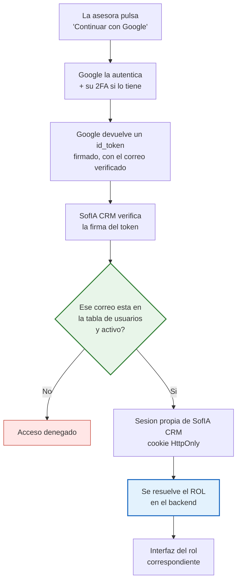

# D-14 · Decisiones de arquitectura (ADR)

> Registro de decisiones técnicas de fondo. Cada ADR guarda **el contexto, las opciones evaluadas y el porqué** — para que dentro de un año se sepa no solo qué se decidió, sino qué se descartó y con qué argumento.

---

## ADR-001 · Autenticación e inicio de sesión

**Estado:** propuesta · **Fecha:** 2026-08-15 · **Decide:** CyberTovar

### Contexto

Hoy se entra a SofIA **por enlace, sin credenciales**, y el dashboard de métricas se abre pasando la clave de administrador en la URL. No hay usuarios, ni roles, ni sesión, ni forma de revocar acceso.

El rediseño convierte a SofIA CRM en **el responsable de la autorización** (decisión A-02: HubSpot invisible). Sin autenticación real, la matriz de permisos de D-06 es decorativa.

### Idea de partida a evaluar

> *"Email de Google + contraseña = el ID del usuario en HubSpot. Si el correo coincide con uno registrado en HubSpot, entra; si no, no entra."*

---

### 🔴 Por qué el ID de HubSpot no puede ser la contraseña

Una contraseña tiene que ser **secreta, cambiable y revocable**. El `owner_id` de HubSpot no es ninguna de las tres.

| Problema | Detalle |
|---|---|
| **No es secreto** | Aparece en la URL de HubSpot al abrir un contacto, lo devuelve la API a cualquiera con el token, está escrito a mano en `lead_assigner.py` (`OWNERS_CONFIG`) dentro del repositorio — y **está escrito en esta misma documentación**, que circula en Word |
| **🔴 Son consecutivos** | Jubeny `89096378` · Mónica `89096379` · Luisa `89096380`. **Quien conoce uno tiene los otros probando ±1.** Un solo ID filtrado abre las tres cuentas |
| **No se puede cambiar** | Lo asigna HubSpot y es permanente. Si se filtra, no hay rotación posible |
| **No se puede revocar** | Dar de baja a una persona no invalida su "contraseña" |
| **Permite enumerar usuarios** | Si el error distingue *"correo no registrado"* de *"ID incorrecto"*, se descubre qué correos son válidos |

> ⚠️ En la práctica esto equivale a **un sistema sin contraseña**: cualquiera que sepa el correo de una asesora entra.

### ✅ Lo que sí acierta la idea, y se conserva íntegro

> **HubSpot como lista blanca: solo entra quien tenga correo registrado como owner activo.**

Esa parte es correcta y es exactamente lo que se implementa. Lo que se descarta es *usar el ID como secreto*, no la idea de validar contra HubSpot.

---

### Opciones evaluadas

| # | Opción | Cómo funciona | Veredicto |
|---|---|---|---|
| **A** | Correo + `owner_id` como contraseña | El ID hace de secreto | ❌ **Descartada** — el secreto no es secreto |
| **B** | Correo + contraseña propia | Cifrado, recuperación, bloqueo por intentos | 🟡 Viable, pero hay que construir y mantener todo |
| **C** | **Continuar con Google** | OIDC estándar; Google prueba la identidad, SofIA CRM decide el acceso | ✅ **Recomendada** |
| **D** | Enlace mágico al correo | Se envía un enlace de un solo uso | 🟡 Alternativa si Google no encaja |

### Comparación B vs C

| | **B · Contraseña propia** | **C · Google** |
|---|---|---|
| Contraseñas almacenadas en SofIA | Sí — cifrado, filtraciones, rotación | **Ninguna** |
| Recuperación de acceso | Hay que construirla | La resuelve Google |
| Bloqueo por intentos | Hay que construirlo | Incluido |
| Segundo factor | Hay que construirlo | **Incluido si el usuario lo tiene** |
| Trabajo de desarrollo | Alto | **Bajo** |
| Encaja con los correos actuales | Sí | **Sí — los 6 owners activos usan `@gmail.com`** |
| Depende de un tercero | No | Sí — si Google cae, nadie entra |

---

### Decisión: **Opción C — Continuar con Google**

### Cómo funciona, paso a paso



> 🔑 **El paso E es tu idea, intacta.** Google solo responde *"esta persona es quien dice ser"*. **Quién puede entrar lo decide SofIA CRM**, contra su lista blanca sincronizada con HubSpot.
> 🔑 **El rol nunca viene de Google.** Se resuelve en el backend a partir de la sesión. Si viajara en el cliente, se falsificaría.

### Requisitos concretos

| # | Requisito | Detalle |
|---|---|---|
| 1 | Proyecto en Google Cloud Console | Credenciales OAuth 2.0 tipo *Aplicación web* |
| 2 | Pantalla de consentimiento | Nombre y logo de SofIA CRM |
| 3 | **Solo los scopes `openid`, `email`, `profile`** | 🔑 **No son sensibles** → **no hace falta verificación de Google, no hay tope de usuarios y no aparece pantalla de advertencia** |
| 4 | URI de redirección autorizada | El dominio de SofIA CRM. ✅ **El subdominio de Railway sirve** — ver A-1. No hace falta demostrar propiedad con scopes básicos |
| 5 | Orígenes JavaScript autorizados | Mismo dominio |
| 6 | Tabla propia de usuarios | `correo · owner_id · rol · activo` |

> ✅ **El punto 3 es el hallazgo que elimina la principal objeción a Google.** Las apps que solo piden identificar al usuario quedan fuera del proceso de verificación y del límite de 100 usuarios; ese límite solo aplica a scopes sensibles o restringidos.

### ⚠️ Los correos son Gmail personales, no un dominio corporativo

`gerencia.inmproteger@gmail.com`, `comercial5.inmproteger@gmail.com`… son cuentas **personales de Gmail**, no `@inmproteger.com` en Google Workspace. Implica:

- ❌ No se puede usar el parámetro `hd` para restringir por dominio de organización
- ✅ La restricción tiene que ser **lista blanca por correo** — justo lo que propusiste
- 🔵 Si algún día migran a Google Workspace con dominio propio, `hd` se añade como segunda barrera sin rehacer nada

### Encaje con la arquitectura

| Pieza | Cómo encaja |
|---|---|
| Modelo de identidad (§3 de D-02) | Usuario = correo + `owner_id`. Google resuelve la identidad; el Rol y los Permisos siguen siendo de SofIA CRM |
| Pantalla *Team Members* del Administrador | Es donde se da de alta el correo → **la lista blanca es administrable sin deploy** (objetivo O-3) |
| Sincronización con HubSpot | Si el owner se desactiva en HubSpot, el usuario se bloquea en SofIA CRM |
| Multi-dispositivo | La sesión es **por usuario**, no por conexión (§15.2 de D-02) |
| Diseño del wireframe | Se conserva la tarjeta tal cual; los dos campos se sustituyen por un botón *Continuar con Google* |

### Consecuencias

**A favor:** SofIA CRM no almacena ni una contraseña · desaparece toda una clase de vulnerabilidad · el segundo factor llega gratis · poco trabajo de desarrollo · la lista blanca queda administrable.

**En contra:** dependencia de Google — si Google cae, nadie entra · hace falta un dominio propio verificado · si alguien pierde su cuenta de Gmail, pierde el acceso hasta que el Administrador lo reasigne.

### Requisitos de seguridad transversales

| # | Requisito |
|---|---|
| 1 | Eliminar el acceso por enlace sin credenciales — incluida la clave en la URL de `/metrics` |
| 2 | El rol se resuelve **en el backend** desde la sesión, nunca en el cliente |
| 3 | El aislamiento se aplica **en la consulta a base de datos**, no en el filtro del frontend |
| 4 | Sesión con caducidad y renovación; cookie `HttpOnly` + `Secure` + `SameSite` |
| 5 | Registro de auditoría de inicios de sesión: quién, cuándo, desde dónde |
| 6 | Revocación inmediata al desactivar un usuario |
| 7 | Mensaje de error **idéntico** en todos los fallos, para no permitir enumerar correos |

---

### ❓ Preguntas abiertas de este ADR

| # | Pregunta | Por qué importa |
|---|---|---|
| A-1 | Dominio para el redirect | **RESUELTA** — se usa el de Railway. Ver A-1 abajo |
| A-2 | Primer administrador | **RESUELTA** — arranque por semilla. Ver A-2 abajo |
| **A-3** 🟠 | ¿Cuánto dura la sesión? | Con dos dispositivos abiertos a la vez, una sesión eterna es un riesgo y una corta es una molestia |
| **A-4** 🟠 | ¿Qué pasa si alguien pierde acceso a su Gmail? | Sin plan, se queda fuera del CRM |
| **A-5** 🟡 | ¿Hay intención de migrar a Google Workspace con dominio propio? | Cambia si se puede usar `hd` como segunda barrera |
| **A-6** 🟡 | ¿Se permite que dos personas compartan un correo? | Hoy "Publicidad Proteger" es un owner que no es una persona |

**Fuentes:** [OpenID Connect · Sign in with Google](https://developers.google.com/identity/openid-connect/openid-connect) · [Apps no verificadas](https://support.google.com/cloud/answer/7454865) · [Requisitos de verificación](https://support.google.com/cloud/answer/13464321) · [Configurar la pantalla de consentimiento](https://developers.google.com/workspace/guides/configure-oauth-consent)

---

## ADR-002 · Monolito modular frente a microservicios

**Estado:** pendiente de redactar. Análisis preliminar en [D-02 §16](02-actores-y-roles.md).

## ADR-003 · Etapas frente a propiedades del contacto

**Estado:** pendiente de redactar. Decisión ya tomada (Opción B) en [D-02 §25.1](02-actores-y-roles.md); falta formalizarla como ADR.

## ADR-004 · Modelo de gestión del agente de IA

**Estado:** pendiente de redactar. Plan de 6 pilares en [D-02 §18](02-actores-y-roles.md).

## ADR-005 · Persistencia del KPI semanal

**Estado:** pendiente de redactar. Análisis en [D-02 §21](02-actores-y-roles.md).

---

### A-1 · El dominio de Railway sirve

**Situacion:** el unico dominio disponible hoy es el subdominio que asigna Railway.

**Veredicto: funciona.**

| Requisito de Google | Estado con Railway |
|---|---|
| La URI de redireccion debe usar **HTTPS** | Cumple — Railway sirve HTTPS por defecto |
| La URI debe coincidir **exactamente** con la registrada (esquema, mayusculas, barra final) | Hay que **fijarla explicitamente**, no dejar que se autogenere |
| Demostrar propiedad del dominio | **No aplica** — solo se exige en el proceso de verificacion, y con los scopes `openid email profile` no hay verificacion |

> **El fallo mas habitual documentado en despliegues de Railway:** la aplicacion genera una URI de redireccion distinta a la registrada en Google Cloud Console y devuelve `400 invalid_request`. Se evita fijando la URI como variable de entorno y registrando exactamente ese valor.

> **Riesgo a medio plazo:** si el subdominio de Railway cambia — al renombrar el servicio o crear un proyecto nuevo — **el inicio de sesion deja de funcionar** hasta actualizar Google Cloud Console.
>
> **Recomendacion:** empezar con el dominio de Railway y registrar en paralelo un dominio propio tipo `crm.inmproteger.com` apuntando por CNAME a Railway. Google admite registrar **ambas URIs a la vez**, asi que se migra sin cortar el servicio. Un dominio propio ademas se ve mas serio para las asesoras y aisla del cambio de URL.

### A-2 · Arranque del primer administrador

**Decision:** el primer administrador es CyberTovar, en calidad de desarrollador.

**Mecanismo propuesto — semilla en el arranque:**

```
Variable de entorno:  BOOTSTRAP_ADMIN_EMAIL = tovar18025@gmail.com

Al iniciar la aplicacion:
  si la tabla de usuarios esta VACIA  -> crear ese correo como Administrador activo
                                          y registrarlo en el log
  si ya hay usuarios                  -> no hacer nada
```

| Por que asi | |
|---|---|
| Reproducible | Queda declarado en la configuracion, no en un paso manual que alguien olvida |
| Compatible con Railway | Es una variable de entorno mas |
| Se auto-desactiva | En cuanto existe un usuario, deja de tener efecto |
| Auditable | El arranque queda en el registro |

> **Riesgo a cubrir:** si la variable se queda puesta y algun dia la tabla de usuarios queda vacia, el mecanismo se rearma solo. Mitigacion: registrar el evento de forma muy visible y **retirar la variable** una vez creado el primer administrador.

> **Precision necesaria.** Claude no puede ser un usuario del CRM: no tiene cuenta de Google ni la necesita. Interviene a traves del codigo y del despliegue, no iniciando sesion. **El primer administrador es una persona real — la cuenta de CyberTovar.** Desde ahi se dan de alta los demas en la pantalla *Team Members*.

### Estado del ADR-001

**Sin bloqueos.** Quedan tres preguntas menores: duracion de la sesion (A-3), perdida de acceso a Gmail (A-4), migracion a Workspace (A-5).

