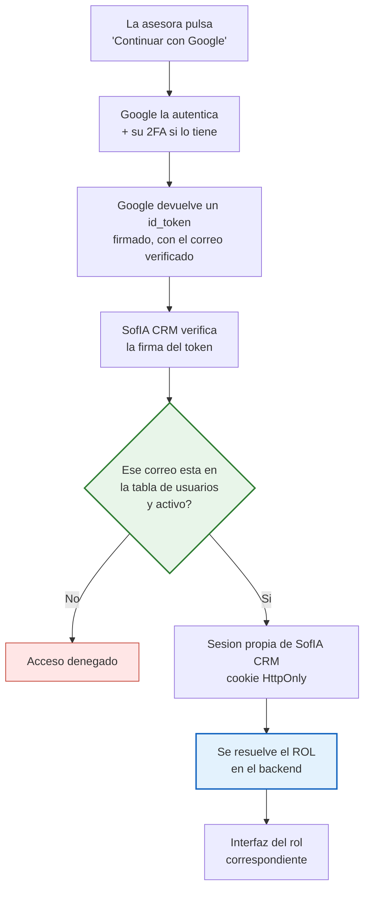

# D-14 · Decisiones de arquitectura (ADR)

> Registro de decisiones técnicas de fondo. Cada ADR guarda **el contexto, las opciones evaluadas y el porqué** — para que dentro de un año se sepa no solo qué se decidió, sino qué se descartó y con qué argumento.

---

## ADR-001 · Autenticación e inicio de sesión

**Estado:** propuesta · **Fecha:** 2026-08-15 · **Decide:** CyberTovar

### Contexto

Hoy se entra a SofIA **por enlace, sin credenciales**, y el dashboard de métricas se abre pasando la clave de administrador en la URL. No hay usuarios, ni roles, ni sesión, ni forma de revocar acceso.

El rediseño convierte a SofIA CRM en **el responsable de la autorización** (decisión A-02: HubSpot invisible). Sin autenticación real, la matriz de permisos de D-06 es decorativa.

### Idea de partida a evaluar

> *"Email de Google + contraseña = el ID del usuario en HubSpot. Si el correo coincide con uno registrado en HubSpot, entra; si no, no entra."*

---

### 🔴 Por qué el ID de HubSpot no puede ser la contraseña

Una contraseña tiene que ser **secreta, cambiable y revocable**. El `owner_id` de HubSpot no es ninguna de las tres.

| Problema | Detalle |
|---|---|
| **No es secreto** | Aparece en la URL de HubSpot al abrir un contacto, lo devuelve la API a cualquiera con el token, está escrito a mano en `lead_assigner.py` (`OWNERS_CONFIG`) dentro del repositorio — y **está escrito en esta misma documentación**, que circula en Word |
| **🔴 Son consecutivos** | Jubeny `89096378` · Mónica `89096379` · Luisa `89096380`. **Quien conoce uno tiene los otros probando ±1.** Un solo ID filtrado abre las tres cuentas |
| **No se puede cambiar** | Lo asigna HubSpot y es permanente. Si se filtra, no hay rotación posible |
| **No se puede revocar** | Dar de baja a una persona no invalida su "contraseña" |
| **Permite enumerar usuarios** | Si el error distingue *"correo no registrado"* de *"ID incorrecto"*, se descubre qué correos son válidos |

> ⚠️ En la práctica esto equivale a **un sistema sin contraseña**: cualquiera que sepa el correo de una asesora entra.

### ✅ Lo que sí acierta la idea, y se conserva íntegro

> **HubSpot como lista blanca: solo entra quien tenga correo registrado como owner activo.**

Esa parte es correcta y es exactamente lo que se implementa. Lo que se descarta es *usar el ID como secreto*, no la idea de validar contra HubSpot.

---

### Opciones evaluadas

| # | Opción | Cómo funciona | Veredicto |
|---|---|---|---|
| **A** | Correo + `owner_id` como contraseña | El ID hace de secreto | ❌ **Descartada** — el secreto no es secreto |
| **B** | Correo + contraseña propia | Cifrado, recuperación, bloqueo por intentos | 🟡 Viable, pero hay que construir y mantener todo |
| **C** | **Continuar con Google** | OIDC estándar; Google prueba la identidad, SofIA CRM decide el acceso | ✅ **Recomendada** |
| **D** | Enlace mágico al correo | Se envía un enlace de un solo uso | 🟡 Alternativa si Google no encaja |

### Comparación B vs C

| | **B · Contraseña propia** | **C · Google** |
|---|---|---|
| Contraseñas almacenadas en SofIA | Sí — cifrado, filtraciones, rotación | **Ninguna** |
| Recuperación de acceso | Hay que construirla | La resuelve Google |
| Bloqueo por intentos | Hay que construirlo | Incluido |
| Segundo factor | Hay que construirlo | **Incluido si el usuario lo tiene** |
| Trabajo de desarrollo | Alto | **Bajo** |
| Encaja con los correos actuales | Sí | **Sí — los 6 owners activos usan `@gmail.com`** |
| Depende de un tercero | No | Sí — si Google cae, nadie entra |

---

### Decisión: **Opción C — Continuar con Google**

### Cómo funciona, paso a paso



> 🔑 **El paso E es tu idea, intacta.** Google solo responde *"esta persona es quien dice ser"*. **Quién puede entrar lo decide SofIA CRM**, contra su lista blanca sincronizada con HubSpot.
> 🔑 **El rol nunca viene de Google.** Se resuelve en el backend a partir de la sesión. Si viajara en el cliente, se falsificaría.

### Requisitos concretos

| # | Requisito | Detalle |
|---|---|---|
| 1 | Proyecto en Google Cloud Console | Credenciales OAuth 2.0 tipo *Aplicación web* |
| 2 | Pantalla de consentimiento | Nombre y logo de SofIA CRM |
| 3 | **Solo los scopes `openid`, `email`, `profile`** | 🔑 **No son sensibles** → **no hace falta verificación de Google, no hay tope de usuarios y no aparece pantalla de advertencia** |
| 4 | URI de redirección autorizada | El dominio de SofIA CRM. ✅ **El subdominio de Railway sirve** — ver A-1. No hace falta demostrar propiedad con scopes básicos |
| 5 | Orígenes JavaScript autorizados | Mismo dominio |
| 6 | Tabla propia de usuarios | `correo · owner_id · rol · activo` |

> ✅ **El punto 3 es el hallazgo que elimina la principal objeción a Google.** Las apps que solo piden identificar al usuario quedan fuera del proceso de verificación y del límite de 100 usuarios; ese límite solo aplica a scopes sensibles o restringidos.

### ⚠️ Los correos son Gmail personales, no un dominio corporativo

`gerencia.inmproteger@gmail.com`, `comercial5.inmproteger@gmail.com`… son cuentas **personales de Gmail**, no `@inmproteger.com` en Google Workspace. Implica:

- ❌ No se puede usar el parámetro `hd` para restringir por dominio de organización
- ✅ La restricción tiene que ser **lista blanca por correo** — justo lo que propusiste
- 🔵 Si algún día migran a Google Workspace con dominio propio, `hd` se añade como segunda barrera sin rehacer nada

### Encaje con la arquitectura

| Pieza | Cómo encaja |
|---|---|
| Modelo de identidad (§3 de D-02) | Usuario = correo + `owner_id`. Google resuelve la identidad; el Rol y los Permisos siguen siendo de SofIA CRM |
| Pantalla *Team Members* del Administrador | Es donde se da de alta el correo → **la lista blanca es administrable sin deploy** (objetivo O-3) |
| Sincronización con HubSpot | Si el owner se desactiva en HubSpot, el usuario se bloquea en SofIA CRM |
| Multi-dispositivo | La sesión es **por usuario**, no por conexión (§15.2 de D-02) |
| Diseño del wireframe | Se conserva la tarjeta tal cual; los dos campos se sustituyen por un botón *Continuar con Google* |

### Consecuencias

**A favor:** SofIA CRM no almacena ni una contraseña · desaparece toda una clase de vulnerabilidad · el segundo factor llega gratis · poco trabajo de desarrollo · la lista blanca queda administrable.

**En contra:** dependencia de Google — si Google cae, nadie entra · hace falta un dominio propio verificado · si alguien pierde su cuenta de Gmail, pierde el acceso hasta que el Administrador lo reasigne.

### Requisitos de seguridad transversales

| # | Requisito |
|---|---|
| 1 | Eliminar el acceso por enlace sin credenciales — incluida la clave en la URL de `/metrics` |
| 2 | El rol se resuelve **en el backend** desde la sesión, nunca en el cliente |
| 3 | El aislamiento se aplica **en la consulta a base de datos**, no en el filtro del frontend |
| 4 | Sesión con caducidad y renovación; cookie `HttpOnly` + `Secure` + `SameSite` |
| 5 | Registro de auditoría de inicios de sesión: quién, cuándo, desde dónde |
| 6 | Revocación inmediata al desactivar un usuario |
| 7 | Mensaje de error **idéntico** en todos los fallos, para no permitir enumerar correos |

---

### ❓ Preguntas abiertas de este ADR

| # | Pregunta | Por qué importa |
|---|---|---|
| A-1 | Dominio para el redirect | **RESUELTA** — se usa el de Railway. Ver A-1 abajo |
| A-2 | Primer administrador | **RESUELTA** — arranque por semilla. Ver A-2 abajo |
| **A-3** 🟠 | ¿Cuánto dura la sesión? | Con dos dispositivos abiertos a la vez, una sesión eterna es un riesgo y una corta es una molestia |
| **A-4** 🟠 | ¿Qué pasa si alguien pierde acceso a su Gmail? | Sin plan, se queda fuera del CRM |
| **A-5** 🟡 | ¿Hay intención de migrar a Google Workspace con dominio propio? | Cambia si se puede usar `hd` como segunda barrera |
| **A-6** 🟡 | ¿Se permite que dos personas compartan un correo? | Hoy "Publicidad Proteger" es un owner que no es una persona |

**Fuentes:** [OpenID Connect · Sign in with Google](https://developers.google.com/identity/openid-connect/openid-connect) · [Apps no verificadas](https://support.google.com/cloud/answer/7454865) · [Requisitos de verificación](https://support.google.com/cloud/answer/13464321) · [Configurar la pantalla de consentimiento](https://developers.google.com/workspace/guides/configure-oauth-consent)

---

## ADR-002 · Monolito modular frente a microservicios

**Estado:** ✅ decidido · 2026-08-20

**Decisión: monolito modular.** Un solo despliegue con límites internos estrictos.

| A favor | En contra de microservicios aquí |
|---|---|
| ~7 usuarios, ~19 leads/día | Multiplican los puntos de fallo |
| El sistema ya sufrió fugas de memoria y `SIGKILL` con **un** worker | Operar 5 servicios con ese historial es peor, no mejor |
| Un despliegue, un registro de errores | Trazas distribuidas que nadie leerá |
| Los módulos se pueden extraer después | Extraer es fácil; volver a juntar no |

**Único candidato futuro a extraer:** el motor de IA — perfil de carga distinto y dependencias propias.
**Consecuencia:** `outbound_panel.py` (10.222 líneas) se parte en ~10 módulos con fronteras explícitas. Ver [D-12 §6](12-arquitectura.md).

## ADR-003 · Etapas frente a propiedades del contacto

**Estado:** ✅ decidido · 2026-08-15

**Contexto:** las 21 etapas de `lifecyclestage` son excluyentes, pero solo **7 forman una secuencia**. Las otras 14 son clasificaciones metidas en el mismo campo porque HubSpot ofrece uno solo de ese tipo.

**El coste actual, medido:** un contacto marcado `Hasta 2M` **deja de decir en qué punto del embudo está**. Se pierde información a diario. Y `No Responde` concentra **1.220 contactos** — el 38 % de la base.

**Decisión: separar en cuatro campos.**

| Campo | Valores |
|---|---|
| `etapa` | 7 — el embudo real |
| `presupuesto` | 4 — propiedad |
| `segmento` | 5 — propiedad |
| `motivo_cierre` | 5 — propiedad |

**Consecuencias:** el Kanban baja de 21 a **7 columnas** y se vuelve usable · un contacto puede estar en `Visita Realizada` **y** ser `Hasta 2M` **y** `Propietario` · **migración compleja**: hay que inferir la etapa de los 3.209 contactos que hoy están en una clasificación → [D-18](18-migracion.md).

## ADR-004 · Modelo de gestión del agente de IA

**Estado:** ✅ decidido · 2026-08-15

**Evaluación separada:** modelo de interacción **85/100 — se mantiene**. Implementación técnica **60/100 — se rehace**.

**Decisión: SofIA es un asignatario, no un estado.** Los 4 estados conversacionales se sustituyen por `assigned_to` + historial de eventos.

**Plan de 6 pilares:**

| # | Pilar | Prioridad |
|---|---|---|
| 1 | Un solo motor de respuesta — quedarse con `SofiaBrain`, retirar el orquestador | 🔴 |
| 2 | SofIA como asignatario | 🔴 |
| 3 | Contrato de autonomía explícito | 🔴 |
| 4 | Handoff auditable — hoy el motivo se calcula y se descarta | 🟠 |
| 5 | **Banco de evaluación** — 30-50 conversaciones etiquetadas | 🟠 |
| 6 | Degradación segura — si el LLM falla, escalar en vez de callar | 🟠 |

**Lo que NO se toca:** Single-Stream (una llamada al LLM en vez de dos), el flujo completo, el RAG, el historial en Redis, los prompts modularizados y APScheduler.

**Riesgo principal:** hoy conviven **dos arquitecturas de agente y dos máquinas de estado**. Nadie puede responder *"¿por qué SofIA contestó esto?"* sin saber por qué ruta entró el mensaje.

## ADR-005 · Persistencia del KPI semanal

**Estado:** ✅ decidido · 2026-08-15

**Pregunta:** ¿guardar el KPI semanal en Drive?

**Drive no es una base de datos.** Es almacenamiento de archivos: cada actualización exigiría leer, modificar y reescribir el archivo entero, sin control de concurrencia ni consultas.

| Opción | Veredicto |
|---|---|
| Archivo CSV/JSON en Drive | ❌ Se corrompe con dos escrituras a la vez |
| Google Sheets vía API | 🟡 Sirve para añadir una fila semanal; **no como fuente operativa** |
| **MongoDB — colección `kpi_semanal`** | ✅ **Recomendada** |

**Decisión: las dos cosas, cada una en su sitio.** MongoDB es la fuente operativa que lee el Dashboard; un trabajo semanal añade una fila a un Sheet en Drive para consulta humana de Marketing y dirección.

**Ventana:** lunes a sábado, la misma para todos los roles.

---

## ADR-006 · Cola de propagación hacia HubSpot

**Estado:** 🔴 pendiente de redactar — **es el ADR que falta y sostiene D-11**.

**Contexto:** la política de fuentes de verdad exige que la escritura local sea síncrona y la propagación a HubSpot diferida con reintentos. Esa pieza **no existe hoy**: la reconciliación de 6 h hace de sustituto.

**A decidir:** tecnología de la cola · política de reintentos · qué pasa si un elemento falla de forma permanente · cómo se observa su salud.

---

### A-1 · El dominio de Railway sirve

**Situacion:** el unico dominio disponible hoy es el subdominio que asigna Railway.

**Veredicto: funciona.**

| Requisito de Google | Estado con Railway |
|---|---|
| La URI de redireccion debe usar **HTTPS** | Cumple — Railway sirve HTTPS por defecto |
| La URI debe coincidir **exactamente** con la registrada (esquema, mayusculas, barra final) | Hay que **fijarla explicitamente**, no dejar que se autogenere |
| Demostrar propiedad del dominio | **No aplica** — solo se exige en el proceso de verificacion, y con los scopes `openid email profile` no hay verificacion |

> **El fallo mas habitual documentado en despliegues de Railway:** la aplicacion genera una URI de redireccion distinta a la registrada en Google Cloud Console y devuelve `400 invalid_request`. Se evita fijando la URI como variable de entorno y registrando exactamente ese valor.

> **Riesgo a medio plazo:** si el subdominio de Railway cambia — al renombrar el servicio o crear un proyecto nuevo — **el inicio de sesion deja de funcionar** hasta actualizar Google Cloud Console.
>
> **Recomendacion:** empezar con el dominio de Railway y registrar en paralelo un dominio propio tipo `crm.inmproteger.com` apuntando por CNAME a Railway. Google admite registrar **ambas URIs a la vez**, asi que se migra sin cortar el servicio. Un dominio propio ademas se ve mas serio para las asesoras y aisla del cambio de URL.

### A-2 · Arranque del primer administrador

**Decision:** el primer administrador es CyberTovar, en calidad de desarrollador.

**Mecanismo propuesto — semilla en el arranque:**

```
Variable de entorno:  BOOTSTRAP_ADMIN_EMAIL = tovar18025@gmail.com

Al iniciar la aplicacion:
  si la tabla de usuarios esta VACIA  -> crear ese correo como Administrador activo
                                          y registrarlo en el log
  si ya hay usuarios                  -> no hacer nada
```

| Por que asi | |
|---|---|
| Reproducible | Queda declarado en la configuracion, no en un paso manual que alguien olvida |
| Compatible con Railway | Es una variable de entorno mas |
| Se auto-desactiva | En cuanto existe un usuario, deja de tener efecto |
| Auditable | El arranque queda en el registro |

> **Riesgo a cubrir:** si la variable se queda puesta y algun dia la tabla de usuarios queda vacia, el mecanismo se rearma solo. Mitigacion: registrar el evento de forma muy visible y **retirar la variable** una vez creado el primer administrador.

> **Precision necesaria.** Claude no puede ser un usuario del CRM: no tiene cuenta de Google ni la necesita. Interviene a traves del codigo y del despliegue, no iniciando sesion. **El primer administrador es una persona real — la cuenta de CyberTovar.** Desde ahi se dan de alta los demas en la pantalla *Team Members*.

### Estado del ADR-001

**Sin bloqueos.** Quedan tres preguntas menores: duracion de la sesion (A-3), perdida de acceso a Gmail (A-4), migracion a Workspace (A-5).

---

### A-3 · Duracion y almacenamiento de la sesion

**Pregunta:** ¿`sessionStorage` con JWT, o cookie `HttpOnly` enviada por el servidor?

#### Comparacion

| | `sessionStorage` + JWT | **Cookie `HttpOnly`** |
|---|---|---|
| ¿JavaScript puede leer el token? | **Si** | **No** — el navegador lo bloquea |
| Riesgo de XSS | **Alto.** Un script inyectado hace `sessionStorage.getItem('jwt')` y se lleva la sesion | **Nulo para robo de token** |
| Riesgo de CSRF | Bajo | Existe — se cubre con `SameSite=Lax` + token anti-CSRF |
| Alcance | **Por pestana.** Una pestana nueva **no tiene token** | Todo el navegador |
| Se envia solo en cada peticion | No — hay que anadirlo a mano | **Si**, incluido streaming y WebSocket |
| Coste | Gratis | Gratis |

#### El problema practico de `sessionStorage`

> `sessionStorage` es **por pestana, no por sesion de usuario**. Si una asesora abre el CRM en una segunda pestana, esa pestana **no tiene token y le pide iniciar sesion otra vez**.
>
> Para alguien que trabaja todo el dia y abre pestanas constantemente, eso es exactamente la friccion que el rediseno quiere eliminar (razon n.o 5 del "por que ahora"). Y en dos dispositivos el problema se duplica.

#### Sobre el comportamiento que buscas

El efecto *"la sesion muere al cerrar"* tambien lo da una **cookie de sesion** — sin `Max-Age` ni `Expires`, el navegador la borra al cerrarse. Matiz: `sessionStorage` muere al cerrar **la pestana**; la cookie de sesion muere al cerrar **el navegador**. La segunda encaja mejor con la jornada de una asesora.

#### Decision

> ✅ **Cookie `HttpOnly` + `Secure` + `SameSite=Lax`**, con vida de **12 horas** y renovacion deslizante mientras haya actividad.

| Requisito | Estado |
|---|---|
| HTTPS obligatorio | ✅ Railway lo da |
| Token anti-CSRF en operaciones que escriben | Hay que implementarlo |
| `SameSite=Lax` | Suficiente si frontend y backend comparten dominio |
| Renovacion deslizante | Cada peticion valida extiende la sesion |
| Revocacion inmediata | La sesion se invalida en servidor al desactivar al usuario |

**Ninguna de las dos opciones cuesta dinero.** Ambas son capacidades nativas del navegador.

> **Sobre las peticiones largas de IA:** las cookies se envian automaticamente en **todas** las peticiones, incluidas SSE y el handshake de WebSocket. Con `sessionStorage` habria que anadir la cabecera a mano en cada llamada. Para este sistema, la cookie es tambien mas comoda.

### A-4 · Cambiar el correo de un usuario sin perder sus contactos

> ✅ **Si es posible, y es la forma correcta de disenarlo.**

La clave esta en el modelo de datos: **el correo es una credencial, no un identificador.**

| Concepto | Papel |
|---|---|
| `user_id` interno | **Identidad permanente.** Nunca cambia |
| `hubspot_owner_id` | Vinculo con HubSpot. Nunca cambia |
| `email` | **Solo credencial de acceso.** Editable por el Administrador |

Los contactos y los portales se enlazan al `user_id` / `owner_id`, **nunca al correo**. Por eso el Administrador puede cambiar el correo desde *Team Members* y la persona conserva intactos sus contactos, sus portales y su historial.

> ⚠️ **Requisito de auditoria:** todo cambio de correo debe quedar registrado (quien lo cambio, cuando, valor anterior). Cambiar el correo de acceso de otra persona es una operacion sensible.

### A-5 · Google Workspace

> ✅ **Por ahora no.** Se mantiene la lista blanca por correo. Si algun dia migran, se anade `hd` como segunda barrera sin rehacer nada.

### A-6 · Correos compartidos

> ✅ **No se permiten.** Un correo = una persona.

**Consecuencia inmediata:** `82598814` "Publicidad Proteger" es hoy **un owner que no es una persona**. Al aplicar esta regla hay que convertirlo en la cuenta de una persona real con rol Marketing, o retirarlo. → entra en D-18.
