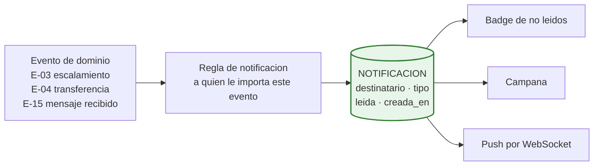
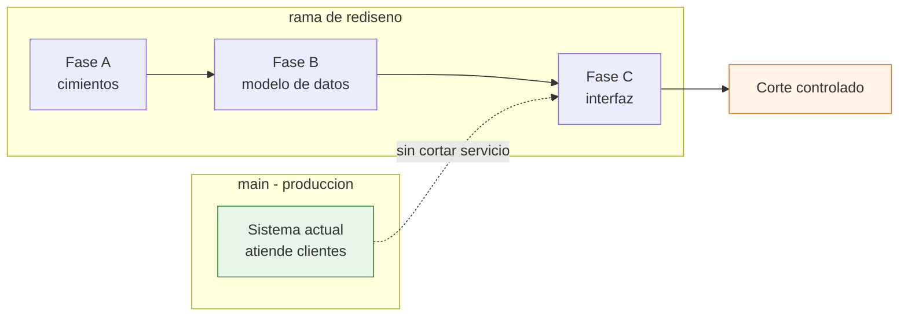

# D-18 · Estrategia de migración y coexistencia

> **Estado:** v1 — 2026-08-21. Análisis de módulos hecho con el índice del grafo de código (2.504 nodos, 9.470 relaciones).
> **Depende de:** [D-04 Inventario](04-inventario-actual.md) · [D-10 Modelo de datos](10-modelo-de-datos.md) · [D-11 Fuentes de verdad](11-fuentes-de-verdad.md)
> **Restricción de partida:** `main` sigue en producción. **Nada que funcione se elimina.**

---

## 1. Principio rector

> **Se conserva todo lo que funciona. Se reescribe solo lo que impide el rediseño.**

De las 31.579 líneas del sistema, la mayor parte **no se toca**. El rediseño cambia el modelo de datos, la autorización y la interfaz — no el motor.

---

## 2. 🔴 Corrección a D-04: la unificación de asesoras ya está hecha

D-04 afirmó que **cuatro fuentes** definen quién es una asesora. **Es incorrecto** — el índice del grafo y la lectura del código lo desmienten.

| Fuente supuesta | Realidad verificada |
|---|---|
| `OWNERS_CONFIG` en `lead_assigner.py` | ✅ **Se deriva** de `advisors_registry` — `lead_assigner.py:28-29` |
| `utils/advisors_registry.py` | ✅ **Es la fuente única declarada.** La usan `outbound_panel.py:48` y `app.py:706` |
| `panel_advisors` en MongoDB | 🔴 **Colección muerta — cero consumidores en Python.** Igual que `contacts` |
| Owners de HubSpot | Sistema externo, autoritativo |

> ✅ **El trabajo de unificar la identidad de las asesoras ya se hizo.** `advisors_registry.py` es la fuente única y funciona.

### Lo que sí sigue duplicado

`utils/channels_registry.py` mantiene **`owner_id` escrito a mano por canal** (líneas 28, 38, 48, 58, 68, 82…). La asignación **canal → owner** vive ahí, no en el registro de asesoras.

> 🔑 **Esa es la duplicación real, y es exactamente lo que la pantalla *Team Members* debe sustituir.** Es un problema mucho más pequeño de lo que decía D-04.

### Y el modelo de roles ya existe en embrión

`advisors_registry.py` declara por asesora:

| Campo | Significado | Equivalente en el rediseño |
|---|---|---|
| `receives_leads` | Recibe asignación automática | Tiene canales asignados |
| `uses_panel` | Tiene bandeja | Es rol operativo |
| `receives_transfers` | Destino de las transferencias por embudo | **Es A. Seguimiento** |

> 🔑 **`receives_transfers: True` en Luisa es literalmente el rol A. Seguimiento, ya codificado.**
> Migrar a `USUARIO` + `ROL` **no es inventar un modelo: es formalizar el que ya existe** y sacarlo del código a la base de datos.

---

## 3. Análisis de los módulos que funcionan

Evaluados con el grafo de código. **Cohesión** = qué tan autocontenido está el módulo (1,0 = perfecto).

### 3.1 Veredicto por módulo

| Módulo | Cohesión | Veredicto | Esfuerzo |
|---|---|---|---|
| **Ciclo de citas** | **0,747** | ✅ **Se conserva casi intacto** | 🟢 Bajo |
| **Integración HubSpot outbound** | **0,784** | ✅ Se conserva | 🟢 Bajo |
| **Frontend del panel** | **0,992** | ⚠️ Muy cohesionado, pero se rehace la interfaz | 🔴 Alto — por diseño, no por calidad |
| **Envíos masivos** | — | ✅ Se conserva | 🟢 Bajo |
| **Mensajes programados** | — | ✅ Se conserva | 🟢 Bajo |
| **APScheduler** | 0,389 | 🟡 Se conserva, se reordena | 🟡 Medio |
| **Notificaciones** | disperso | 🔴 **Se rediseña** | 🔴 Alto |
| **Citaciones de mensajes** | — | 🟡 Se conserva, se mejora | 🟡 Medio |

---

### 3.2 ✅ Ciclo de citas — el módulo mejor construido del sistema

**Cohesión 0,747**, agrupado en un clúster propio de 26 miembros: `get_appointment`, `update_appointment`, `get_appointments_needing_followup`, `get_appointments_needing_followup2`.

| | |
|---|---|
| **Qué hace** | Agendar, editar, cancelar · recordatorio 24 h antes · auto-transición a *Visita Realizada* a 1 h 30 · encuesta `experiencia_cita` |
| **Por qué funciona** | Está encapsulado en `appointment_manager.py` (793 líneas) con su propia clave de deduplicación (`_build_notification_key`, `was_notification_sent`) |
| **Qué se conserva** | **Todo.** La lógica temporal, los tres jobs, la deduplicación |
| **Qué cambia** | Solo dos cosas: `advisor_id` y `worker_id` pasan a ser claves foráneas a `USUARIO`, y se añade `interes_id` opcional |
| **Qué se gana** | Cada transición emite su evento (`E-08` a `E-13`), así el historial y la `Fecha Formulario` salen gratis |

> 🔑 **`was_notification_sent` merece atención**: ya resuelve el problema de "no mandar dos veces lo mismo". Ese patrón debería **extenderse al módulo de notificaciones**, que es justo el que falla.

---

### 3.3 ✅ Envíos masivos y mensajes programados — se conservan

| | Envíos masivos | Mensajes programados |
|---|---|---|
| Dónde | `bulk_campaigns` + job `bulk_campaign_processor` + `job_depuracion_masivos.py` | `scheduled_messages` + job `scheduled_messages` |
| Volumen real | 9 campañas | 20 mensajes |
| Estructura | Cola con procesamiento por lotes | Cola con estado `sent_at` / `error` |
| Veredicto | ✅ **Se conserva** | ✅ **Se conserva** |
| Qué cambia | `advisor_id` → FK. Emite eventos al enviar | Igual |

> 🔑 **Ambos ya implementan el patrón que necesita ADR-006**: encolar, procesar por lotes, registrar el error, reintentar. **La cola de propagación puede reutilizar este diseño** en vez de inventarlo.

---

### 3.4 🔴 Notificaciones — el módulo a rediseñar

**Es el más disperso del sistema.** Está repartido en **seis archivos y tres persistencias**:

| Dónde | Qué aporta |
|---|---|
| `conversation_state.py` 1661-1897 | `add_to_advisor_inbox` · `remove_from_advisor_inbox` · `get_inbox_unread_map` · `get_all_inbox_phones` · `add_advisor_notification` · `remove_advisor_notification` |
| `outbound_panel.py` | `get_advisor_notifications` · `mark_notification_read` · `cleanup_stale_inbox` |
| `app.py` 1357-1430 | `check_24h_advisor_notifications` |
| `websocket_manager.py` 107-136 | `send_to_advisor` |
| `PanelAsesores/index.js` 5760 | `updateUnreadBadge` |
| `appointment_manager.py` | `was_notification_sent` — **deduplicación propia, aparte** |

**Tres persistencias distintas para lo mismo:**

| Mecanismo | Dónde vive | Problema |
|---|---|---|
| Badge rojo (no leídos) | Memoria del frontend | **Se pierde al recargar** |
| Punto azul | DOM directo | No sobrevive a nada |
| Campana | Redis ZSET, 30 días | La única que persiste |

> 🔴 **La causa de los fallos está aquí.** Tres mecanismos, tres persistencias, sin una definición común de qué es una notificación ni cuándo se considera atendida. Y existe un `cleanup_stale_inbox` — un endpoint dedicado a limpiar la basura que este diseño genera.

**Rediseño propuesto — un solo modelo:**

| Principio | Consecuencia |
|---|---|
| **La notificación es una entidad, no tres mecanismos** | Un solo almacén, un solo estado `leída` |
| **Se deriva de un evento** | No hay que acordarse de notificar: el evento lo dispara |
| **Badge, campana y push son tres presentaciones del mismo dato** | Recargar la página no pierde nada |
| **Deduplicación de serie** | Se generaliza el patrón de `was_notification_sent` |

**Esfuerzo:** 🔴 alto — se reescribe. **Pero el comportamiento observable mejora**, no cambia.

---

### 3.5 🟡 APScheduler — se conserva, se reordena

15 trabajos, agrupados por el grafo en un clúster de **cohesión 0,389** — baja, porque están mezclados con lógica de negocio dentro de `app.py` (2.242 líneas).

| Qué se conserva | Qué cambia |
|---|---|
| Los 15 trabajos y su lógica | Salen de `app.py` a su propio módulo |
| `scheduler_lock_heartbeat` — evita doble scheduler | Se conserva íntegro |
| `memory_watchdog` | Se conserva |
| Los tiempos escritos a mano (24 h, 48 h, 90 días, 1 h 30) | **Salen a configuración** — decisión D15-1 |

> El problema no son los trabajos: es **dónde viven**. Sacarlos de `app.py` es mover código, no reescribirlo.

---

### 3.6 🟡 Citaciones de mensajes — se conserva, se mejora

`reply_quote_formatter.py` da formato a las respuestas citadas.

| Limitación actual | Mejora propuesta |
|---|---|
| La cita es **texto formateado** dentro del mensaje | Guardar `mensaje_citado_id` como referencia |
| No se puede saltar al mensaje original | Pulsar la cita lleva al mensaje |
| Si el original se edita, la cita queda obsoleta | La referencia siempre apunta al actual |

**Esfuerzo:** 🟡 medio. Un campo nuevo en `MENSAJE` y el salto en la interfaz.

---

## 4. Módulos que NO estaban en la lista y también se rescatan

El barrido del grafo encontró **seis módulos más** que funcionan y merecen conservarse:

| # | Módulo | Dónde | Por qué se rescata |
|---|---|---|---|
| 1 | **Procesamiento multimedia** | `media_processor.py` (1.200 líneas) + Bunny CDN | Audio, imágenes y documentos resueltos. Nada que rehacer |
| 2 | **Agregador de mensajes** | `message_aggregator.py` | Junta mensajes seguidos del cliente para no responder tres veces |
| 3 | **Normalizador de teléfonos** | `phone_normalizer.py` — **fan-in 31** | Es la base de la identidad del contacto. Crítico y funciona |
| 4 | **Los cuatro detectores** | `link_detector` · `property_code_detector` · `pii_validator` · `date_parser` | Ya extraen lo que necesitan `INTERES` y los eventos `E-06`/`E-07` |
| 5 | **Perfilador de consultas** | `query_profiler.py` (294 líneas) | Mide latencia por request y enmascara PII. Es observabilidad ya construida |
| 6 | **Registro de línea de tiempo de HubSpot** | `timeline_logger.py` (1.215 líneas) | Ya escribe el historial en HubSpot. Se reaprovecha para la propagación |

> 🔑 **`query_profiler.py` es un hallazgo.** El rediseño necesita observabilidad y **ya existe**, con enmascarado de PII incluido. No hay que construirla.

---

## 5. Resumen: qué se conserva y qué se reescribe

| Categoría | Módulos | % del sistema |
|---|---|---|
| ✅ **Intacto** | Motor de IA · RAG · Twilio · multimedia · agregador · normalizador · detectores · perfilador · citas · masivos · programados | **~55 %** |
| 🟡 **Se mueve o se ajusta** | Schedulers · citaciones · timeline · HubSpot outbound | **~15 %** |
| 🔴 **Se reescribe** | Notificaciones · autorización · modelo de datos · `outbound_panel.py` · frontend | **~30 %** |

> **Menos de un tercio del código se reescribe.** El "80 % de rediseño" es de **producto**, no de código: el motor se conserva, cambia lo que lo rodea.

---

## 6. Las siete cargas de migración de datos

| # | Migración | Volumen | Riesgo |
|---|---|---|---|
| 1 | Repartir `lifecyclestage` en 4 campos | **3.209 contactos** | 🔴 El dato de etapa se perdió en los clasificados |
| 2 | Colapsar `(teléfono, canal)` a `teléfono` | 3.146 conversaciones | 🟠 Hay teléfonos con varios canales |
| 3 | Crear `USUARIO` desde `advisors_registry` | 6 owners | 🟢 **Trivial — el registro ya existe** |
| 4 | Sacar `owner_id` de `channels_registry` a `CANAL_ASIGNADO` | 16 canales | 🟢 Baja |
| 5 | Fusionar `whatsapp` y `whatsapp_directo` | por contar | 🟢 Baja |
| 6 | Renombrar `Seguimiento` → `Post Cita` en HubSpot | 1 etapa | 🟢 El ID no cambia |
| 7 | Crear etapa `Nuevo Lead` en HubSpot | — | 🟠 Toca producción |
| 8 | Eliminar colecciones muertas `contacts` y `panel_advisors` | 0 y 4 docs | 🟢 **Verificado: cero consumidores** |

### 🔴 La migración 1 — la única realmente difícil

Un contacto que hoy está en `Hasta 2M` **no dice en qué punto del embudo está**.

| Opción | Coste | Fiabilidad |
|---|---|---|
| **A** · Inferir la etapa del historial de mensajes | Alto | Media |
| **B** · Dejarlos todos en `En Conversación` | Trivial | Baja — falsea el embudo |
| **C** · Inferir de las citas: si tiene cita realizada → `Visita Realizada`; si tiene cita → `Visita Agendada`; si no → `En Conversación` | **Medio** | **Alta** |

> **Recomendación: opción C.** Hay **496 citas** en `appointments` con fecha y estado — es una fuente objetiva para reconstruir el punto del embudo de los contactos que la tuvieron. Para el resto, `En Conversación`.
> Los **1.220 de `No Responde`** se resuelven solos: pasan a `motivo_cierre = No Responde` conservando su etapa inferida.

---

## 7. Estrategia de coexistencia

`main` sigue atendiendo clientes durante todo el rediseño.

### Reglas de coexistencia

| # | Regla |
|---|---|
| 1 | **Nada que rompa producción se fusiona.** Ni un despliegue que deje a una asesora sin panel |
| 2 | Los cambios en HubSpot se secuencian aparte — tocan el sistema vivo |
| 3 | Renombrar `Seguimiento` → `Post Cita` es **seguro**: el ID no cambia y el código consulta por ID |
| 4 | Crear `Nuevo Lead` **no** altera nada hasta que algo empiece a escribirla |
| 5 | Las colecciones nuevas (`USUARIO`, `INTERES`, `EVENTO`) **conviven** con las actuales sin tocarlas |
| 6 | La migración de `lifecyclestage` es **el punto de no retorno**: exige copia de seguridad y ventana acordada |

### Orden de ejecución

| Fase | Qué entra | ¿Rompe producción? |
|---|---|---|
| **A · Cimientos** | `USUARIO` · autenticación con Google · `EVENTO` empieza a registrar en paralelo | ❌ No — se añade, no se sustituye |
| **B · Datos** | `INTERES` · `CANAL_ASIGNADO` · persistir enlaces y códigos ya detectados | ❌ No |
| **C · Modelo** | Repartir `lifecyclestage` · colapsar la clave de conversación | 🔴 **Sí — punto de no retorno** |
| **D · Interfaz** | Dashboards · Kanban · Team Members | ❌ No si B y C están hechas |
| **E · Limpieza** | Retirar estados, colecciones muertas y endpoints de recuperación | ❌ No |

> 🔑 **A y B no rompen nada y desbloquean casi todo.** Se pueden entregar mientras `main` sigue igual. **C es la única fase que exige ventana.**

---

## 8. Plan de reversión

| Fase | Cómo se revierte |
|---|---|
| A · B | Se desactivan las escrituras nuevas. Los datos añadidos no estorban |
| **C** | 🔴 **Copia de seguridad completa de `contacts` en HubSpot y de `conversations` en MongoDB antes de empezar.** La reversión es restaurar |
| D | Volver al frontend anterior — el backend soporta ambos |
| E | No se ejecuta hasta que C y D lleven semanas estables |

---

## 9. Pendiente

- Guion exacto de la migración 1 con la lógica de inferencia
- Ventana acordada para la fase C
- Criterios de verificación tras cada fase
- Qué hacer con las 3.146 conversaciones que tienen varios canales por teléfono
