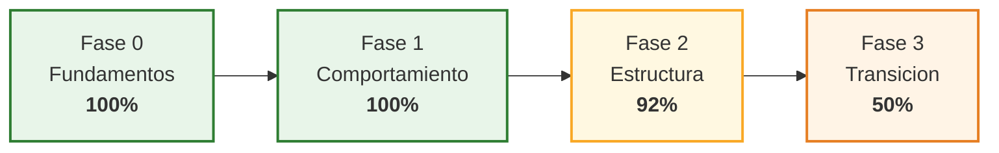
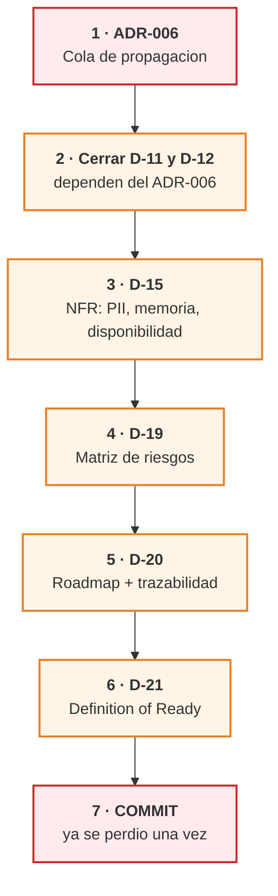

# Auditoría de la documentación — 2026-08-27

> **Qué es esto.** Una revisión archivo por archivo del estado real de la planeación: qué está cerrado, qué está escrito pero desactualizado, qué falta y en qué orden se cierra.
> Se hace después de dos cambios que movieron el terreno: la **corrección de D-04 / D-10** y el **análisis de módulos rescatables** que produjo D-18.

---

## 0-bis. Avance desde esta auditoría — 2026-08-27

| Paso | Estado |
|---|---|
| ✅ **Commit** | Hecho por CyberTovar |
| ✅ **Paso 1 · ADR-006** | Escrito. Patrón *outbox* generalizando el motor de envíos masivos |
| ✅ **Paso 2 · D-11 §5 y D-12 §7-§8** | Cerrados. D-12 §7 sustituido por la lista medida de D-18 |
| ✅ **D11-1** | La única pregunta que bloqueaba un documento — resuelta por ADR-006 |
| 🟠 Siguiente | D-15 → D-19 → D-20 → D-21 |

**Fase 2 pasa de 92 % a 97 %. Total: 95 %.**

---

## 0. Respuesta directa

**Sí, D-18 está creado y registrado.** `18-migracion.md`, 294 líneas, 9 secciones, dado de alta en el `LAYOUT` de `md2docx.py` y ya presente en el espejo Word (*Fase 3 - Transición / 18 - Estrategia de Migracion*).

**Y no, no hace falta que respondas nada para que yo termine los documentos que quedan.** Ninguna de las 14 preguntas abiertas bloquea la escritura de ADR-006, D-19, D-20 ni D-21. Lo que sí necesito de ti está en el §7 y son dos cosas, ninguna de ellas una respuesta larga.

---

## 1. Qué llevamos hasta ahora

| | |
|---|---|
| Documentos escritos | **19 de 21** + índice + guía + catálogo de wireframes = **22 archivos** |
| Líneas de Markdown | **5.892** |
| Wireframes catalogados | 29 imágenes + catálogo comentado |
| Fases cerradas | **Fase 0 ✅ · Fase 1 ✅** |
| Avance total | **≈ 93 %** |



---

## 2. Estado archivo por archivo

### Leyenda

| Marca | Significa |
|---|---|
| ✅ **Cerrado** | Escrito, revisado y coherente con lo decidido hasta hoy |
| 🟢 **Cerrado, sin revisar contigo** | Escrito y completo, pero nunca lo confirmaste explícitamente |
| 🟡 **Desactualizado** | Completo, pero contiene afirmaciones que ya sabemos falsas o cifras viejas |
| 🟠 **Incompleto** | Tiene cuerpo pero le falta una parte declarada |
| 🔴 **Falta** | No existe |

### Fase 0 — Fundamentos · **100 %**

| Doc | Archivo | Líneas | Estado | Observación |
|---|---|---|---|---|
| D-01 | `01-glosario.md` | 371 | 🟡 | Línea 84: define *Equipo* desde `OWNERS_CONFIG`. La fuente real es `advisors_registry` |
| D-02 | `02-actores-y-roles.md` | 1.523 | ✅ | El documento más denso. 27 secciones, roles confirmados por wireframe |
| D-03 | `03-vision.md` | 350 | ✅ | Métricas medidas en producción. Quedan las **metas** (N-1), que son del negocio |
| — | `wireframes/README.md` | 13.699 B | 🟠 | Catálogo completo, pero **`wf32.png` (Marketing Dashboard) nunca llegó al disco**. El contenido está transcrito |

### Fase 1 — Comportamiento · **100 %**

| Doc | Archivo | Líneas | Estado | Observación |
|---|---|---|---|---|
| D-04 | `04-inventario-actual.md` | 261 | ✅ | **Corregido el 26-ago** — la afirmación de las "cuatro fuentes" está desmentida y marcada |
| D-05 | `05-casos-de-uso.md` | 260 | 🟢 | 32 casos de uso con criterios Gherkin |
| D-06 | `06-matriz-permisos.md` | 151 | 🟢 | Rol × recurso × acción + visibilidad de las 21 etapas |
| D-07 | `07-journey-maps.md` | 224 | 🟢 | 5 recorridos |
| D-08 | `08-maquinas-de-estado.md` | 241 | ✅ | Modelo de asignatario. Incluye la corrección de los tres mecanismos (ventana / limpieza / posponer) |
| D-09 | `09-catalogo-eventos.md` | 126 | ✅ | 22 tipos de evento, E-01…E-22 |

### Fase 2 — Estructura · **92 %**

| Doc | Archivo | Líneas | Estado | Observación |
|---|---|---|---|---|
| D-10 | `10-modelo-de-datos.md` | 258 | ✅ | **Corregido el 26-ago** junto con D-04 |
| D-11 | `11-fuentes-de-verdad.md` | 103 | 🟠 | §5 declarada *"pendiente de desarrollar"*. **Depende de ADR-006** |
| D-12 | `12-arquitectura.md` | 236 | 🟠 | C4 completo, pero §8 remite el diseño de la cola a ADR-006. No incorpora aún los módulos rescatados de D-18 |
| D-13 | `13-contratos-api.md` | 242 | 🟢 | Contratos de API y eventos |
| D-14 | `14-adrs.md` | 360 | 🟠 | **ADR-001…005 cerrados. ADR-006 es un esqueleto de 5 líneas** que dice explícitamente *"pendiente de redactar"* |
| D-15 | `15-nfr.md` | 67 | 🟠 | El documento **más delgado de todos**. §4 declarada pendiente. Le faltan los NFR de PII, memoria y disponibilidad, que en este sistema no son opcionales |

### Fase 3 — Transición · **50 %**

| Doc | Archivo | Líneas | Estado | Observación |
|---|---|---|---|---|
| D-16 | `16-antes-despues.md` | 187 | 🟡 | Línea 69: sigue diciendo que dar de alta una asesora es *"editar `OWNERS_CONFIG`"*. Ya no es cierto |
| D-17 | `17-benchmark-crms.md` | 247 | 🟢 | 10 patrones, incluye Leadsales |
| D-18 | `18-migracion.md` | **294** | ✅ | **Nuevo.** Análisis de módulos + 8 cargas de migración + coexistencia + reversión. §9 lista 4 detalles pendientes |
| D-19 | *riesgos* | — | 🔴 | **No existe** |
| D-20 | *roadmap + trazabilidad* | — | 🔴 | **No existe** |
| D-21 | *definition of ready* | — | 🔴 | **No existe** |

### Archivos de gobierno

| Archivo | Estado | Observación |
|---|---|---|
| `ESTADO.md` | 🟡 **El más desactualizado** | Ver §4 |
| `00-INDICE.md` | 🟡 **Gravemente desactualizado** | Ver §4 |
| `_LEEME.md` | 🟡 | Anuncia un bloqueo (V-4) resuelto hace semanas y describe Fases 1 y 2 como *"por crear"* |
| `_tools/md2docx.py` | ✅ | 22 documentos en el `LAYOUT`, D-18 incluido |
| `_tools/docx2md.py` | ✅ | Recuperación de emergencia. Ya salvó la documentación una vez |

---

## 3. Qué se adelantó en esta última tanda

| Avance | Consecuencia |
|---|---|
| **Corrección de las "cuatro fuentes"** | `advisors_registry.py` **ya es** la fuente única de identidad de asesoras. Lo único duplicado que queda es el `owner_id` escrito a mano en `channels_registry.py` |
| **`receives_transfers` es el rol A. Seguimiento** | Migrar a `USUARIO` + `ROL` **no inventa** un modelo: formaliza el que ya está codificado y lo saca a la base de datos |
| **Análisis de módulos con el grafo de código** | 2.504 nodos, 9.470 aristas, 12 agrupaciones. Cohesión medida, no opinada |
| **6 módulos rescatables no listados** | `media_processor` · `message_aggregator` · `phone_normalizer` · los 4 detectores · `timeline_logger` · **`query_profiler`** |
| **El reparto real del rediseño** | **~55 % intacto · ~15 % se mueve · ~30 % se reescribe.** El "80 %" es de producto, no de código |
| **Opción C para la migración difícil** | Las 496 citas de `appointments` permiten inferir la etapa de los 3.209 contactos con una fuente objetiva |
| **Fase 3 pasó de 31 % a 50 %** | D-18 era el documento obligatorio con `main` vivo |

---

## 4. 🔴 Lo que está completo pero **no actualizado**

Es tu quinto punto y es el hallazgo más importante de esta auditoría: **hay documentos cerrados que hoy mienten.** Un documento con una afirmación falsa es peor que uno que falta, porque desarrollo lo va a leer como verdad.

| # | Archivo | Qué dice | Qué es cierto | Peso |
|---|---|---|---|---|
| 1 | `ESTADO.md` §5, hallazgo 1 | *"**Cuatro fuentes** definen quién es una asesora"* | Es **una sola**: `advisors_registry`. Lo duplicado es el `owner_id` por canal | 🔴 |
| 2 | `ESTADO.md` §6 | Fase 3 al 31 %, total 89 %, **D-18 listado como faltante** | Fase 3 al 50 %, total 93 %, D-18 escrito | 🔴 |
| 3 | `ESTADO.md` §7 | 7 cargas de migración | Son **8** — falta eliminar las colecciones muertas | 🟠 |
| 4 | `00-INDICE.md` | **D-04 a D-21 marcados "⬜ No iniciado"** | 16 de esos 18 están escritos | 🔴 |
| 5 | `00-INDICE.md` | *"🔴 Bloqueo activo — la pregunta V-4"* | **V-4 está resuelta**: canal y rol son ortogonales | 🔴 |
| 6 | `_LEEME.md` | Fases 1 y 2 *"por crear"* + el bloqueo V-4 | Ambas escritas; V-4 resuelta | 🟠 |
| 7 | `16-antes-despues.md:69` | Dar de alta una asesora = editar `OWNERS_CONFIG` | Es `advisors_registry` — y el punto sigue siendo válido: **se edita código y se despliega** | 🟡 |
| 8 | `01-glosario.md:84` | *Equipo* vive en `OWNERS_CONFIG` | Se deriva de `advisors_registry` | 🟡 |
| 9 | `12-arquitectura.md` §7 | *"Qué se conserva del sistema actual"* | Escrito **antes** de D-18. Ahora hay una lista medida que debe sustituirlo | 🟠 |

> 🔑 **Los puntos 1, 2, 4 y 5 se corrigen en esta misma tanda** — son los que hacen que el índice y el estado dejen de servir como mapa.

---

## 5. Qué falta revisar **contigo**

Ninguno bloquea. Son documentos que escribí y nunca confirmaste:

| Doc | Por qué conviene que lo mires |
|---|---|
| **D-05** casos de uso | Son 32. Si alguno describe un comportamiento que no quieres, se arrastra a todo el desarrollo |
| **D-06** matriz de permisos | Define **quién ve qué**. Un error aquí es un problema de seguridad, no de documentación |
| **D-07** journey maps | Los 5 recorridos son mi lectura de cómo trabaja el equipo |
| **D-13** contratos de API | Muy técnico. Se puede delegar a desarrollo |
| **D-17** benchmark | Los 10 patrones son propuestas, no decisiones |

---

## 6. Los pasos que faltan, en orden



| # | Paso | Por qué en ese lugar | ¿Te necesito? |
|---|---|---|---|
| **1** | **ADR-006 · Cola de propagación** | Es el único documento del que **dependen otros dos**. Y ya no hay que inventarlo: **envíos masivos y mensajes programados ya implementan ese patrón** — encolar, procesar por lotes, registrar el error, reintentar | ❌ No |
| **2** | Cerrar §5 de D-11 y §7-§8 de D-12 | Se desbloquean solas en cuanto exista ADR-006. D-12 §7 se sustituye por la lista medida de D-18 | ❌ No |
| **3** | **D-15 · Completar los NFR** | Hoy tiene 67 líneas. Faltan PII, memoria y disponibilidad — los tres que este sistema ya ha sufrido en producción | ❌ No |
| **4** | **D-19 · Riesgos** | Se escribe **después** de D-18 a propósito: la mitad de los riesgos reales salen de la migración y de la coexistencia | ❌ No |
| **5** | **D-20 · Roadmap + trazabilidad** | Cierra el círculo: cada caso de uso de D-05 ↔ cada fase A-E de D-18. Es lo que convierte 22 documentos en un plan | ❌ No |
| **6** | **D-21 · Definition of Ready** | El contrato con desarrollo. Se escribe al final porque necesita saber qué hay | ❌ No |
| **7** | 🔴 **Commitear** | **Sí, ya te lo debo señalar otra vez** | ✅ **Sí** |

---

## 7. Qué necesito de ti

Solo dos cosas, y ninguna es una respuesta larga.

### 🔴 1 · Commitear la documentación — **esto es urgente**

22 archivos y 5.892 líneas de trabajo siguen **sin versionar**. Esta documentación **ya se perdió una vez** exactamente por esto, y se recuperó de milagro escribiendo `docx2md.py` para leerla desde el Word.

```bash
git add .gitignore docs/rediseno
```

```bash
git commit -m "docs(rediseno): planeacion al 93 por ciento con D-18 y auditoria"
```

### 🟡 2 · `wf32.png` — el Marketing Dashboard

Es la única pieza de insumo que falta. Ha fallado tres veces al copiarse. **No bloquea nada** — el contenido está transcrito en el catálogo — pero el wireframe original es mejor evidencia que mi transcripción.

### Y lo que **no** necesito

Las **14 preguntas abiertas** del registro de `00-INDICE.md` **no bloquean nada de lo que queda**:

| Grupo | Qué son | Cuándo hacen falta |
|---|---|---|
| G-1, G-2 | Nombres de canales y de eventos | Al implementar. Son etiquetas |
| V-2b, N-1, N-2, N-3 | **Metas del negocio** y confirmación de no-objetivos | Solo afectan al tablero de métricas |
| A-3, A-4, A-5, A-6 | Detalles de la sesión y de las cuentas de Google | Al implementar la autenticación |
| D11-1 | Retardo de sincronización aceptable | **Se resuelve solo con ADR-006**: el ADR propone los valores y tú confirmas o corriges |
| D15-1, D08-1 | Automatizaciones configurables · posponer | Ya tienen recomendación escrita |

> 🔑 **Puedo escribir los seis pasos que faltan sin que respondas nada.** Lo que sí te pido es que **commitees**, porque el riesgo de perder el trabajo es real y ya se materializó una vez.

---

## 8. Resumen en una tabla

| Pregunta que hiciste | Respuesta |
|---|---|
| **¿D-18 actualizado?** | ✅ Sí. Creado, con 294 líneas, registrado en el espejo Word |
| **¿Qué llevamos?** | 19 de 21 documentos · 5.892 líneas · **93 %** |
| **¿Qué se adelantó?** | Corrección de D-04/D-10 · análisis de módulos con grafo · 6 módulos rescatados de más · Fase 3 de 31 % a 50 % |
| **¿Qué está completo?** | **Fase 0 y Fase 1 al 100 %.** D-18 y las correcciones de D-04/D-10 |
| **¿Qué está casi?** | **Fase 2 al 92 %** — le falta solo ADR-006 y completar D-15 |
| **¿Qué falta revisar?** | D-05, D-06, D-07 contigo. D-13 y D-17 se pueden delegar |
| **¿Qué está completo pero desactualizado?** | **`ESTADO.md` y `00-INDICE.md`** — 9 puntos concretos en §4. Los críticos se corrigen ahora |
| **¿Qué falta por escribir?** | ADR-006 → D-15 → D-19 → D-20 → D-21 |
| **¿Qué necesito de ti?** | **Commitear.** Y `wf32.png` si aparece |
