# Wireframes — origen y catálogo

Fuente original: `Documentacion Re-estructura SofIA/DOCUMENTACION.docx`.
Se versionan aquí porque son **la única fuente de la intención de diseño** tras la pérdida de `Planos_Rediseno_SofIA_v1.docx`.

> **Actualizado 2026-08-15 (ronda 3)** — 29 imágenes curadas y reordenadas por CyberTovar. Incorpora el **Dashboard de A. Interna**, el **Dashboard del Administrador** y la **sección Citas de Marketing**, que no existían.

---

## 1. A. Seguimiento

### Dashboard
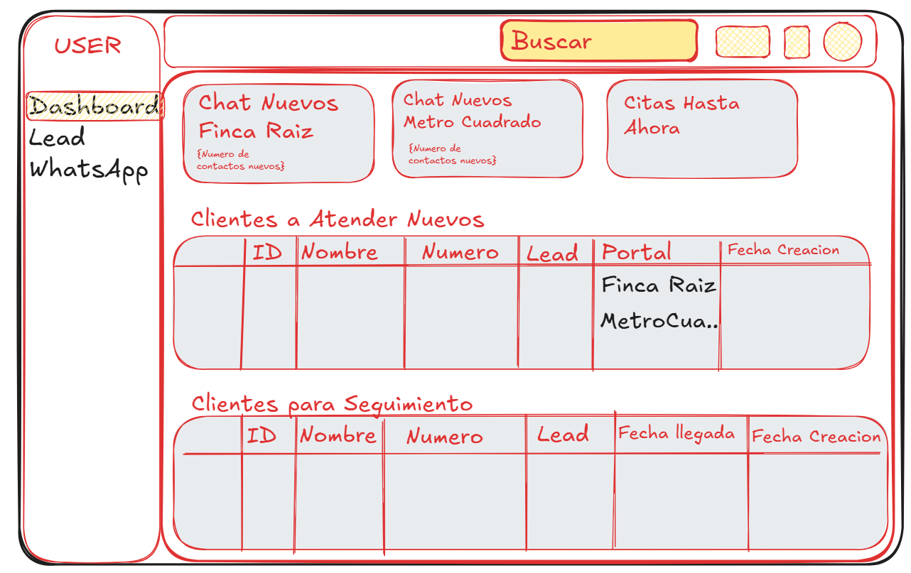

KPIs: `Chat Nuevos Finca Raíz` · `Chat Nuevos Metro Cuadrado` · `Citas Hasta Ahora`
Cola 1 — **Clientes a Atender Nuevos**: `ID · Nombre · Número · Lead · Portal · Fecha Creación`
Cola 2 — **Clientes para Seguimiento**: `ID · Nombre · Número · Lead · Fecha llegada · Fecha Creación`

> Las dos colas corresponden a sus **dos vías de entrada**: canal directo y transferencia manual.

### Lead — Kanban
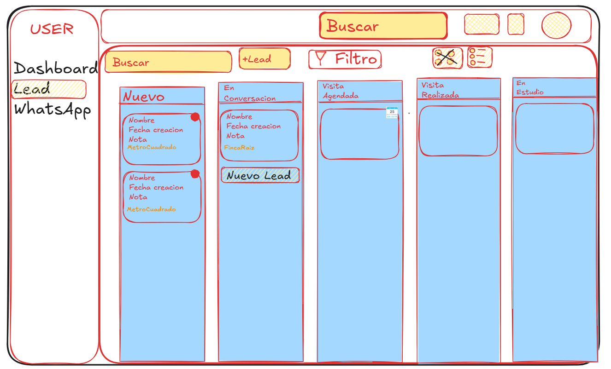

Columnas (**19**): `Nuevo · En Conversación · Visita Agendada · Visita Realizada · En Estudio · Post-Cita · No Responde · Hasta 1.5M · **Hasta 2M** · Hasta 2.5M · Hasta 3M · Propietarios · Otros Municipios · Local o Bodega · Ya encontró · Cerrado Perdido · **Cerrado Ganado** · Aprobado · Reubicado`

Tarjeta: `Nombre · Fecha creación · Asignado · Nota · Portal`. Punto rojo = no leído. Calendario en `Visita Agendada`.

> ✅ **Corregido 2026-08-15.** No había duplicación — cada rol tiene **un solo embudo**. `Hasta 2M` y `Cerrado Ganado` **sí** pertenecen a A. Seguimiento y quedan incorporadas.
> **19 etapas exactas — coincide con la matriz de [D-02 §6](../02-actores-y-roles.md).**

### Lead — Tabla y detalle

### WhatsApp

Panel derecho: `Asignado · Lead · Canal · Nota · Lead Info` + **"Ver historial de contacto"**. Cita editable dentro del hilo. Composer con adjuntos, audio y plantillas.

### Chat desde el Kanban
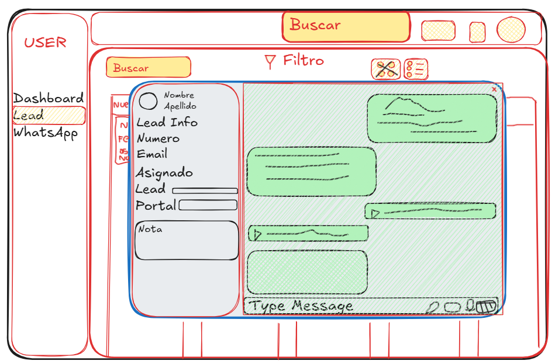

### Navegación cruzada
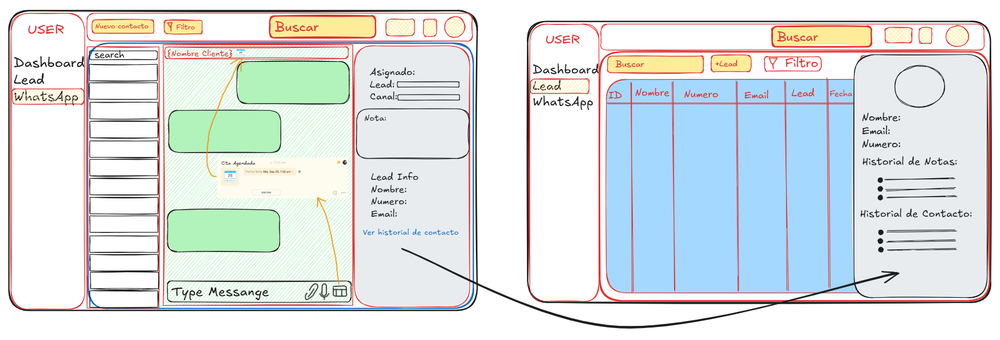

---

## 2. A. Interna

### Dashboard ✅ *resuelve W-4*
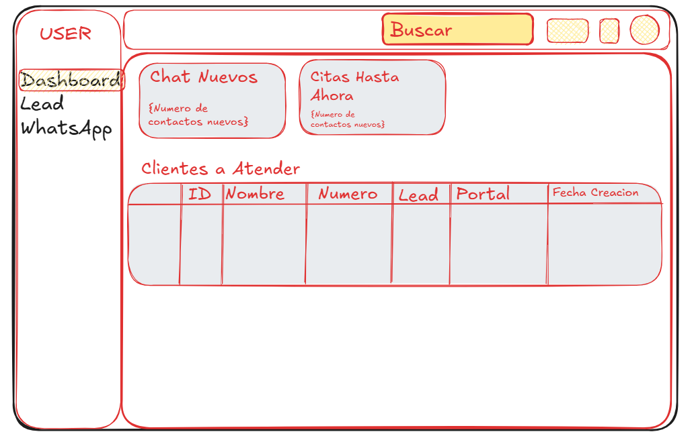

**2 KPIs:** `Chat Nuevos` · `Citas Hasta Ahora`
**1 cola — `Clientes a Atender`:** `ID · Nombre · Número · Lead · Portal · Fecha Creación`

> ⚠️ El dibujo rotula el subtítulo del segundo KPI como *"{Número de contactos nuevos}"* — copiado del primero. Debe decir el número de citas.
> ✅ Es el mismo dato con dos nombres. **Queda `Clientes a Atender`**, el del dibujo.

### Lead — Kanban
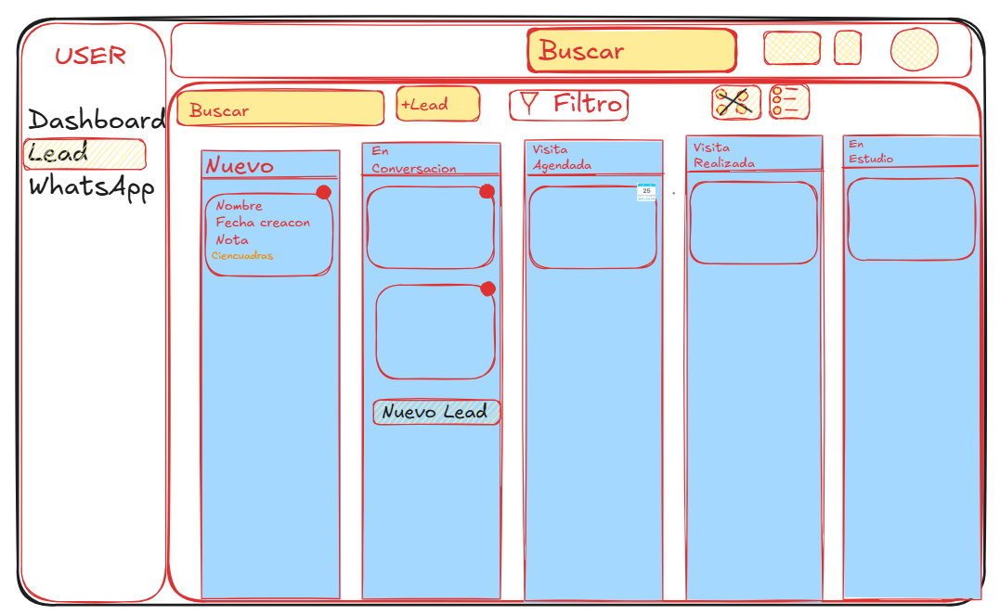

Columnas: `Nuevo · En Conversación · Visita Agendada · Visita Realizada · En Estudio · Otras áreas · Ya encontró · Aprobado · Cerrado Perdido · Cerrado Ganado · Venta`

> ✅ **11 etapas — coincide exactamente con la matriz de [D-02 §6](../02-actores-y-roles.md).**

### Tabla, WhatsApp, chat y navegación cruzada
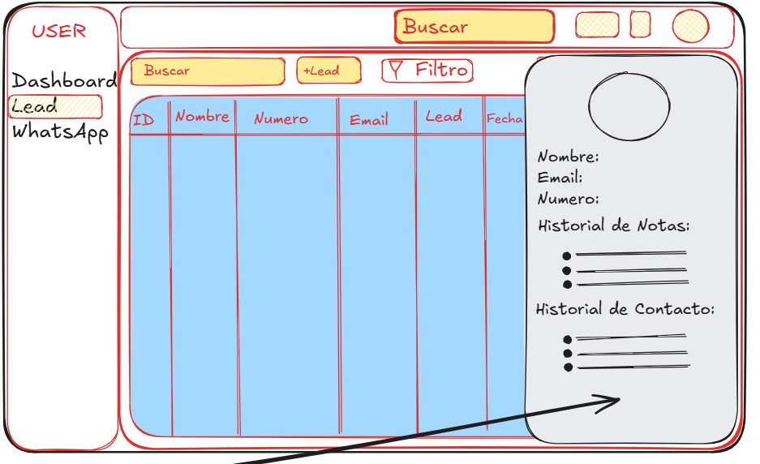
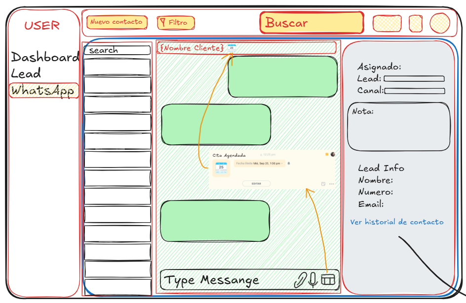

Idénticas a las de A. Seguimiento. **La diferencia entre roles está en el Dashboard y en las etapas del Kanban, no en las pantallas de trabajo.**

---

## 3. Administrador

### Dashboard — Vista total *(v2, 2026-08-15)*

**3 KPIs — todos con ventana de 7 días:**
| KPI | Definición |
|---|---|
| `Chats Nuevos` | Nuevos chats de los últimos 7 días |
| `Citas hasta ahora` | Contactos con cita en los últimos 7 días |
| `Clientes Transferidos a seguimiento` | Contactos que fueron transferidos a seguimiento |

**3 colas:**
| Cola | Columnas |
|---|---|
| `Citas Realizadas hasta ahora` | `ID · Nombre · Número · Lead · Portal · Fecha Creación · **Fecha Formulario**` |
| `Clientes Nuevos a atender` | `ID · Nombre · Número · Lead · Portal · Fecha Creación · **Link**` |
| `Clientes transferidos a seguimiento` | `ID · Nombre · Número · Lead · Portal · Fecha Creación` |

**Qué cambió respecto de la v1 (`wf15`):**
| Cambio | Efecto |
|---|---|
| ❌ Desaparece `Clientes Nuevo Seguimiento (MC y FR)` | Los contactos nuevos ya **no se separan por portal** — una sola cola, sin confusión |
| ➕ Columna **`Link`** en `Clientes Nuevos a atender` | El enlace de origen **no es exclusivo de Marketing**: el Administrador también lo ve |
| ➕ Columna **`Fecha Formulario`** | Misma columna que la sección `Citas` de Marketing |
| ➕ Ventana explícita de **7 días** en los tres KPIs | Antes decía "en la semana" |

> 🔑 **La columna `Link` cambia el alcance del dato.** El enlace de origen deja de ser una necesidad de Marketing y pasa a ser **un dato del contacto** que ven varios roles.

> ⚠️ **Dos ventanas temporales distintas conviven:** el Administrador usa **últimos 7 días** (ventana móvil); las asesoras usan **semana lunes→sábado** con reinicio (P-11). ¿Es intencional? Si el Administrador debe cuadrar con lo que ve cada asesora, las ventanas tienen que coincidir.

### Configuración — Team Members
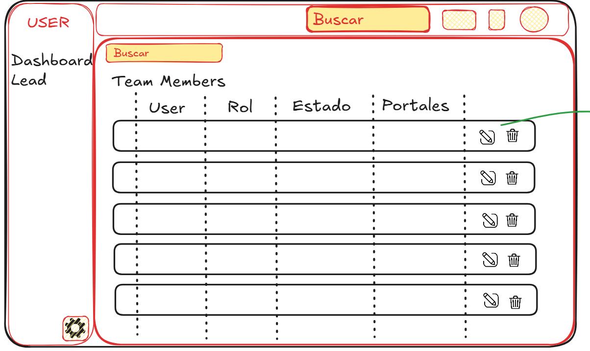

`User · Rol · Estado (Activo o inactivo) · Portales {Actualizar}` con editar y eliminar por fila. Acceso por el **engranaje** inferior izquierdo.

> ✅ Es la materialización del objetivo **O-3**: cambiar un usuario, su rol o sus portales deja de ser código y pasa a ser configuración.

### Asignación de portales
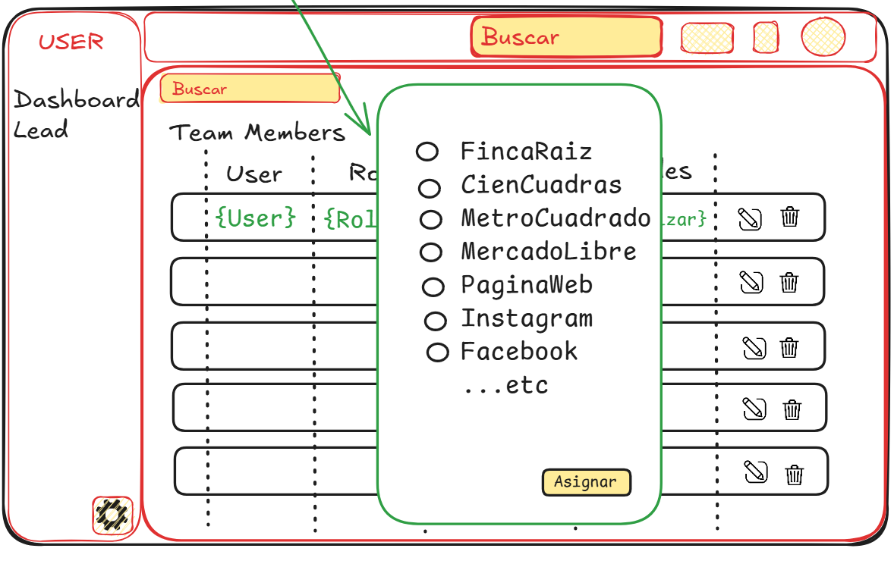

Selector con casillas: `FincaRaiz · CienCuadras · MetroCuadrado · MercadoLibre · PaginaWeb · Instagram · Facebook · …etc` y botón `Asignar`.

> ⚠️ El selector debe alimentarse del **registro de canales**, no de una lista escrita a mano en el frontend.

### Supervisión — Kanban de todos los embudos
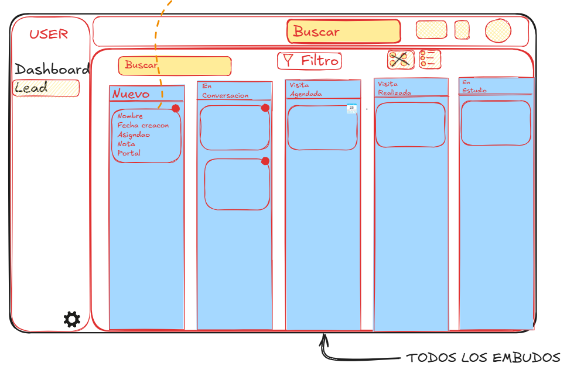

Rotulado **"TODOS LOS EMBUDOS"**. Tarjeta con **todos** los campos de los roles **+ indicador de qué usuario tiene ese contacto**.

**Las 21 etapas** (unión de A. Interna y A. Seguimiento):
`Nuevo · En Conversación · Visita Agendada · Visita Realizada · En Estudio · Post-Cita · No Responde · Hasta 1.5M · Hasta 2M · Hasta 2.5M · Hasta 3M · Propietarios · Otros Municipios · Otras Áreas · Local o Bodega · Ya encontró · Cerrado Perdido · Cerrado Ganado · Aprobado · Reubicado · Venta`

> ✅ Coincide exactamente con el inventario verificado contra la API de HubSpot.

### Supervisión — Contacto e historial sin conversación
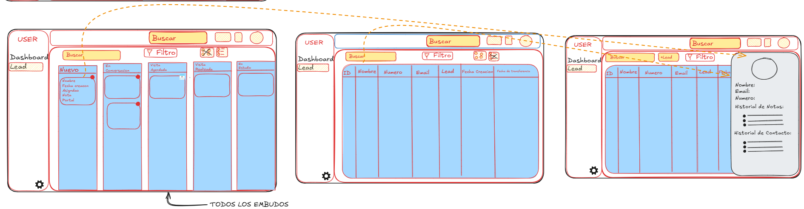

Tabla de leads + `Historial de Notas` e `Historial de Contacto`, **sin hilo de mensajes**.

### Navegación cruzada
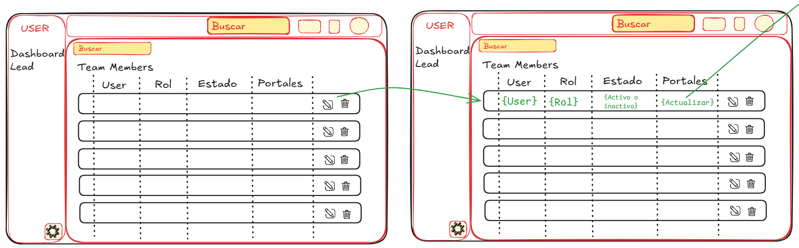

---

## 4. Marketing

### Navegación exclusiva: `Dashboard · Redes · Citas`
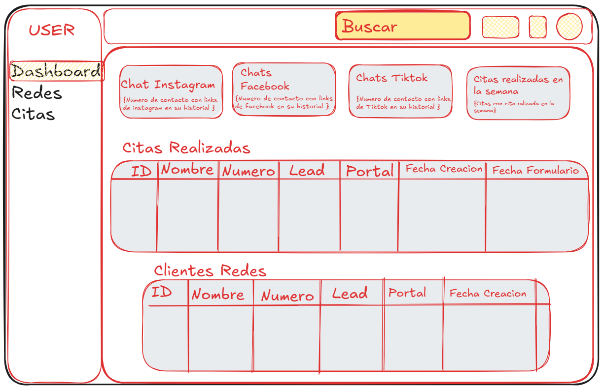

**Tercera navegación distinta.** Ninguna sección coincide con las de asesora ni con las del Administrador:

| Rol | Navegación |
|---|---|
| A. Interna · A. Seguimiento | `Dashboard · Lead · WhatsApp` |
| Administrador | `Dashboard · Lead` + ⚙ |
| **Marketing** | **`Dashboard · Redes · Citas`** |

### Sección `Redes`
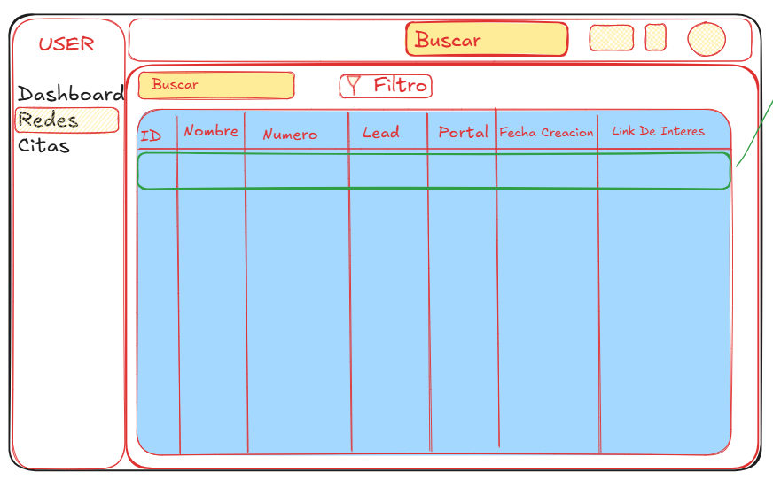

Tabla: `ID · Nombre · Número · Lead · Portal · Fecha`
Detalle: `Nombre · Email · Número · Historial de Notas · Historial de Contacto`

> 🔑 En el `Historial de Contacto` aparece la entrada **"Envío link de instagram"**, anotada como *"Dirige al link enviado por el contacto"*. **El enlace se guarda y es pulsable.**

### Sección `Citas` ✅ *resuelve W-6*
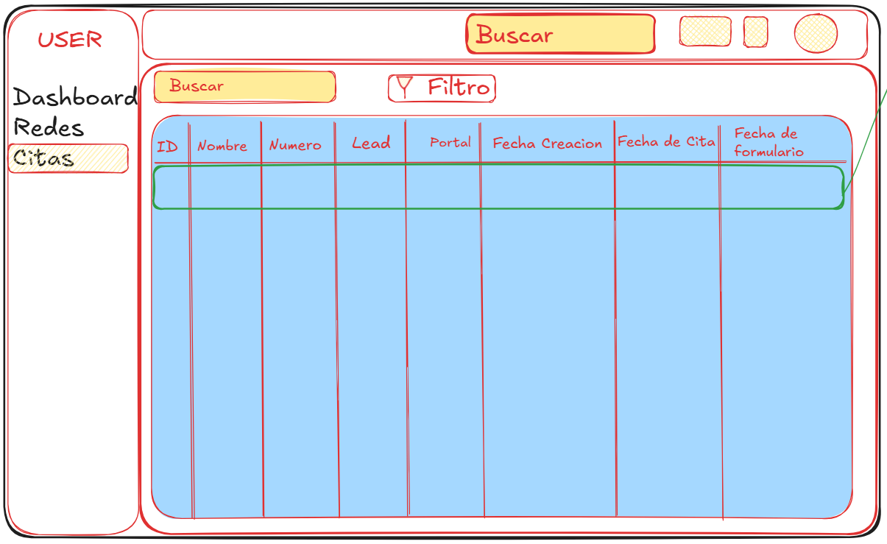

Tabla: `ID · Nombre · Número · Lead · Portal · Fecha Creación · **Fecha de Cita** · **Fecha de formulario**`

> ✅ **Resuelve M-3.** `Fecha de formulario` es **cuándo se envió la plantilla de seguimiento post-cita**. Marketing no solo sabe que el proceso existe: ve la fecha exacta.

### Navegación cruzada
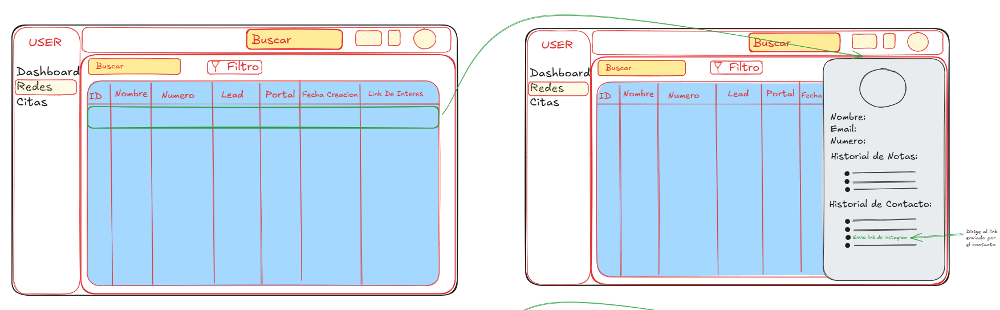

### Dashboard — 4 KPIs
| # | KPI |
|---|---|
| 1 | Leads por **Instagram** |
| 2 | Leads por **Facebook** |
| 3 | Leads por **TikTok** |
| 4 | **Citas realizadas** |

> ⚠️ **Sin wireframe.** Es la única pantalla de Marketing que no está dibujada.

### Funcionalidad heredada
- **Descarga de Excel** con todos los datos del contacto, por portal (Instagram, Facebook, TikTok). Ya operativa hoy.
- Cada contacto que **completa una cita** recibe una plantilla automática.

---

## 4-bis. Inicio de sesión — igual para todos los roles

Tarjeta oscura sobre fondo amarillo, con el isotipo de WhatsApp al fondo. Marca: **SofIA · Inm. Proteger**.
Campos: **Email** · **Password**. Botón: **ENTRAR**.

Una sola pantalla para los cuatro roles. Tras autenticarse, el sistema resuelve el rol y lleva a la interfaz correspondiente.

> 🔴 **Contradice la decisión de autenticación registrada en [D-02 §14](../02-actores-y-roles.md).**
> El wireframe dibuja **email + contraseña propia** — que es la **Opción A**. La decisión confirmada fue la **Opción B: Iniciar sesión con Google**, elegida porque los 6 owners activos usan correo `@gmail.com`, porque SofIA no tendría que almacenar contraseñas y porque el segundo factor lo aporta Google sin construir nada.
>
> **Hay que elegir una:**
> | | Lo que dibuja el wireframe | Lo decidido |
> |---|---|---|
> | Método | Email + contraseña propia | Botón *Continuar con Google* |
> | Contraseñas en SofIA | Sí — hay que cifrarlas, recuperarlas, bloquear intentos | **Ninguna** |
> | Segundo factor | Hay que construirlo | Incluido |
> | Trabajo de desarrollo | Alto | Bajo |
>
> **Tercera vía posible:** mantener el diseño de la tarjeta tal cual y sustituir los dos campos por un único botón *Continuar con Google*. Se conserva la marca y el aspecto, cambia solo el mecanismo.

---

## 5. Estado por rol

| Rol | Estado |
|---|---|
| **A. Seguimiento** | ✅ Completo — Dashboard, Kanban, tabla, WhatsApp, navegación |
| **A. Interna** | ✅ **Completo** — Dashboard añadido en esta ronda |
| **Administrador** | ✅ **Completo** — Dashboard, configuración, portales, supervisión, navegación |
| **Marketing** | 🟠 Casi — falta solo el **Dashboard con los 4 KPIs** |
| **Inicio de sesión** | ✅ Entregado — pero **contradice la decisión de autenticación**, ver §4-bis |

### Lo que sigue faltando

| # | Pantalla | Prioridad |
|---|---|---|
| **W-1b** | Dashboard de Marketing con los 4 KPIs | 🟠 Media |
| **W-5b** | Decidir el mecanismo del login: contraseña propia o Google | 🔴 Alta |

---

## 6. Decisiones confirmadas por los wireframes

- ✅ **Tres navegaciones distintas**, una por familia de rol — no es la misma pantalla con botones apagados
- ✅ **Las pantallas de trabajo son idénticas entre A. Interna y A. Seguimiento.** Lo que cambia es el **Dashboard** y las **etapas del Kanban**
- ✅ El Dashboard del Administrador **agrega** las colas de ambas asesoras y añade supervisión
- ✅ El Kanban mueve **contactos** por etapa — contact-centric sin Deals
- ✅ **Nota y Portal conviven** en la tarjeta
- ✅ La tarjeta del Administrador añade **el dueño del contacto**
- ✅ `Historial de Notas` e `Historial de Contacto` son **dos cosas distintas**
- ✅ El Administrador **configura y observa, pero no conversa**
- ✅ Marketing ve **cuándo se envió** la plantilla post-cita
- ✅ La **navegación cruzada** existe en los tres roles, no solo en asesora

---

## 7. Problemas de diseño detectados

### 🔴 Un Kanban de 19 columnas no es usable

A. Seguimiento tiene **19 etapas**. Un tablero con 19 columnas obliga a desplazamiento horizontal permanente y hace imposible ver el embudo de un vistazo — que es justamente para lo que sirve un Kanban.

Cómo lo resuelven los CRM del benchmark:

| Solución | Quién la usa |
|---|---|
| **Varios embudos** en vez de uno solo — el usuario elige cuál ve | Pipedrive, HubSpot |
| **Agrupar etapas** en fases plegables | Salesforce |
| **Vista guardada** con un subconjunto de columnas | Attio |

> ❓ **Decisión pendiente.** Mi recomendación: **separar en varios embudos** (p. ej. *Comercial*, *Presupuesto*, *Cierre*), que además encaja con el patrón #2 del benchmark (vistas guardadas por rol).

### ⚠️ Menores

- El segundo KPI del Dashboard de A. Interna lleva el subtítulo equivocado
- El Kanban de A. Seguimiento duplica `En Estudio` y omite `Hasta 2M` y `Cerrado Ganado`
- El nombre de la cola de A. Interna difiere entre el texto y el dibujo

---

## 8. Pendiente del `.docx` original

Los títulos `CASOS DE USO` y `*Mapa de Permisos` siguen **sin contenido** en `DOCUMENTACION.docx` — se llenan en D-05 y D-06.

---

## 9. Imágenes pendientes de guardar

`wf30.png` (Dashboard del Administrador v2) y `wf31.png` (Inicio de sesión) están **transcritas y analizadas** arriba, pero los archivos aún no están en esta carpeta.
Guárdalos como `docs/rediseno/wireframes/wf30.png` y `wf31.png`, o añádelos a `DOCUMENTACION.docx` y los extraigo.
